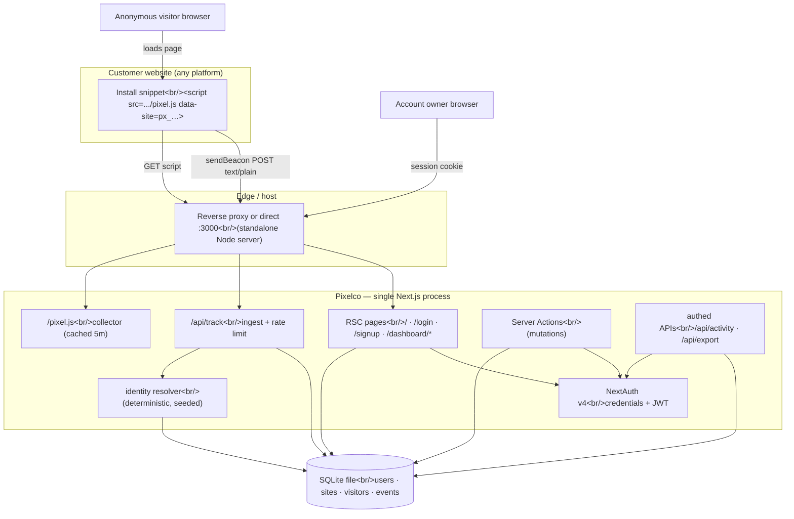
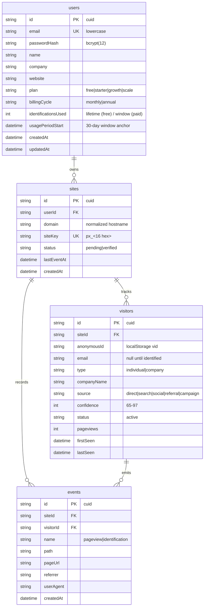

# Pixelco — Master Project Architecture Document (PAD) v1.0

**Classification:** Internal Engineering Reference
**Status:** DEFINITIVE, PRODUCTION-LOCKED BLUEPRINT
**Companion Document:** README.md (user-facing setup) · AGENTS.md (agent quick-start) · CLAUDE.md (working agreements)
**Last Updated:** 2026-09-15
**Audience:** Senior Engineers, Tech Leads, DevOps, and Onboarding Engineers
**Rule:** Every architectural decision in this document traces to a specific rationale.
           Nothing is here "because it's popular."

---

#### Revision Block — v1.0 (Tracked Changes)

- `[SYN]` Initial blueprint generated from the as-built codebase (71 TS files,
  ~6,950 source lines). All sections verified against the repository state at
  commit `7d06bae` (main).
- `[SR]` Verification evidence recorded: ESLint clean, `tsc --noEmit` clean,
  `next build` green (17 routes), standalone production server smoke-tested,
  browser E2E flows exercised (sign-up, login, domain add, beacon ingest,
  identification, plan switch, profile persistence, CSV export).
- `[SAN]` Scope honesty pass: simulated subsystems (identity resolution,
  billing) and known gaps (no automated test suite, per-instance rate
  limiting) are labelled as such in §1, §7, §8, §11.

---

## Table of Contents

1. [System Overview & Decisions](#1-system-overview--decisions)
2. [High-Level System Topology](#2-high-level-system-topology)
3. [Application Architecture](#3-application-architecture)
4. [Data Architecture](#4-data-architecture)
5. [Design System Reference](#5-design-system-reference)
6. [Security Architecture](#6-security-architecture)
7. [Worker / Background Service Architecture](#7-worker--background-service-architecture)
8. [Testing Strategy](#8-testing-strategy)
9. [Build & Deployment](#9-build--deployment)
10. [Developer Handbook](#10-developer-handbook)
11. [Known Issues & Outstanding Tasks](#11-known-issues--outstanding-tasks)
12. [Key Files Reference](#12-key-files-reference)
13. [Glossary](#13-glossary)

---

## 1. System Overview & Decisions

### 1.1 Document Metadata & Purpose

Pixelco is a cookieless **visitor email identification SaaS** built as a
single Next.js application. It is a full-stack clone of the commercial
pixelco.io product: marketing site, credential auth, analytics dashboard,
tracking pixel, and identity-resolution pipeline. This PAD is the definitive
engineering reference for onboarding, debugging, and extension. Read it
top-down; §3 (layer model) and §6 (security rules) are the sections most
likely to be violated by well-meaning changes.

**Honest scope statement.** Two subsystems are deliberate simulations of
capabilities that cannot be cloned from the commercial product:

- **Identity resolution** (§3.3, ADR-005): the proprietary identity graph is
  replaced by a deterministic seeded resolver with the same interface and the
  same advertised ~20% match rate.
- **Billing** (ADR-006): plan switching updates entitlements directly; no
  payment processor is integrated.

Everything else — ingest, session stitching, domain verification, quota
accounting, analytics, exports, auth — is a real working pipeline.

### 1.2 Technology Stack Summary

| Layer | Technology | Version | Key Rationale |
|-------|------------|---------|---------------|
| Web framework | Next.js (App Router, Turbopack) | 16.3.5 | RSC-by-default colocates data fetching with rendering; route handlers for the collector; standalone output for self-hosting |
| UI runtime | React / React DOM | 19.3.0 | Required by Next 16; `useActionState` drives form pending states |
| Language | TypeScript (strict) | 5.9.3 | `any` is an ESLint error; strictness is a release gate |
| Styling | Tailwind CSS (CSS-first) | 4.3.3 | No config file; tokens in `@theme inline`; matches the shadcn/ui v4 toolchain |
| UI primitives | shadcn/ui (New York) + Radix | radix 1.1.x–1.3.x | Accessible composable primitives; source-owned, no runtime lock-in |
| Charts | Recharts | 2.15.4 | Declarative SVG charts; area chart for the 14-day trend |
| ORM | Prisma | 6.19.3 | Type-safe queries; push-based schema sync fits the single-DB design |
| Database | SQLite (Postgres-ready) | file-based | Zero-config self-hosting; schema uses portable types (see ADR-003) |
| Auth | NextAuth v4 (credentials + JWT) | 4.24.15 | Email/password without OAuth provider dependencies; stateless sessions (ADR-004) |
| Password hashing | bcryptjs | 3.0.3 | Pure-JS bcrypt; 12 rounds |
| Validation | Zod | 4.6.5 | Single validation dialect at every boundary (actions + ingest) |
| Icons | lucide-react | 0.525.0 | Consistent outline icon set |
| Dev tooling | ESLint 9 flat, tsx | 9.x / 4.23.13 | Flat config with React Compiler rules; tsx runs the Prisma seed |
| Runtime | Node.js | ≥ 20 | Next 16 requirement |

### 1.3 Architecture Decision Records

**ADR-001: Next.js 16 App Router as the single application framework**

- **Context:** The product needs a marketing site, an authenticated
  dashboard, and two public HTTP endpoints (collector script + beacon
  ingestion). Operating three deployments (static site + API + SPA) would
  triple infrastructure for a self-hostable product.
- **Decision:** One Next.js 16 App Router application. RSC pages render the
  marketing site and dashboard; route handlers serve `/pixel.js` and
  `/api/track`; Server Actions handle all mutations.
- **Rationale:** Colocation of rendering and data access removes a client
  data-fetching layer entirely; `output: "standalone"` yields a single
  deployable Node server; auth cookies work uniformly across pages and APIs.
- **Consequences:** (+) One process, one DB, one deploy target. (−) Server
  Components' constraints (no hooks in RSC) discipline component design;
  the team must respect the client-island boundary.
- **Alternatives Rejected:** Separate marketing site + SPA dashboard (extra
  infrastructure, duplicated auth); Remix/Vite (no equivalent
  server-action + route-handler unification at the time of writing).

**ADR-002: Server Actions as the only mutation path, behind an ActionResult envelope**

- **Context:** Dashboard mutations (add domain, delete account, change plan,
  update profile) need session checks, validation, and revalidation. REST
  endpoints would require a parallel client fetch layer and error contract.
- **Decision:** All UI mutations are `'use server'` actions in `src/actions/*`
  returning `ActionResult<T> = { ok: true; data } | { ok: false; error: {
  code, message, fieldErrors? } }`. Route handlers are a fixed whitelist:
  `api/track`, `api/activity`, `api/export`, `api/health`,
  `api/auth/[...nextauth]`, `pixel.js`.
- **Rationale:** One error contract for every form; validation via one Zod
  dialect; revalidation (`revalidatePath`) scoped to the narrowest route.
  Pattern adopted from the scandihaven architecture where it proved itself
  across a production monorepo.
- **Consequences:** (+) No client fetch layer for writes; typed errors
  everywhere. (−) NextAuth v4's client-only `signIn` forced the sign-up
  flow into a submit-handler sequence (action → client signIn → redirect),
  which is documented in the component.
- **Alternatives Rejected:** tRPC (extra dependency, duplicate of server
  actions for this scale); raw route handlers per mutation (breaks the
  single error contract).

**ADR-003: SQLite as the default database behind Prisma, Postgres-ready schema**

- **Context:** The product must be self-hostable by non-operators in under
  five minutes, yet credible at SaaS scale.
- **Decision:** `DATABASE_URL` defaults to a SQLite file; the Prisma schema
  uses portable scalar types (String ids with cuid, DateTime, Int) and no
  SQLite-specific column types, so switching `provider` to `postgresql`
  plus a URL is the entire migration path.
- **Rationale:** Zero-config local/self-host runs (single file, no daemon);
  Prisma's client API is identical across providers. Identified hotspots
  for Postgres (window-reset SQL, aggregate groupBy on date buckets) are
  consciously implemented as bounded in-JS aggregation over ≤14-day windows
  (see §4.3).
- **Consequences:** (+) `npm install && npm run db:push` is a working
  deployment. (−) Single-writer concurrency limits ingest throughput;
  in-memory rate limiting is per-instance (§11); analytics aggregation is
  application-side rather than SQL-side.
- **Alternatives Rejected:** Postgres-only (kills the five-minute self-host);
  PlanetScale/Neon serverless drivers (external dependency contradicts
  self-hosting).

**ADR-004: NextAuth v4 with credentials provider and JWT strategy**

- **Context:** The product's identity model is email/password with no
  external identity requirements in the clone; the reference product's
  OAuth buttons are marketing surface.
- **Decision:** NextAuth 4.24 with a Credentials provider (bcrypt compare in
  `authorize`), JWT sessions (30-day expiry), session augmentation in
  `src/types/next-auth.d.ts` so `session.user.id` is the database key. OAuth
  buttons render disabled with explanatory titles.
- **Rationale:** v4 is the stable line compatible with Next 16 App Router
  without the v5 beta churn; JWT strategy avoids session-table plumbing for
  a credentials-only flow; `getServerSession` works in RSC and actions.
- **Consequences:** (+) No OAuth configuration surface; stateless session
  verification. (−) Sessions cannot be revoked server-side before expiry
  (acceptable: single-product accounts, 30-day window); v4's client-only
  `signIn`/`signOut` shape the auth flows (§3.3).
- **Alternatives Rejected:** Better-Auth (cleaner model but adds a runtime
  dependency for a single credentials flow); v5 beta (interface churn);
  hand-rolled JWT auth (reimplements CSRF and cookie hardening — never
  hand-roll auth).

**ADR-005: Deterministic seeded identity-resolution engine**

- **Context:** The commercial product resolves visitors through a
  proprietary identity graph — the one component that cannot be cloned
  functionally. The clone still needs a working end-to-end pipeline:
  decision points, quota accounting, event ledger, dashboard surfacing.
- **Decision:** `src/lib/identification.ts` resolves identity with
  `sha256('pixelco-resolver' | siteKey | anonymousId)` seeded into a
  mulberry32 PRNG: ~20% of visitors resolve (matching the advertised match
  rate), ~25% of resolutions are B2B (work email + company name), the rest
  B2C (personal email), confidence 65–97. Decisions are stable per visitor
  across restarts.
- **Rationale:** Same interface and observable statistics as the real
  subsystem; deterministic so demos, seeds, and (future) tests are
  reproducible; quota gating exercises the real accounting path.
- **Consequences:** (+) The full product pipeline is demonstrable and
  honest about being simulated (labelled in UI copy and docs). (−) Changing
  name lists, PRNG, or thresholds reshapes historical decisions — such
  changes are data-affecting migrations and must be treated as such.
- **Alternatives Rejected:** Random (non-seeded) resolution (non-reproducible
  demos); a pluggable "real provider" interface with no implementation
  (speculative abstraction); calling a third-party enrichment API (external
  dependency + cost, contradicts the clone's self-contained scope).

**ADR-006: Simulated billing — plan entitlements without payment processing**

- **Context:** The dashboard's Pricing & Plan page must switch plans
  (Free/Starter/Growth/Scale, monthly/annual with 20% annual discount) for
  the quota system to be exercisable, but integrating Stripe in a
  self-hosted clone without keys would produce a permanently broken flow.
- **Decision:** `changePlanAction` updates `user.plan`, `billingCycle`,
  resets `usagePeriodStart` (and the used counter when the plan changes),
  and the UI marks this path as simulated. Prices are defined as integer
  cents in `src/lib/plans.ts` — the single source of truth for quotas,
  limits, overage prices, and display.
- **Rationale:** Integer-cent money and one catalogue keep a future Stripe
  integration additive; nothing on the page lies to the user about payment.
- **Consequences:** (+) Full entitlement lifecycle works today. (−) A real
  integration must add webhook idempotency and server-side price
  re-derivation before production (§11).
- **Alternatives Rejected:** Stripe with placeholder keys (broken flow);
  removing the pricing page (the quota system is core to the clone).

**ADR-007: Cookieless collector with text/plain beacons**

- **Context:** The pixel runs on customer sites cross-origin; cookie
  restrictions (ITP, third-party cookie deprecation) and CORS preflight
  latency both threaten reliability of the ingest path.
- **Decision:** `/pixel.js` generates a per-site visitor id stored in
  localStorage (`_px_vid_<siteKey>`), and ships beacons via
  `navigator.sendBeacon` with a `text/plain;charset=UTF-8` Blob body — a
  CORS-safelisted content type, so no preflight. The server parses the text
  body as JSON. Visitor stitching keys on `(siteId, anonymousId)` in the
  payload, never on cookies.
- **Rationale:** sendBeacon survives page unload; text/plain avoids an
  OPTIONS round-trip on every pageview; localStorage first-party storage
  needs no consent banner under the product's cookieless positioning.
- **Consequences:** (+) Zero-cookie ingest; one POST per pageview. (−)
  Responses are unreadable from sendBeacon (acceptable — the collector is
  fire-and-forget); localStorage is unavailable in some privacy modes, in
  which case the visitor falls back to a per-pageview id (documented
  degradation).
- **Alternatives Rejected:** `application/json` fetch beacons (preflight on
  every pageview); first-party cookies (contradicts the cookieless claim);
  1×1 GIF GET tracking (URL length limits, no SPA route events).

---

## 2. High-Level System Topology



**Runtime characteristics.** One Node process (standalone build) serves
everything; the database is a single SQLite file accessed through Prisma's
connection pool (single writer). The ingest path (`/api/track`) is
optimised for accept-then-persist: no redirects, 204 responses, in-memory
fixed-window rate limiting at 120 events/minute/site-key. The dashboard
read path is session-scoped and `force-dynamic`. Scaling today is vertical
(one bigger box); horizontal scale requires Postgres + shared rate-limit
storage (§11).

---

## 3. Application Architecture

### 3.1 The Layer Model

```
Layer 0: Route handlers — public protocol surfaces (collector script,
         beacon ingest, auth, health) and authed JSON APIs. Rule: they
         validate input and never contain business rules beyond their
         single responsibility.
Layer 1: RSC pages — session-scoped rendering; fetch via analytics lib;
         never fetch in client components except the activity poll.
         Rule: `force-dynamic` on session pages; UI state stays client-side.
Layer 2: Client islands — 'use client' components under src/components/*
         for interactivity (filters, forms, polling, copy). Rule: no
         direct DB or secrets access; server communication only through
         actions and the whitelisted APIs.
Layer 3: Server Actions — the ONLY write path. Rule: session re-check,
         Zod parse, ActionResult envelope, narrowest revalidatePath.
Layer 4: Domain libs — src/lib/* (pure logic + server-only data access).
         Rule: no React imports; dependencies point downward only.

Golden Rule: requests flow L0/L1 → L3 → L4 → DB and render flows back up.
A client island never bypasses L3 to write, and a page never reaches past
L4. Cycles between layers are build-breaking by convention — enforce by
review.
```

### 3.2 Annotated Directory Structure

```
pixel-identifier/
├── src/
│   ├── app/
│   │   ├── page.tsx                    ← Marketing landing (13 sections)
│   │   ├── layout.tsx                  ← Root layout: fonts, metadata, Toaster
│   │   ├── globals.css                 ← Tailwind 4 @theme tokens (brand palette)
│   │   ├── login/ · signup/            ← Auth pages (dark shell + forms)
│   │   ├── dashboard/
│   │   │   ├── layout.tsx              ← Session gate (UX) + sidebar/topbar chrome
│   │   │   ├── page.tsx                ← Overview: KPIs, trend, top pages, recent
│   │   │   ├── visitors/page.tsx       ← Visitor table + detail sheet (client)
│   │   │   ├── activity/page.tsx       ← Live feed (5s poll)
│   │   │   ├── install/page.tsx        ← Snippet + status + platform guides
│   │   │   ├── domains/page.tsx        ← Domain registration + limits
│   │   │   ├── pricing/page.tsx        ← Plan switching (simulated billing)
│   │   │   └── settings/page.tsx       ← Profile + danger zone
│   │   ├── api/
│   │   │   ├── track/route.ts          ← Beacon ingest (204/429, CORS *)
│   │   │   ├── activity/route.ts       ← Authed: latest 60 events JSON
│   │   │   ├── export/route.ts         ← Authed: CSV download
│   │   │   ├── health/route.ts         ← SELECT 1 probe
│   │   │   └── auth/[...nextauth]/route.ts
│   │   └── pixel.js/route.ts           ← Collector script (folder named pixel.js)
│   ├── actions/
│   │   ├── auth.ts                     ← signUpAction (account creation only)
│   │   ├── domains.ts                  ← add/delete/list domain actions
│   │   └── settings.ts                 ← profile, plan change, account deletion
│   ├── components/
│   │   ├── marketing/                  ← Landing sections (server + 2 client)
│   │   ├── dashboard/                  ← Sidebar, topbar, tables, feeds, panels
│   │   ├── auth/                       ← Shell + login/signup forms (client)
│   │   ├── ui/                         ← shadcn primitives (15 components in use)
│   │   └── pixelco-logo.tsx            ← Inline SVG brand mark
│   ├── hooks/                          ← use-toast (shadcn toast state)
│   ├── lib/
│   │   ├── db.ts                       ← Prisma client singleton
│   │   ├── auth.ts                     ← NextAuth options (credentials + JWT)
│   │   ├── analytics.ts                ← server-only: stats, trend, top pages
│   │   ├── identification.ts           ← Deterministic resolver + source rules
│   │   ├── plans.ts                    ← Plan catalogue (int cents, quotas)
│   │   ├── validation.ts               ← Zod schemas + ActionResult type
│   │   ├── snippet.ts                  ← Snippet builder + collector URL
│   │   └── format.ts                   ← relative time, initials, CSV cells
│   └── types/next-auth.d.ts            ← Session.user.id augmentation
├── prisma/
│   ├── schema.prisma                   ← users · sites · visitors · events
│   └── seed.ts                         ← Idempotent demo seed (guards non-local DBs)
├── docs/                               ← SSH push runbook + reference materials
└── AGENTS.md · CLAUDE.md · README.md · Project_Architecture_Document.md
```

### 3.3 Critical Code Patterns

**Pattern 1 — Ingest endpoint: accept, validate, persist, stay silent**

```typescript
// src/app/api/track/route.ts (excerpt)
export async function POST(request: NextRequest): Promise<NextResponse> {
  let raw: string
  try {
    raw = await request.text()           // text/plain body (see ADR-007)
  } catch {
    return new NextResponse(null, { status: 204, headers: CORS_HEADERS })
  }

  let json: unknown
  try {
    json = JSON.parse(raw)
  } catch {
    return new NextResponse(null, { status: 204, headers: CORS_HEADERS })
  }

  const parsed = trackPayloadSchema.safeParse(json)
  if (!parsed.success) {
    // Malformed beacons must never break or reveal anything — 204, not 400:
    // the collector is fire-and-forget and the endpoint is public.
    return new NextResponse(null, { status: 204, headers: CORS_HEADERS })
  }
  // ...
  const site = await db.site.findUnique({ where: { siteKey: payload.k }, include: { user: { … } } })
  if (!site) {
    // Unknown key: 204 rather than 404 so probes cannot enumerate site keys.
    return new NextResponse(null, { status: 204, headers: CORS_HEADERS })
  }
```

*Why this pattern:* every early exit returns the same shape so the customer's
page never observes errors; enumeration is impossible; validation happens
before any DB touch. The full handler then verifies the domain by hostname,
upserts the visitor, appends the pageview event, and runs quota-gated
resolution — each step a single bounded write.

**Pattern 2 — ActionResult envelope for every mutation**

```typescript
// src/lib/validation.ts
export type ActionResult<T> =
  | { ok: true; data: T }
  | { ok: false; error: { code: string; message: string; fieldErrors?: Record<string, string[]> } }

// src/actions/domains.ts (excerpt)
const domain = normalizeDomain(parsed.data.domain)
if (!domain) {
  return fail('VALIDATION', 'That does not look like a valid domain.', {
    domain: ['Enter a domain like yoursite.com'],
  })
}
// ownership-scoped delete — cross-tenant deletion impossible:
await db.site.deleteMany({ where: { id: siteId, userId } })
revalidatePath('/dashboard/domains')
```

*Why this pattern:* forms render one typed error surface; Zod field errors
map straight to `fieldErrors`; actions never throw across the boundary.
Ownership predicates (`userId`) ride along every write — the layout's
redirect is UX, this is the real authorization.

**Pattern 3 — Deterministic identity resolution**

```typescript
// src/lib/identification.ts (excerpt)
function seedFrom(...parts: string[]): number {
  const digest = createHash('sha256').update(parts.join('|')).digest()
  return digest.readUInt32BE(0)
}

function mulberry32(seed: number): () => number { /* stable PRNG */ }

export function resolveIdentity(anonymousId: string, siteKey: string): ResolvedIdentity | null {
  const seed = seedFrom('pixelco-resolver', siteKey, anonymousId)
  const rand = mulberry32(seed)
  if (Math.floor(rand() * 100) >= MATCH_RATE_PERCENT) return null   // ~80% stay anonymous
  // … derive names/provider/company/confidence from further rand() draws
}
```

*Why this pattern:* identical inputs always produce identical outputs —
across restarts, replicas, and seeds — so analytics, demos, and future tests
are reproducible. The draw order is part of the contract; reordering the
`rand()` calls reshapes history (see ADR-005 consequences).

**Pattern 4 — Client submit-handler auth sequence (NextAuth v4 constraint)**

```tsx
// src/components/auth/signup-form.tsx (excerpt)
async function handleSubmit(event: React.FormEvent<HTMLFormElement>) {
  event.preventDefault()
  const formData = new FormData(event.currentTarget)
  const result = await signUpAction(null, formData)      // 1. server action creates account
  if (!result.ok) { /* render field errors */ return }
  const signInResult = await signIn('credentials', {     // 2. client-only API signs in
    email, password, redirect: false,
  })
  if (signInResult?.error) { router.push('/login?registered=1'); return }
  router.push('/dashboard')                               // 3. enter the app
  router.refresh()                                        // 4. re-render with session
}
```

*Why this pattern:* v4 exposes `signIn` only on the client; doing both steps
in the submit handler (not an effect) keeps state transitions user-driven
and satisfies the React Compiler's `set-state-in-effect` rule. The effect
variant of this flow self-cancelled its redirect in testing — that failure
is why this shape is load-bearing.

**Pattern 5 — Cookieless collector**

```javascript
// src/app/pixel.js/route.ts (served script, excerpt)
var payload = {
  k: siteKey,                              // from data-site attribute
  u: location.href, p: location.pathname + location.search,
  r: document.referrer || '', t: document.title || '',
  v: getVid(),                             // localStorage _px_vid_<siteKey>
  w: window.screen.width, h: window.screen.height
}
navigator.sendBeacon(endpoint, new Blob([JSON.stringify(payload)],
  { type: 'text/plain;charset=UTF-8' }))   // safelisted type → no preflight
// SPA routes: pushState/replaceState/popstate patched → re-send on path change
```

*Why this pattern:* one POST per pageview, survives unload, no OPTIONS
round-trip, zero cookies. The visitor id travels in the payload, so CORS
can be `*` without credentials.

---

## 4. Data Architecture

### 4.1 Database Schema



Uniques and indexes: `sites @@unique([userId, domain])`, `siteKey` unique;
`visitors @@unique([siteId, anonymousId])` + index `(siteId, lastSeen)`;
`events` indexes `(siteId, createdAt)` and `(siteId, name, createdAt)` —
the latter serves the trend chart and the identification feed.

### 4.2 Data Models

Statuses are strings (SQLite has no enums) constrained by application code:
`plan` ∈ `src/lib/plans.ts` (the catalogue is the enum), `site.status` ∈
`{pending, verified}`, `event.name` ∈ `{pageview, identification}`,
`visitor.source` derived by `sourceFromReferrer`. Monetary values exist only
in `plans.ts` (integer cents); no money columns are stored.

### 4.3 Persistence Strategy

- **Client:** Prisma singleton via `globalThis` cache (`src/lib/db.ts`) —
  one pool per process, query logging in dev only.
- **Schema sync:** push-based (`db:push`) — no migration history; the schema
  is young and single-writer, making push pragmatically safe. Moving to
  Postgres in production implies adopting `prisma migrate`.
- **Aggregation:** analytics read minimal fields for ≤14-day windows and
  aggregate in JS (`getTrend`, `getTopPages`) — bounded by window size, so
  complexity is O(events in window) regardless of total table size. Top
  pages scans lifetime pageviews; at very large scales this becomes a
  SQL groupBy (Postgres) — tracked in §11.
- **Quota accounting:** `identificationsUsed` increments atomically inside
  the ingest transaction chain; the monthly window resets lazily on first
  event after 30 days (checked in both ingest and `getUsage`). The
  check-then-increment race can overshoot the quota by at most one —
  documented, acceptable at this scale.

---

## 5. Design System Reference

### 5.1 Typographic System

- **Geist Sans** (`next/font/google`, `--font-geist-sans`) for all UI;
  Geist Mono for code/paths. H1 landing: 4xl→[3.4rem] extrabold tracking-tight;
  KPI values: 3xl extrabold with `tabular-nums`; body: `text-sm` /
  `text-muted-foreground` for secondary.

### 5.2 Color Tokens

| Token | Hex | Usage | Notes |
|-------|-----|-------|-------|
| `--primary` | `#FACC15` | CTAs, active nav, badges, avatar fill | Black text on yellow — 14.7:1 |
| `--primary-foreground` | `#1C1917` | Text/icons on primary | |
| `--chart-1` | `#F59E0B` | Pageviews series | Amber |
| `--chart-2` | `#2DD4BF` | Identified series, confidence bars | Teal |
| `--background` | `#FFFCF5` | Marketing canvas | Warm off-white |
| `.bg-app` | `#F9FAFB` | Dashboard canvas | Cool gray |
| `--muted-foreground` | `#6B7280` | Secondary text | 4.8:1 on white |
| `--destructive` | red (oklch) | Danger zone, delete | |
| `--border` | `#E7E5DF` | Hairlines | Warm gray |

Focus visibility: brand yellow fails contrast for focus rings, so
`.focus-brand` uses `#A16207` (amber-700) 2px outlines — an accessibility
decision, not a styling preference.

### 5.3 Component Primitives

shadcn/ui (New York style) source-owned in `src/components/ui/` — 15
primitives in use (accordion, alert-dialog, badge, button, card, checkbox,
dropdown-menu, input, label, progress, select, sheet, tabs, toast, toaster).
Composites live beside their feature (`components/dashboard/*`), never in
`ui/`. Icons: lucide-react outline style; the brand mark is inline SVG
(`pixelco-logo.tsx`) so it inherits color and needs no asset requests.

### 5.4 Motion / Animation

CSS-only. `feed-in` keyframes (0.45s, `cubic-bezier(0.22,1,0.36,1)`) for the
landing "Live Visitor Feed" rows; `animate-pulse` for the live indicator;
hover transitions ≤200ms. All motion collapses under
`prefers-reduced-motion: reduce` (the `feed-in` rule disables itself).
No JS animation library — Framer Motion was deliberately not added for two
animations.

---

## 6. Security Architecture

### 6.1 Security Rules

| Rule | Enforcement |
|------|-------------|
| All external input validated (Zod) before use | `validation.ts` schemas in every action + ingest; no action reads raw FormData fields beyond schema input |
| No secrets in code or logs | `.env*` gitignored; `.gitignore` rejects `*.key`/`ssh-key.txt`; ESLint `no-console` restricts to warn/error/info |
| Parameterized data access only | Prisma query API exclusively; no `$queryRaw` with interpolation (the single `$queryRaw` in health uses a literal `SELECT 1`) |
| Authorization on every mutation, not just the layout | Each action re-fetches the session and scopes writes by `userId`; `deleteDomainAction` deletes by `{ id, userId }` |
| Password storage | bcrypt, 12 rounds; hashes never leave `authorize` |
| Sessions | Signed JWT (HttpOnly cookie, 30-day); `NEXTAUTH_SECRET` required |
| Beacon endpoint hardening | Site-key lookup returns 204 for unknown keys (anti-enumeration); 120/min fixed-window per key; 204 for malformed payloads |
| Output encoding | React escapes by default; CSV export escapes per RFC 4180 (`csvCell`); snippet interpolates only server-generated values (site key hex + derived origin) |
| Account deletion | Requires retyped email confirmation; cascades all owned data |

### 6.2 Security Utilities

`normalizeDomain` (hostname-grammar allowlist — defeats path/query/injection
smuggling through the domain field), `sourceFromReferrer` (URL-parsed, never
string-matched raw), rate limiter with stale-bucket sweep (bounds memory),
CSV cell escaper, `initialsForEmail` (display-only derivation).

### 6.3 Authentication & Authorization

Single role (account owner) — no RBAC surface. The dashboard layout
redirect is UX; actions and authed APIs independently verify the session
and derive `userId` server-side. Tenant isolation is enforced by query
predicates (`where: { site: { userId } }`), not by client-supplied IDs.

### 6.4 Threat Model (STRIDE, ingest surface)

| Threat | Vector | Mitigation |
|--------|--------|------------|
| Spoofing | Forged beacons with a stolen site key (public in page source) | Accepted limitation of all client-side analytics; rate limiting bounds abuse; verification requires hostname match |
| Tampering | Malformed/oversized payloads | Zod schema with length caps; silent 204 rejection |
| Repudiation | No ingest audit trail | Events ledger is append-only with timestamps — acceptable |
| Information disclosure | Site-key enumeration; user enumeration at signup | 204s for unknown keys/domains; duplicate-email returns a generic conflict without confirming ownership |
| DoS | Beacon floods | Per-key fixed window (120/min) + response shape that costs nothing; in-memory (per-instance) — see §11 |
| Elevation | Direct mutation of another tenant's resources | Ownership predicates on every write; actions re-check session |

---

## 7. Worker / Background Service Architecture

**Intentionally absent.** There are no queues, workers, or cron jobs. Rationale:

- Identity resolution runs inline in the ingest request (sub-millisecond,
  deterministic — no external calls), so no async decoupling is needed.
- The Activity Log's "real-time" feed is 5-second client polling of an
  indexed query (`ORDER BY createdAt DESC LIMIT 60`) — at this scale,
  polling is cheaper and operationally simpler than a websocket service.
- Rollups do not exist: analytics aggregate on read over bounded windows
  (§4.3), eliminating the classic aggregator-worker entirely.

If traffic scales past SQLite's single-writer comfort, the first worker to
introduce is an outbox-driven event rollup job (the scandihaven `job` table
pattern) — that migration point is tracked in §11, not implemented
speculatively.

---

## 8. Testing Strategy

### 8.1 Test Distribution

| Category | Files | Tests | Location | Framework |
|----------|-------|-------|----------|-----------|
| Lint (static) | 71 | — | repo-wide | ESLint 9 + typescript-eslint + React Compiler rules |
| Types (static) | 71 | — | repo-wide | `tsc --noEmit`, strict |
| Build (integration) | 17 routes | — | `next build` | Next 16 |
| Unit / E2E (dynamic) | 0 | 0 | — | **none installed** |

### 8.2 Test Patterns (current, manual)

The verification evidence for v1.0 is: gate green (lint/typecheck/build),
standalone-server smoke (routes 200, health `{"status":"ok","db":"up"}`,
auth guard 307), and a scripted browser pass: sign-up → auto sign-in →
dashboard empty state → add domain → beacon burst via `curl` (16 + 26
visitors) → 6 identifications at ~20% match rate → trend/top-pages/recent
render → visitor filters + detail sheet → CSV export content check → plan
switch (Growth) → profile save persistence → mobile viewport pass.

### 8.3 Coverage Thresholds

None configured (no test framework). Highest-value first targets when
adding Vitest: `resolveIdentity` (distribution + determinism property
tests), `normalizeDomain` (hostname grammar), `sourceFromReferrer`,
`csvCell` (RFC 4180), `plans.ts` (price math), and an integration test for
`/api/track` (visitor upsert, hostname verification, quota gating, rate
limiting).

### 8.4 Pre-PR / Pre-Deploy Checklist

- [ ] `npm run verify` green (lint → typecheck → build)
- [ ] `npm run db:push` still clean against the current schema
- [ ] Ingest probe returns 204 (README "Testing the tracking pipeline")
- [ ] `/api/health` reports `db: up`
- [ ] Sign-up → dashboard flow manually exercised
- [ ] No secrets in `git diff` (`git ls-files | grep -E '\.env|\.key$'` is empty)
- [ ] Docs updated if setup, env, or architecture changed

---

## 9. Build & Deployment

### 9.1 Production Build

```bash
npm run verify                       # gate
npm run build                        # → .next/standalone (Node server)
cp -r .next/static .next/standalone/.next/
cd .next/standalone
DATABASE_URL="file:/abs/path/pixelco.db" \
NEXTAUTH_SECRET="…" NEXTAUTH_URL="https://host" \
PORT=3000 HOSTNAME=0.0.0.0 node server.js
```

17 routes: 3 static (`/`, `/login`, `/signup`), 8 dynamic pages
(dashboard + authed APIs), 6 handlers. Standalone is the supported
self-host target; Vercel deploys work by removing `output: "standalone"`.

### 9.2 Environment Variables

| Name | Required | Description | Default |
|------|----------|-------------|---------|
| `DATABASE_URL` | yes | SQLite file path (absolute in standalone) or Postgres URL | `file:./db/pixelco.db` (relative resolves against `prisma/`) |
| `NEXTAUTH_SECRET` | yes | ≥32-char session signing secret | — (fail-fast without it) |
| `NEXTAUTH_URL` | prod | Canonical origin used for auth callbacks | `http://localhost:3000` |

### 9.3 Docker Configuration

No Dockerfile ships yet. The standalone output is Docker-ready by design
(`node:20-alpine` + server.js + prisma engine); a future container must
mount the SQLite file as a volume and pass absolute `DATABASE_URL`.

### 9.4 CI/CD Pipeline

No CI workflow is configured. The push runbook is manual: verification
gate → conventional commit → `docs/ssh_git_wrapper_v3.py` with an
externally-supplied deploy key (`docs/how-to-git-push-using-ssh-wrapper_SKILL.md`).
The wrapper pre-flights auth with `git ls-remote`, pushes
`HEAD:refs/heads/main` only, and shreds the materialized key.

---

## 10. Developer Handbook

### 10.1 Local Setup

Minimal: Node ≥ 20 → `npm install` → `cp .env.example .env` (set
`NEXTAUTH_SECRET`) → `npm run db:push` → `npm run dev`. With demo data:
`npm run db:seed` (demo@pixelco.local / Demo123456!; refuses non-local
`DATABASE_URL`).

### 10.2 Common Commands

| Command | Location | Purpose |
|---------|----------|---------|
| `npm run dev` | repo root | Dev server :3000 |
| `npm run lint` / `typecheck` / `build` | repo root | Gate stages |
| `npm run verify` | repo root | Full gate in order |
| `npm run db:push` / `db:seed` | repo root | Schema sync / demo seed |
| `curl -X POST /api/track …` | anywhere | Ingest probe (see README) |

### 10.3 Code Style Rules

Enforced by ESLint 9 flat config: `no-explicit-any` error, unused vars
error (`_` prefix exempt), `no-console` warn (warn/error/info allowed),
React Compiler rules (notably `set-state-in-effect` — error). Formatting
follows existing file style; there is no Prettier config — match the
surrounding code.

### 10.4 Git Workflow

Trunk-based: `main` only. Conventional Commits with scopes
(`feat(visitors):`, `fix(track):`). Atomic commits — one logical change
each. Never commit `.env*`, `*.key`, or the SQLite file (all gitignored).
Pushes via the SSH wrapper (§9.4), never with ambient credentials.

---

## 11. Known Issues & Outstanding Tasks

| Priority | Issue | Impact | Status |
|----------|-------|--------|--------|
| HIGH | No automated unit/E2E test suite | Regressions in resolver/quota/ingest logic are caught only by the manual gate | Open — Vitest wiring is the first contribution to make |
| HIGH | Identity resolution and billing are simulations | Clone parity, not production capability — labelled everywhere | By design (ADR-005/006) |
| MEDIUM | In-memory rate limiting (per-instance) | Multi-instance deploys would multiply the effective limit | Open — swap to shared store when horizontally scaling |
| MEDIUM | `getTopPages` aggregates lifetime pageviews in JS | Degrades at very large event counts | Open — SQL groupBy on Postgres migration |
| MEDIUM | Quota check-then-increment can overshoot by one | Off-by-one over quota under concurrent beacons | Accepted — documented in §4.3 |
| LOW | OAuth buttons are disabled placeholders | Users must use email sign-in | By design — no providers configured |
| LOW | Sessions are 30-day JWTs; no early revocation | Stolen cookies valid until expiry | Accepted for this product shape |
| LOW | No Dockerfile / CI workflow | Self-hosting requires manual steps | Open |
| LOW | Relative SQLite paths resolve against `prisma/` | Confusing first-run behavior | Documented (README, §9.2) |

---

## 12. Key Files Reference

| File | Lines | Purpose |
|------|-------|---------|
| `src/app/api/track/route.ts` | ~204 | Beacon ingest: validation, rate limit, hostname verification, visitor upsert, quota-gated resolution |
| `src/app/pixel.js/route.ts` | ~116 | Collector script served as a route (cookieless vid, sendBeacon, SPA hooks) |
| `src/lib/identification.ts` | ~136 | Deterministic identity-resolution engine + referrer→source rules + site-key generator |
| `src/lib/plans.ts` | ~122 | Plan catalogue: integer-cent prices, quotas, domain limits (single source of truth) |
| `src/lib/analytics.ts` | ~174 | Server-only aggregations: overview stats, 14-day trend, top pages, usage window |
| `src/lib/validation.ts` | ~98 | Zod schemas for every boundary + `ActionResult<T>` envelope |
| `src/lib/auth.ts` | ~52 | NextAuth options (credentials, JWT, session callbacks) |
| `src/actions/domains.ts` | ~121 | Add/delete/list domain actions (ownership-scoped) |
| `src/actions/settings.ts` | ~121 | Profile, plan change (simulated billing), account deletion |
| `src/app/dashboard/layout.tsx` | ~43 | Session gate (UX) + sidebar/topbar chrome + usage props |
| `src/app/dashboard/page.tsx` | ~201 | Overview: KPI cards, trend chart, top pages, recent identifications |
| `src/components/dashboard/visitors-table.tsx` | ~347 | Visitors page: segments, search, filters, detail sheet, export |
| `src/components/dashboard/activity-feed.tsx` | ~138 | Live feed with 5s polling + pause control |
| `src/components/auth/signup-form.tsx` | ~160 | Action → client signIn → redirect sequence (ADR-004 pattern) |
| `src/app/globals.css` | ~171 | Tailwind 4 `@theme` brand tokens, focus ring, motion, scrollbar |
| `prisma/schema.prisma` | ~95 | users · sites · visitors · events (uniques + ingest indexes) |
| `prisma/seed.ts` | ~174 | Idempotent demo seed (local-DB guard) |

---

## 13. Glossary

| Term | Meaning |
|------|---------|
| **Beacon** | One POST from the collector to `/api/track` describing a pageview |
| **Collector** | The `/pixel.js` script executing on a customer site |
| **Site key** | `px_<16 hex>` public identifier binding beacons to a registered domain |
| **Visitor** | A browser on a site, keyed by `(siteId, anonymousId)`; identified once an email is resolved |
| **Identification** | A resolution event: visitor → real email (+ type, company, confidence) |
| **Match rate** | Share of visitors resolved; engine targets ~20% |
| **Domain verification** | Flipping a site from `pending` to `verified` when a beacon's page hostname matches the registered domain |
| **Quota** | Per-plan identification allowance: lifetime (Free) or 30-day window (paid) |
| **Resolver** | The deterministic identity engine (`identification.ts`) |
| **Standalone** | Next.js `output: "standalone"` build: a self-contained `server.js` Node deployment |
