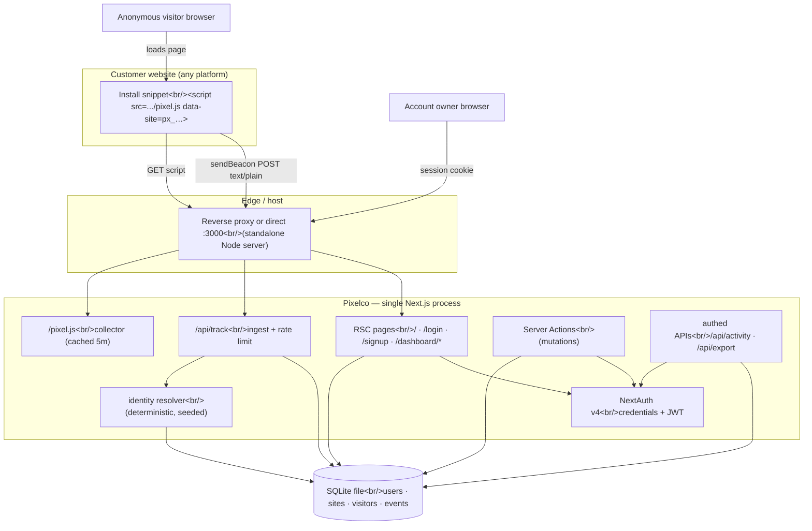
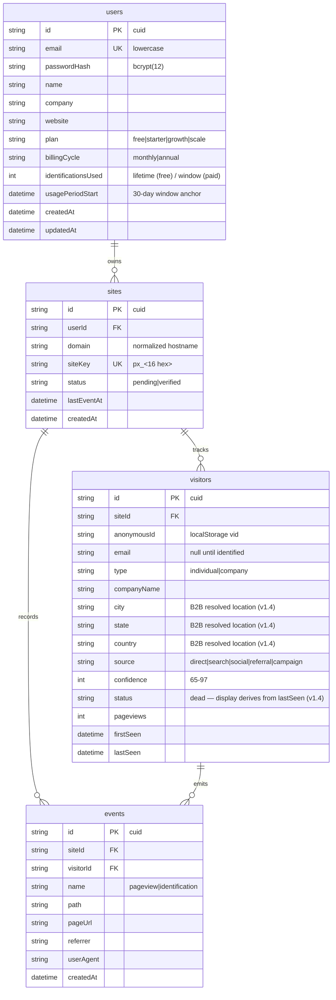

# Pixelco — Master Project Architecture Document (PAD) v1.21

**Classification:** Internal Engineering Reference
**Status:** DEFINITIVE, PRODUCTION-LOCKED BLUEPRINT
**Companion Document:** README.md (user-facing setup) · AGENTS.md (agent quick-start) · CLAUDE.md (working agreements)
**Last Updated:** 2026-09-19 (v1.21)
**Audience:** Senior Engineers, Tech Leads, DevOps, and Onboarding Engineers
**Rule:** Every architectural decision in this document traces to a specific rationale.
           Nothing is here "because it's popular."

---

#### Revision Block (Tracked Changes)

- **v1.21** `[SYN]` Round-22 first-run states, activity pagination &
  sub-page interaction parity audit (plan:
  `docs/plans/2026-09-19-round22-firstrun-activity-parity.md`; evidence
  `/tmp/r22-caps` + `docs/screenshots/` + `research/` probe scripts). The
  live stayed **100% stable since R21** (seventh consecutive stable audit
  — 8 of 9 pages zero token ops after a viewport-corrected re-capture; the
  landing's 3 ops are the known feed-row phase artifact; bundle hash
  UNCHANGED, `index-C3AAh5Je.js`). R22 introduced the **7th probe
  generation**: the live's empty-state branches decoded from its app
  bundle (the definitive source) + runtime confirmation on the live
  visitors page (no-match search); a fresh live signup attempted (the
  live's Supabase signup returns 200 WITHOUT a session — email
  confirmation gate, F11); the Activity Log model decoded from bundle
  component `hxe`; blog/docs sub-page interactions probed at runtime.
  Findings (all fixed via TDD, suite 568/56 → **596/59**): **(F1)** the
  visitors empty state — the live renders `<p class="text-sm
  text-muted-foreground py-12 text-center">No visitors identified yet.
  Install your pixel to get started.</p>` REPLACING the entire table
  wrapper (direct child of the `p-0` card; branch = the current tab's
  FILTERED count === 0 — search+confidence+source all feed it, so a
  no-match search on a populated account shows the INSTALL message,
  runtime-verified; "No visitors match your filters." only materializes
  pagination-past-end); the clone shipped a `<td colSpan=6>` row with
  different strings and a total&&all===0 branch. **(F2)** activity empty
  state — the live's exact `<p>` + string "No activity yet. Install your
  pixel to start tracking." (the clone had a different string at
  `px-4 py-16`). **(F3)** Top Pages empty = `py-8` (not py-12) +
  text-utility-first order. **(F4)** domains empty = a plain `div`
  `text-center py-12 text-sm text-muted-foreground` direct child of the
  `p-0` card (not CardContent + inner p). **(F5)** Recent Identifications
  empty class order `text-sm text-muted-foreground py-12 text-center`.
  **(F6) MAJOR — the Activity Log is PAGINATED, not polled:** the live
  ships 50-per-page offset pagination (bundle `Jc=50`, `useState(0)` page
  index, `count exact`), a footer ONLY when `count > 50` (`flex
  items-center justify-between px-5 py-3 border-t border-border`; "1–50 of
  N" span + ghost icon chevrons h-7 w-7 + "Page X of Y"), NO polling, NO
  load-older, NO cursor walk; the clone shipped 60/page cursor + 5s poll
  + "Load older events" — rebuilt to the live's model
  (`listActivity` page mode + count envelope, `/api/activity?page=`,
  client page state, poll/tick/load-older retired). **(F7)** the live's
  install page with ZERO domains renders its normal header +
  "Add a domain first to get your tracking snippet." interstitial card
  (the placeholder key `px_xxxxxxxxxxxxxxxx` is the loading fallback,
  never the zero-sites path — F7 re-read mid-round from the full bundle
  branch); the clone's custom guidance card rebuilt to the exact live
  structure; the DomainSwitcher renders only when sites > 1. **(F8)** the
  docs copy-success Check icon carries `text-green-500`. **(F9)** the
  docs "Contact Support" is a real `<button>` on the live (dead — no
  handler, verified by click) — the clone now ships the real Button tag
  (R17 contact-sales pattern) with a WORKING mailto onClick; the
  dead-button behavior itself remains a documented live defect. **(F10)**
  the visitors search placeholder varies by tab — `Search companies...`
  (b2b) vs `Search emails, companies...` (else).
  Non-findings/intentional: **(F11)** the live's signup email-confirmation
  gate ("Check your email" toast; Supabase returns 200 without session;
  login 400 "Email not confirmed") — the clone keeps auto-session signup
  (no mail transport — "Honesty over simulation", D-class, Known Issues);
  blog index/articles (static, pinned R13); docs copy button structure;
  password policy (min 6 + confirm ✓); page-reset-on-filter-change ✓;
  the live's stale-index selection persistence (live defect — clone's
  clear-on-change stays); the "capture" event type (the live's
  form-capture pipeline — no clone pipeline, dead map entry);
  react-query focus-refetch + in-card spinners (CSR machinery vs RSC
  streaming — D-class architecture divergence). Post-fix verification:
  fresh signup → `/dashboard` (auto-session ✓), all first-run empty
  branches DOM-verified (exact classes/strings, table GONE), activity
  pagination end-to-end ("1–50 of 130" → next → "51–100 of 130",
  "Page 1 of 3"/"Page 2 of 3"), NO polling (idle-network check), zero
  console errors, 8 screenshots + 3 VLM confirmations.
- **v1.20** `[SYN]` Round-21 functional-flow & export parity audit (plan:
  `docs/plans/2026-09-19-round21-functional-export-parity.md`; evidence
  `/tmp/r21-caps` + `docs/screenshots/` + `research/round21-audit/`). The
  live stayed **100% stable since R19** (sixth consecutive stable audit —
  the landing's only 7 token changes were one feed row's `done`-unmount
  timing artifact; bundle hash UNCHANGED, `index-C3AAh5Je.js`). R21
  introduced the **6th probe generation**: the CSV export decoded from
  the live's app bundle (`index-nhmKaUsm.js`, function W — the definitive
  source), the visitors filter selects OPENED at runtime (Radix portal
  options harvested live-vs-clone), and the first-ever responsive probes
  (375px/768px — landing + dashboard — **PARITY**, non-finding: both
  sides 1-col grids, same hamburger, same 768px sidebar tree; the live's
  own landing has docScrollableX at 375 — its quirk, never replicate).
  Findings (all fixed via TDD, suite 543/54 → **568/56**): **(F1)** the
  CSV export's byte format diverged completely — the live emits
  `Type,Name,Detail,Confidence,Source,Location,First Seen,Last
  Seen,Status` (Company/Individual rows, `X%`/`—`, identType/"IP
  Lookup", geo-join/`—`, en-US short First Seen, RELATIVE Last Seen,
  computed 1-hour status), joined with **LF**, **NO BOM**, **NO quoting**
  (the live embeds its date comma raw — replicated faithfully), scoped to
  **the current page** (Export All = all-rows-on-this-page vs the
  selected subset); the clone shipped `Email,Type,Company,…`, ISO
  dates, CRLF, BOM, csvCell quoting, all-rows scope. The route now emits
  the live's bytes; the mechanism stays a server route (invisible). The
  topbar's Export All href is page-scoped via the chrome store's new
  `pageVisitorIds`. **(F2)** PAGE_SIZE 25 → the live's `ni = 20`.
  **(F3)** the confidence filter is the live's BANDS — `All / High
  (85%+) / Medium (70-84%) / Low (<70%)` (gte 85 / 70-84 / lt 70 — band
  semantics, not lower bounds; the clone shipped 90%+/75%+/50%+).
  **(F4)** the `source` column repurposed to the live's identification
  source — `direct`/`network` for individuals (bundle rule
  `confidence>=70 → direct`), `ip-lookup` for companies; the filter ships
  `All Sources / Direct Signups / Network Matches`; the b2c Type badge
  is Direct (neon-green) / Network (electric-blue); traffic attribution
  (`sourceFromReferrer`) RETIRED — the live's rows never carry it
  (referrer stays on Event rows). **(F5)** the confidence bar fill is
  the live's 3-TIER (>=85 neon-green / >=70 electric-blue / else
  hot-pink; the clone always shipped neon-green). **(F6)** company rows
  carry confidence **null** (the live's b2b model — excluded from
  confidence bands, `—` in export; the resolver keeps the RNG draw,
  stores null). **(F7)** the landing mobile dropdown rebuilt on the
  live's captured structure — `md:hidden bg-background border-b
  border-border px-6 py-4 flex flex-col gap-4`, plain anchors, 4 links
  + ONE `h-10 w-full` gradient CTA, **no Log In** (the clone shipped a
  richer styled dropdown with Log In). **(F8)** the b2b Confidence cell
  is ALWAYS the MapPin location div (`location || "—"` — never a bar,
  never a bare span). **(F9)** `relativeTime` = the live's `Ry`
  byte-for-byte — "Just now" <60s / "N min ago" / "N hr ago" /
  **"Nd ago"** (no space, no weeks, no date fallback; the clone shipped
  "N d ago" + weeks + a 45s boundary). **(F10)** `isVisitorActive`
  window 30 min → the live's **1 hour** (bundle `36e5`).
  Non-findings/intentional: the plan-switch flow (the live's Get Started
  opens a Stripe **EmbeddedCheckout** dialog — a paid external
  dependency; the clone's direct `changePlanAction` stays, D-class
  "Honesty over simulation"), the landing header root tag (`<nav>` on
  the live vs the clone's `<header>` + inner nav — D5 invisible a11y
  chrome, KEPT), pagination footer (pinned R11). Post-fix verification:
  export fetch byte-checks green (header/rows/filename/no-BOM/LF/
  page-scoped href), selects' options identical to the live's, cells
  verified (Direct/Company badges, MapPin company cell, "1d ago"
  compact), zero console errors, 5 screenshots + 2 VLM confirmations.
- **v1.19** `[SYN]` Round-20 runtime-state & functional parity audit (plan:
  `docs/plans/2026-09-19-round20-runtime-functional-parity.md`; evidence
  `/tmp/r20-caps` + `docs/screenshots/` + `research/round20-audit/vlm*`).
  The live stayed **100% stable since R19** (fifth consecutive stable
  audit — zero token changes across all 7 dashboard pages + shell +
  landing). R20 introduced two new probe generations beyond the R19
  toolchain: **runtime-state observation** (16 s feed sampling on live +
  clone, then a definitive re-extraction of the live's phase machine
  from its JS bundle) and **functional probes** (pricing toggle state
  machine, visitors sort, domains add/delete flows). Findings — **(F1)**
  the pricing toggle's MONTHLY state (never covered by the static pins,
  which capture the annual default): the live's off-branch track is
  `bg-muted` (the clone shipped `bg-muted-foreground/30`), the off-branch
  knob emits `translate-x-0` (the clone omitted it), paid cards read
  **"billed monthly"** in monthly mode (the R18 note claiming an empty
  spacer was an unverified assumption — the live's KD branch is
  `monthlyPrice>0 && !annual → "billed monthly"`). All three sub-fixes
  applied to `pricing-section.tsx`; the toggle's attr divergence
  (the live ships a plain `<button aria-label>`, the clone keeps
  role="switch"/aria-checked/type + knob aria-hidden) was re-ruled
  KEPT under the D5 precedent (invisible functional a11y chrome — the
  same category as the trend chart's role="img", D3) — the R20 probe
  confirmed those are the ONLY remaining attr divergences on the
  toggle. **(F2)** the live's
  Add-Domain submit renders **disabled while its controlled input is
  empty** (captured DOM: `type="submit" disabled=""` + `value=""`);
  the clone relied on the native `required` tooltip instead — the input
  is now controlled (`domainValue` state), the button disables on
  `pending || domainValue.trim() === ''`, and the `required` attr was
  dropped (the live ships none). A successful add clears the input via
  React's render-phase adjust pattern (`state !== prevAddResult`),
  preserving the React-19 auto-reset the uncontrolled field had. **(F4)**
  the feed reveal TRANSITION: the live's text column is an
  AnimatePresence `mode:"wait"` — the anonymous block exits FIRST
  (opacity→0, y:-8, 0.3 s) and only then the email block enters
  (opacity 0→1, y 8→0, 0.4 s) — and the ✓ badge springs in (scale 0→1,
  stiffness 400/damping 15); the clone swapped atomically. Runtime
  samples caught the live mid-transition (avatar primary + ✓ badge +
  anonymous text — impossible in the atomic model), proving the staging;
  the clone now stages the swap (`SWAP_MS = 300` after `REVEAL_AT`,
  `.feed-text-exit`/`.feed-text-in`/`.feed-badge-in` keyframes with
  reduced-motion guards; phase constants and all R19 pins unchanged).
  **(F3 — live defects, documented never-replicate divergences)** the
  live's add-domain flow has ZERO input validation — the audit probe
  submitted `not_a_valid domain!!` and the live CREATED it as a domain
  row (probe pollution, immediately cleaned; account restored to its
  original two domains) — and its domain delete is IMMEDIATE with no
  confirm dialog. The clone KEEPS its zod hostname validation and its
  AlertDialog delete confirmation ("Honesty over simulation" / never
  replicate a live defect). Non-findings: visitors sort (absent on BOTH
  sides — headers are plain `th` cells, the only button is the
  select-all checkbox; parity), the feed runtime model (sampling +
  bundle re-extraction confirm the R19 rebuild is EXACT — same cycle,
  roster, tops, reveal order, done-unmount), and pricing URL state (the
  live's toggle is pure useState, NO URL sync; the clone matches).
  Fixed via TDD (+12 pins in `tests/marketing-r20-parity.test.tsx`;
  suite 531/53 → **543/54**). Post-fix verification: pricing monthly
  state probe identical to the live's captured state (track
  `bg-muted`, knob `translate-x-0`, $79/$249/$799 + "billed monthly"),
  domains button computed style `disabled → opacity: 0.5,
  pointer-events: none`, feed 150 ms-cadence sampling observed the
  exit class, the enter class AND the live's mid-transition state
  (VLM-confirmed: amber avatar + checkmark badge + anonymous text),
  zero console errors on 10 pages, 8 screenshots in `docs/screenshots/`
  (r20-*).
- **v1.18** `[SYN]` Round-19 marketing computed-style/geometry audit (plan:
  `docs/plans/2026-09-19-round19-geometry-audit.md`; evidence `/tmp/r19-caps`
  + `docs/screenshots/`). The live stayed **100% stable since R18** (fourth
  consecutive stable audit — marketing body DOM byte-identical, all 7
  dashboard pages zero token drift, dashboard clone-side at the
  documented-residual state). R19 extended the R18 geometry probes to the
  MARKETING bundle's computed styles and found what class-string pins
  cannot see: **(F1)** `.gradient-hero` resolved DARK on every marketing
  surface — the live's marketing bundle defines ONE `.gradient-hero` =
  the amber 3-stop `var(--gradient-hero)` (measured rgb(255,170,0) →
  rgb(255,217,26) → rgb(245,143,0) on step chips/announcement bar/CTA
  banner, not redefined in `.dark`), while the clone's single definition
  was the auth/app-bundle dark sweep — R18 pinned the class STRINGS but
  not the CSS RESOLUTION. Fixed by scoping the amber image to
  `.marketing-scope .gradient-hero` (one bundle, two resolutions, exactly
  the live's two-bundle architecture; the auth canvas sits outside the
  scope and keeps the dark sweep — VLM-verified amber on all three
  marketing surfaces + dark on login); the dead `.gradient-hero-light`
  utility retired (zero references, the live's marketing bundle defines
  no such class). **(F2)** the hero "Live Visitor Feed" widget's ROW MODEL
  was rebuilt from the live's bundle source (symbols PD/TD/ND in
  index-C3AAh5Je.js): 5 entries {label, email, delay} with staggered
  delays [0, 1.8, 3.6, 5.4, 7.2]s (the clone shipped 8 static entries
  incl. emails the live never renders), per-row phase machine
  enter→scan (delay+600ms)→reveal (+1600)→done (+3200, unmount), 10s
  parent cycle re-mounting the roster (was a 2.6s offset rotation), row
  tops `index*56+12` (was `8+slot*56`), avatar backgroundColor
  muted→primary flip with a 0.4s transition (`.feed-avatar`), the
  "Matching…" opacity-pulse badge during scan and the ✓ spring badge
  during reveal. Post-fix the feed rows measure offsetTops
  **12/68/124/180/236 — identical to the live**; VLM comparison of the
  widget crops: layout, stats strip (847/169), colors and structure
  identical (row text differs only by rotation phase at capture).
  **(F4)** the live re-hosted its hero trust-row avatar photos after the
  R8 capture (VLM-verified: five different people) — replaced with the
  live's current set downscaled to the repo's 96px convention (displayed
  at 32px; a perceptual 8×8 average-luma hash pin guards the set
  offline). R19 also ruled F3 a non-finding: the live's avatars 2-5
  returned transient 404s during the audit capture (CDN hiccup; all 200
  on re-check — never replicate a live-side defect). Fixed via TDD (+12
  pins in `tests/marketing-r19-parity.test.tsx`, 2 superseded R18 B5
  pins updated to the phase model; suite 519/52 → **531/53**).
  Post-fix verification: chips/bar/CTA amber + auth dark (computed),
  settings geometry **pixel-exact** (groups 237/325/413, Save 501 both
  sides — the R19 live probe had lost its session mid-run; re-probed
  with fresh login using the form-independent card selector: the live's
  settings page has no `<form>` element — D2 machinery), E2E console
  sweep **zero errors** on 10 pages, screenshots in
  `docs/screenshots/` (7 files).
- **v1.17** `[SYN]` Round-18 app-bundle geometry fixes + marketing
  class realignment (plan:
  `docs/plans/2026-09-19-round18-marketing-realignment.md`; evidence in
  `research/round18-audit/`). The live stayed **100% stable since R17**
  (third consecutive stable audit; zero class/tag changes on all 7
  dashboard pages). The round's first-ever **geometry probes**
  (getBoundingClientRect + computed styles) found two real visual bugs
  invisible to every prior DOM-string verification: **(A1)** the settings
  Profile form intercepted the card body's `space-y-4` (its classless
  `<form>` was the only child, so field groups rendered FLUSH — 0px gaps
  vs the live's 16px, Save button 72px high) and its Save button sat in
  a clone-authored `flex items-center gap-3` wrapper while the email
  input lacked the live's `opacity-60`; **(A2)** every auth form's
  label→input gap was 8px short — Tailwind v4 compiles `space-y-*` as
  `margin-block-end` on the PRECEDING sibling (`:not(:last-child)`) while
  the live's v3 applies margin-top to the FOLLOWING block input, and
  vertical margins on inline `<label>`s are ignored by CSS layout
  (measured 3px vs the live's 11px on login/signup). Fixed via TDD
  (+35 pins, suite 484/51 → **519/52**): the settings form carries
  `space-y-4` + direct-flow button; a scoped `globals.css` rule
  (`.space-y-2 > label + input`) restores v3 semantics without touching
  any pinned class string; the install platform Card's inert
  `aria-labelledby` was dropped. The marketing bundle was realigned to
  the live's current class emission (never byte-verified by R10–R12 —
  those pins covered CTAs/kickers/card chrome, and the R15–R17
  "marketing stable" checks compared text lengths, which a class rebuild
  doesn't move): pricing subtitle `max-w-md mx-auto` + `·` separators +
  the ALWAYS-ON card spacer line + `border border-2` popular card +
  a-block-wrapped CTAs with the live's exact tails; comparison win
  checks `text-accent` (was green) + div BEST VALUE pill; benefits
  how-it-works/CTA/announcement chips on the full `gradient-hero` (was
  the light variant); feed avatars as divs with inline
  `background-color: var(--primary)/var(--muted)` (the live's hsl(var())
  adapted to the clone's hex tokens) + the stat zap as the live's
  data-URI img; hero CTAs as `w-full sm:w-auto` anchors around buttons;
  the header `container`-utility chrome with the lockup on the anchor +
  PNG logo + `gap-7` nav; the footer wordmark without tracking-tight;
  ~20 class-order strings (lucide size→color→margin, text-first
  paragraphs, px-before-border containers); the building icon's lucide
  double-name. New ruling **D5**: the clone's invisible functional
  chrome is KEPT and documented (switch semantics on the billing toggle,
  section aria-labelledby landmarks, focus-brand rings, reveal
  machinery, feed-row hook, decorative aria-hidden); generic-tag swaps
  (span→div) match the live. Post-fix verification: settings geometry
  **pixel-exact** (groups 237/325/413, Save 501), auth gaps 11px both
  sides, landing class-order inventory **zero drifts**, button
  inventory **zero diffs**, E2E smoke green.

- **v1.16** `[SYN]` Round-17 drift watch + verification-gap closure (plan:
  `docs/plans/2026-09-19-round17-verification-gaps.md`; evidence in
  `research/round17-audit/`). The live was **100% stable since R16**
  (zero live-side class/tag changes on all 7 dashboard pages; marketing,
  auth, shell byte-stable). A stricter order-sensitive diff of the clone
  found 3 residuals the R16 verification pass had missed: the activity
  **Identified** badge shipped the wrong generation (secondary-variant
  hybrid with `hover:opacity-90`; the live ships the new-gen
  default-variant string — byte-identical to the domains-Verified
  badge), the **pricing contact-sales card** (outline+asChild mailto
  anchor with flex-first orders; the live ships a variant-free Button
  with the full consumer tail + twMerge-displaced card root
  `border-border bg-card`), and three **install chip wrappers**
  (span/flex-first/aria-hidden; the live ships bare geometry-first
  divs). Fixed via TDD (+8 pins, suite 476/51 → **484/51**). New
  rulings: D1 — the contact CTA is a real button with onClick mailto
  (DOM parity + functional parity); D3 — the trend chart keeps its
  `role="img"`+aria-label (invisible functional a11y, same class as the
  search aria-labels). Responsive spot-checks: 1024/768px identical,
  375px equivalent (both sides' pages overflow horizontally — the
  live's own quirk, reproduced by identical structure). Pixel
  verification note: the live's pre-hydration shell renders dark —
  screenshot parity requires waiting for hydration (the R16 0.00%
  sidebar diff had raced loading skeletons on both sides; the
  loaded-page diff is 0.24%, data-only).

- **v1.15** `[SYN]` Round-16 app content-layer realignment (plan:
  `docs/plans/2026-09-18-round16-content-realignment.md`; evidence in
  `research/round16-audit/`). A fresh drift audit found the marketing
  bundle, auth surfaces, and the R15 shell fully STABLE (landing sections,
  sub-pages, blog/legal, robots/sitemap, favicon, og bytes, login cards —
  all byte-equal; the live only moved its og URLs to gpt-engineer/R2
  storage again, content md5s match). The live shipped a new build of the
  dashboard CONTENT components — every page below the shell drifted in one
  consistent pattern: text in `<span>`/`<div>` (not `<p>`), no
  `text-foreground` on labels/values, geometry-first class orders, `div`
  rows (not `ul`/`li`), `div` icon chips (no `aria-hidden` wrappers), and
  the LEGACY Badge generation on content badges (base `border` +
  secondary `text-secondary-foreground`) while the sidebar/domains-Verified
  badges stay new-gen. Remediated via TDD (42 RED → 44 GREEN pins):
  KPI cards (grid `grid-cols-1 … lg` not xl; span kickers; div
  chips/values), trend chart `h-[280px]` (was 288px), activity rows
  (div generation, legacy Pageview badge), domains rows (div generation,
  legacy Pending badge, no section wrapper), visitors tabs (new-gen
  primitive strings, legacy tab counts, h-3.5 icons, B2B icon-chip
  avatar, Card-wrapped table, no a11y chrome on rows), pricing (Radix
  billing switch, h4 FAQ, CircleHelpIcon), settings (variant-free Save
  with the h-9 tail, bg-background inputs, danger-zone orders), install
  (code/pre/chips/switcher orders, pt-6 Site Key body). New seams:
  `content-badges.tsx` (LegacyBadge), `live-icons.tsx`
  (single-name lucide classes — the R12 custom-icon precedent). The
  settings/install button oddities are cva+twMerge mechanics (size sm
  displaces rounded-md to the tail) — no primitive regeneration. The
  live's broken group-label class (`transition-[margin,opa]`) is
  replicated verbatim (ruling D2). `focus-brand` dropped from app-bundle
  consumers the live doesn't carry. Suite 432/50 → **476/51**; PAD §5
  and §9 updated. Verification: per-page structural diff vs the round16
  captures (visitors/domains/pricing at zero order+token drift),
  sidebar pixel-identical (0.00%), E2E green, zero console errors.

- **v1.14** `[SYN]` Round-15 dashboard shell & auth-card realignment (plan:
  `docs/plans/2026-09-17-round15-shell-realignment.md`; evidence in
  `research/round15-audit/`). The live shipped a new app build: the
  dashboard sidebar migrated from a custom `aside` to the **shadcn Sidebar
  primitive** (verified the dominant variant — 11/13 loads; the clone had
  matched the stale edge variant exactly). The shell was rebuilt
  verbatim: provider/gap/fixed-container DOM (`data-state`,
  `data-collapsible=icon` rail, **md** breakpoints — the sidebar now
  appears at 768px, the mobile Sheet is a 288px/18rem Radix dialog below
  it), `data-sidebar={header,group,group-label,group-content,menu,
  menu-item,menu-button,footer}` tree, the self-hosted PNG logo asset
  (`public/assets/logo-BxfT-ZTZ.png`) with an unlinked font-display
  wordmark, the full `peer/menu-button` class string with appended
  active tails and `mr-2 h-4 w-4` icons (the active item was 36px, now
  the live's 32px), and a non-sticky `h-14` topbar with a
  `data-sidebar="trigger"` toggle, font-display h1 and `bg-hot-pink`
  bell dot. The auth cards realigned to the same build (h3 headings on
  the CardTitle pattern, PNG logo, new-gen Label primitive, OAuth
  buttons on the Button primitive — still disabled placeholders, ruling
  D3: the live's Google button does real OAuth — native validation, no
  `noValidate`). The Badge primitive is now a DIV root without the base
  `border` (the live's badges are divs in both bundles); the pricing
  plan cards were rebuilt Card-base-first with chip-row features and no
  POPULAR badge; headings across the app dropped `text-foreground` (the
  live's convention). TW4 quirk solved en route: `w-[--sidebar-width]`
  compiles to INVALID CSS (`width:--sidebar-width`) — the two affected
  utilities are hand-defined in globals so the DOM ships the live's
  byte-identical class strings with working CSS (ruling D10). The
  install snippet gained the live's 2-space indentation; the landing
  social-proof section lost its clone-authored sr-only H2 (landing H2
  count 8 → 7). Suite 402/49 → **432/50**; PAD sections §5 (shell) and
  §9 (testing) updated. Known micro-divergences documented: lucide's
  default `aria-hidden` stays (D11); the desktop sidebar stays
  CSS-hidden below md on SSR (the live's CSR unmounts it).

- **v1.13** `[SYN]` Round-14 metadata & SEO-surface parity (plan:
  `docs/plans/2026-09-17-round14-metadata-seo-parity.md`; evidence in
  `research/round14-audit/`). The drift re-audit found the rendered DOM
  stable on every surface (landing section heights byte-identical, banner
  scoping intact, sub-page H1/H2 counts equal, blog slugs identical,
  dashboard structure equal, sitemap URL sets equal) — the remaining
  parity surface was the document `<head>`, which no prior round had
  audited end-to-end. Method: head-meta extraction from all 18 live
  marketing routes AFTER hydration (the live is CSR — its raw HTML ships
  one static shell, but its router sets per-page title/description/
  og/twitter/canonical on navigation), the same fields from the clone,
  plus raw-HTTP probes of sitemap/robots/favicon and the app subdomain's
  head. **Marketing metadata (R14-F1..F8):** the root description and
  og/twitter descriptions are now the live copy verbatim; the title
  template suffix is the live's `|` (was `·`); every marketing page sets
  the full live-shaped head via `src/lib/marketing-seo.ts`
  (`marketingMetadata({title, description, path})` — title.absolute,
  per-page og:url/og:title/og:description, `og:locale en_US`, the
  self-hosted 1200×630 social image, `summary_large_image` card, and a
  per-page canonical); blog posts gained a `metaDescription` field (the
  live's meta description is distinct from the card excerpt) and render
  "{title} | Pixelco". **App-bundle head (R14-F9):** the live
  app.pixelco.io ships its own og block — og:title "Pixelco",
  "Visitor identification platform dashboard", a 1920×1080 image, large
  twitter card, and NO canonical/og:url/og:locale — reproduced by
  `src/lib/app-seo.ts` (`appSeoMetadata()`) on login/signup/forgot-
  password and the dashboard layout; `twitter:site @Lovable` (the live's
  build-platform artifact) is deliberately NOT replicated. **404 title
  (R14-F10):** the live swaps its tab title to "Page Not Found | Pixelco"
  client-side; the clone reproduces the swap via a `NotFoundTitle` client
  island (a MutationObserver re-asserts past Next's post-hydration
  metadata patch — a plain assignment gets overwritten) while keeping the
  correct HTTP 404 the live's 200-SPA-fallback cannot offer. **Crawl
  surface (R14-F11/F12):** `robots.txt` and `sitemap.xml` moved from the
  Next metadata conventions to Route Handlers
  (`src/app/{robots.txt,sitemap.xml}/route.ts`) reproducing the live
  documents byte-for-byte — comments, `xmlns:news`/`xmlns:image`
  namespaces, "1.0"-style priorities, lowercase `User-agent:`, the live's
  hand-authored URL order (posts pinned as a literal slug array — it is
  not a date sort) — with the origin substituted from `site-url`.
  **Favicon (R14-F14):** the live ships `/favicon.ico` (256×256
  PNG-in-ICO) with no `<link>` tag; the clone now serves the live's bytes
  from `public/favicon.ico` (the injected `app/icon.svg` link tag is
  gone). **Robots meta (R14-F13):** `robots: {index, follow}` added to
  the root; the clone-authored `keywords` meta dropped (the live ships
  none). Verified on the standalone build: 18/18 marketing surfaces match
  the live head-meta field-for-field (og:image self-hosted by ruling);
  sitemap/robots byte-diff clean (origin-substituted); the 404 title
  swaps on both unmatched routes and `notFound()` calls and restores on
  navigation; a full E2E pipeline pass (sign-up → domain → 25 beacons →
  dashboard → CSV export) ran green. Suite 380/48 → **402 tests / 49
  files** (+22; `tests/seo-parity.test.ts` new, `tests/seo-routes.test.ts`
  rewritten against the route handlers, `blog-posts.test.ts` gained the
  metaDescription guard).
- **v1.12** `[SYN]` Round-13 sub-page parity (plan:
  `docs/plans/2026-09-17-round13-subpage-parity.md`; evidence in
  `research/round13-audit/`). The first pairwise audit of the surfaces no
  prior round had diffed — the marketing sub-pages (about, blog index, 10
  blog posts, docs, 4 legal pages), mobile 375 px behavior, and an R12
  drift re-check. Mobile verdict: the live is a fixed 1280 px layout at
  every viewport and the clone matches (landing full, dashboards EXACT).
  All remaining gaps were sub-page content and chrome, all closed:
  **FAQ accordion (R13-F1):** the primitive was the NEW shadcn generation
  (data-slot attrs, focus-ring suite, `items-start gap-4`, `size-4`
  chevron) while the live ships LEGACY — rewritten to the live strings;
  the item's `last:border-b-0` was the last 1 px of the FAQ section
  (755 → 756 live-exact). **FAQ copy (R13-F2):** all seven answers were
  paraphrases — replaced with the live copy verbatim (ASCII hyphens in
  the match-rate answer). **Banner scoping (R13-F3):** the live renders
  the "🚀 Launch Offer" bar on `/` ONLY — the chrome moved out of the
  shared layout into a `MarketingFrame` used by two sibling route
  groups, `(landing)` (banner) and `(marketing)` (no banner). **About &
  docs (R13-F4/F5):** rebuilt on the live DOM — `container max-w-4xl`
  chrome, `← Back to Home` link, gradient-span H1, border+shadow cards,
  stats band, the sample-snippet warning box + SAMPLE code block with a
  copy button, platform cards, common questions. **Blog (R13-F6/F7/F9):**
  index cards on the live `A.group` recipe (tag/clock chips, Read →
  row, `max-w-5xl` container); article pages gain the Home/Blog/title
  breadcrumb, the text-only metadata row, and a `prose prose-sm` body
  whose arbitrary-variant wrapper styles classless elements;
  `ArticleBody` gained `## `/`### ` heading support and a legal variant
  (direct classes + `<section>` grouping); `formatDateLong` renders
  "September 10, 2026" while the dashboard keeps short dates. **Content
  ports (R13-D3/E2):** all 10 blog posts and all 4 legal pages now carry
  the LIVE copy (converted from round-13 extractions by
  `scripts/r13-convert-{blog,legal}.py`; the legal text names the
  operator Aiviral, kept verbatim; `app.pixelco.io` CTAs map to
  `/signup`). **Font tails (R13-F11):** next/font's generated
  "…Fallback" family has no arrow glyph — the `←` in the sub-page
  back-links rendered as a dash; every font token now ends with the
  live's `system-ui, sans-serif` tail. **Titles (R13-F10):** the landing
  ships the live's exact brand title via `title.absolute` (the root
  template was double-suffixing it); about/docs titles de-duplicated.
  Final VLM: all 8 sub-page pairs EXACT_MATCH (0.99–1.0). Suite
  308/43 → **380 tests / 48 files** (+72: accordion 16, banner 4,
  subpages 14, blog 26, legal 13 minus relocations).
- **v1.11** `[SYN]` Round-12 precision parity & scroll reveal (plan:
  `docs/plans/2026-09-17-round12-precision-parity.md`; evidence in
  `research/round12-audit/`). A fresh live audit (aligned per-section
  captures — `scrollIntoView` does not stick on the live; both sides use
  `window.scrollTo(section.offsetTop)`) closed the last standing
  section-height residuals and shipped the twice-deferred scroll-reveal
  entrance animations. **Scroll reveal (R12-F1, the deferred R10-F14):**
  46 `data-reveal` / `data-reveal-delay` coordinates across the ten
  landing sections (translateY 12/16/20/24 px, ~100 ms sibling stagger,
  once-only) consumed by ONE shared IntersectionObserver client island
  (`src/components/marketing/reveal-observer.tsx`); the hidden state is
  scoped to `.js-reveal` — a pre-paint inline script class on `<html>` in
  the marketing layout — so no-JS readers see everything (progressive
  enhancement the live's CSR shell cannot offer); reduced-motion drops
  the transition, keeping content visible on reveal. **Hero H1 metrics
  (R12-F2):** the live's Tailwind v3 pairs `sm:text-5xl` with
  `line-height: 1` and variant rules cascade AFTER plain utilities — so
  the live H1 renders ratio 1.0 at ≥sm despite `leading-[1.1]`; the
  clone's v4 `--tw-leading` machinery let 1.1 win everywhere (+17 px on
  the hero). Fixed with `leading-[1.1] sm:leading-none` — hero now
  measures 762 px live-exact (was 779). **Testimonial glyphs (R12-F3):**
  the live ships ASCII `"…"`; the clone's curly `“…”` glyphs are wider
  and pushed the second quote onto a 4th line (+23 px on the section).
  ASCII quotes restore the marquee section to 403 px live-exact (was
  426). **Custom B2B icon (R12-F4):** the live's "B2B Company Reveal"
  glyph is a custom 5-path building SVG (absent from lucide-react 0.525
  and six older versions — all 5,466 exports scanned); shipped verbatim
  as `CompanyBuildingIcon` in `features.tsx`. **Token rounding (R12-F5):**
  Tailwind v4's Lightning CSS minifier floor-rounds half-channel HSL —
  the marketing `--foreground` family now ships as literal `#171a26`
  (the browser-computed value of the live's `hsl(230 25% 12%)`);
  authoring HSL silently produced `#171926`, 1/255 off. **Gradient
  buttons (R12-F6):** the live's three gradient CTAs (Add-Domain, Sign
  In, Start Free Trial) render Button base + consumer classes with NO
  variant fragment; the consumers now pass `variant={null} size={null}`
  (cva null = explicit skip) for byte-identical merged strings. Suite
  291/41 → **308 tests / 43 files** (+17: reveal 11, gradient-buttons 4,
  quotes 1, icon 1).
- **v1.10** `[SYN]` Round-11 app-bundle realignment (plan:
  `docs/plans/2026-09-17-round11-app-bundle-realignment.md`; evidence in
  `research/round11-audit/`). A fresh live audit found the app bundle had
  MIGRATED to cool-gray neutrals — `--background` is now
  `hsl(220 20% 97%)` (#F6F7F9, the old `.bg-app` value promoted to the
  token), the foreground is navy `hsl(230 25% 10%)`, `--secondary`/
  `--muted` are `hsl(220 14% 96%)`, borders/inputs are cool
  `hsl(220 13% 91%)` (#E5E7EB), and **`--accent` is the teal data accent**
  (ghost/select/dropdown hovers render teal now); the sidebar ships a
  proper token set (accent `hsl(45 30% 96%)` = #F8F6F2 warm pill, accent
  foreground `hsl(45 100% 40%)` = #CC9900 golden). New utilities:
  `.gradient-accent`, `.gradient-card`, `.glow-accent`,
  `--color-electric-blue`. The trend chart's grid/axis/tooltip strokes
  moved to the cool border color. **The live app ships the LEGACY
  generation of the shadcn primitives** — the clone's new-generation set
  added +48px to every Card (py-6/gap-6 root), square badges, right-side
  select indicators, 3px focus rings and h-9 default buttons; all seven
  primitives (button/badge/card/tabs/select/input/checkbox) were rebuilt
  to the live's exact class strings, CardTitle now renders an
  `h3.font-display` and the sidebar chrome was rebuilt to the live's
  shadcn-Sidebar geometry (8px section stack, h-8 menu buttons with the
  warm active pill, borderless p-4 footer with the Badge-component FREE
  pill, 48px icon rail with the footer hidden, one PanelLeft toggle at
  h-7 w-7 for both desktop rail and mobile sheet). Selection UX: the
  topbar Export button swaps to "Export (N)" (ids-scoped href) with a
  muted "N selected" count in the filter row — the standalone
  Export-Selected row is gone. Marketing: every section kicker is an
  inline `<span>` (the recurring -8px line-box delta), pricing/FAQ
  headers regained mb-14/mb-12, `#benefits` moved to the "Everything you
  need" section, the hero's demo CTA targets `/login` (the live's goes to
  the app), the footer wordmark is a home link and Careers a real anchor,
  the Compare CTA carries gradient-cta, both header CTAs are size sm, and
  font-mono drops the Geist Mono webfont for the live's
  declared-not-loaded `"JetBrains Mono", monospace` stack (system mono on
  both sides). The 404 boundary was rebuilt to the live's minimal
  centered block. Deferred (unchanged): R10-F14 scroll-reveal entrance
  animations. Suite 241/34 → **291 tests / 41 files** (+50: app-theme 7,
  ui-primitives 12, visitors-selection 3, sidebar-chrome 9,
  badge-consumers 7, marketing-r11-parity 9, not-found 3).

- **v1.9** `[SYN]` Round-10 marketing parity deep-dive (plan:
  `docs/plans/2026-09-16-round10-marketing-parity-deep-dive.md`; evidence in
  `research/round10-audit/`). A fresh live audit extracted BOTH `:root`
  token sets — the marketing bundle and the app bundle ship DIFFERENT
  palettes, and the clone's single global palette matched neither. The
  marketing tree now renders through a scoped `.marketing-scope` class on
  the `(marketing)` layout wrapper (R10-F1): pure-white canvas
  (`--background: hsl(0 0% 100%)`), warm-white cards (`hsl(40 30% 98%)`),
  cool-gray hairlines (`hsl(230 15% 90%)`), a **yellow accent**
  (`--accent: hsl(45 100% 50%)` — the process dot bullets, "Save 20%",
  hovers), a 10px radius base, and `--primary-foreground: hsl(0 0% 5%)`;
  the app bundle keeps the global tokens (verified aligned: #FFC105
  primary, 12px radius, #F6F7F9 canvas). The global `--background` moved
  cream → white (each tinted surface paints its own wrapper; the body
  color only shows below the document where the live renders white), and
  `--radius-xl` re-derived at radius + 2px (measured: marketing cards
  resolve 12px at the 10px scope). Structural fixes rebuilt to the live
  DOM verbatim: the hero (card-chip badge with stars/divider/accent dot,
  font-bold 3.5rem h1 with the dash inside the italic gradient span,
  gradient-cta primary / bg-background secondary CTAs, middle-dot
  takes-line, no radial decoration — R10-F2), the benefits 2-column grid
  (R10-F3), the pricing section **defaulting to annual** behind an iOS
  switch with the live CTA matrix (Free = secondary "Free Tier" with no
  /mo on $0; Growth = gradient + leading Zap, no trailing arrow —
  R10-F4), the audience/process chrome incl. yellow-dot feature rows
  instead of pills (R10-F5/F7), the compare cards on bg-background with
  the left-anchored BEST VALUE badge (R10-F6), the CTA card's radial
  sheen + check-icon trust row (R10-F8), the footer's two-band structure
  (R10-F11), the inline "By Ai Viral" wordmark, the kicker/h2 typography
  sweep (font-semibold text-primary kickers, font-bold h2s — R10-F9),
  the stats grid at md, and audience descriptions without trailing
  periods. Scroll-reveal entrance animations are deferred (F14 — at-rest
  parity holds; the repo's motion convention is CSS-only).
- `[SR]` v1.10 evidence: `npm run verify` green (lint, typecheck, **291
  tests across 34 files**, build 35 routes); browser verification:
  pairwise VLM re-diffs at CLOSE MATCH on all 10 landing sections
  (residuals are data/screenshot-content only), computed tokens verified
  (white wrapper, rgb(251,250,248) cards, rgb(248,246,242) secondary
  chips, 12px card radii, yellow toggle), app surfaces re-verified
  untouched (auth gradient canvas, #F6F7F9 dashboard, 12px app radii);
  zero console errors.
- **v1.8** `[SYN]` Round-9 fresh pairwise audit & remediation (plan:
  `docs/plans/2026-09-16-round9-fresh-pairwise-audit.md`; evidence in
  `research/round9-audit/`). A new scroll-stimulated capture pass of
  pixelco.io (10 landing sections) and app.pixelco.io (logged-in, 7
  dashboard pages + login), pairwise-compared against the production
  build, caught three real drifts the Round-8 static claims missed: the
  logo "marquee" was a static tinted strip while the live runs an
  animated `animate-scroll-left` track (2× name copies, 30s linear) that
  shares one `py-16 border-b` section with the testimonial cards
  (`max-w-4xl` grid, `shadow-card`, `text-sm` quotes) — the clone had a
  separate 1232px testimonials section; the login card rendered the
  signup footer link TWICE (a leftover in-form copy plus the R7 page-level
  one); and the stats bar carried a `bg-card/50` tint + `py-12` the live
  doesn't have. All three rebuilt to the live DOM verbatim and pinned by
  new tests (`tests/social-proof.test.tsx` renders the components
  server-side; `tests/login-footer.test.ts` guards the link count).
  A fourth capture-time anomaly (domains page error boundary) was
  invalidated as a stale-server artifact — a `next start` process serving
  a build that was swapped underneath it — and is recorded here so the
  audit trail stays honest.
- `[SR]` v1.8 evidence: `npm run verify` green (lint, typecheck, **198
  tests across 28 files**, build 35 routes); browser verification: marquee
  transform advancing (20 track children), testimonial grid measured
  x=272/w=896 with 283px cards (live-exact), stats strip untinted, login
  card shows exactly one signup link; zero console errors.
- **v1.7** `[SYN]` Round-8 parity restoration & alignment pass (plan:
  `docs/plans/2026-09-16-round8-parity-restoration.md`; evidence in
  `research/round8-audit/`). The repository's git history was re-created via
  GitHub web uploads after round 7, and a docs-vs-codebase alignment audit
  found that **part of the round-7 work did not survive the re-creation**
  even though v1.6 claimed it: the traced logo (R7-V16), the trend-chart
  legend + pageviews fill (R7-V1/V2) and the input-height fix were absent
  from the tree, and every binary under `public/` was dropped while the
  components kept referencing it (hero avatars + benefits screenshot 404).
  This round re-audited the live surfaces (logged-in DOM extraction, SVG
  gradient stop reads, input getBoundingClientRect, logo PNG fetch + pixel
  gradient analysis), restored the lost work, and added a regression test
  (`tests/marketing-assets.test.ts`) that walks every `/assets/…` component
  reference and requires a non-empty file on disk — the exact failure mode
  that shipped 404s now fails CI instead. Assets regenerated as originals:
  five 96×96 AI-generated avatar photos and a production capture of the
  clone's own visitors page at the live asset's 1322×867 geometry.
- `[SR]` v1.7 evidence: `npm run verify` green (lint, typecheck, **190
  tests across 26 files**, build 35 routes); in-browser verification on
  /login, /signup, /dashboard and / (inputs 40px, `space-y-2` groups,
  legend dots rgb(255,193,5)/rgb(43,212,189), `#fillVisitors` 0.15→0 /
  `#fillIdentified` 0.2→0, 5 avatars naturalWidth 96, screenshot
  1322×867, traced logo path in header/sidebar/auth) with zero console
  errors; asset URLs curl-verified 200.
- **v1.6** `[SYN]` Round-7 parity refinement (plan:
  `docs/plans/2026-09-16-round7-parity-refinement.md`; evidence in
  `research/round7-audit/`): a fresh live re-audit (logged-in DOM
  extraction, computed styles, pairwise VLM diffs, OpenCV logo tracing)
  closed the residual gaps. Functional: the activity feed's pageview rows
  show the **truncated anonymous id** (12 chars + "...") — the previous
  seam joined the visitor's current email onto every event, rewriting
  pageview history after identification (R7-F1, RED→GREEN in
  `tests/activity-query.test.ts`). Visual: the trend chart gained the
  live's hand-built centered legend (bg-primary / bg-neon-green dots —
  round 6's "no legend" finding had missed it because it is not a
  Recharts legend) and gradient fills on both series; `--primary`
  realigned to the measured app bundle value #FFC105 (marketing tree
  re-scopes to #FFBF00); every text input moved to the live's h-10; the
  auth forms use space-y-2 fields, my-6 divider, sibling footer links,
  #F6F7F9 OAuth tint and the live's diffuse glow-primary; the logo mark
  is now the OpenCV-traced silhouette of the live asset (54-anchor
  Catmull-Rom path, 135° #FFD119→#FFB800 gradient); marketing: the
  "By Ai Viral" Dancing Script wordmark subtext (captured but missed in
  rounds 5–6), photo-avatar trust row with stacked stars, pill trust
  points, plain-text testimonials, live process-step chrome, the live's
  six-item benefits list with a real product screenshot, gradient-text
  H2 highlights, live pricing CTA variants (marketing enterprise banner
  removed — dashboard-only on the live), card-style FAQ items, the
  max-w-4xl gradient CTA card, audience icon corrections, the live's
  ten-name logo marquee and globe/external-link/mail footer socials;
  HSTS added to the baseline headers (the live sends it).
- `[SR]` v1.6 evidence: `npm run verify` green (lint, typecheck, **187
  tests across 25 files**, build 35 routes); browser DOM pass on every
  changed surface with zero console errors; VLM re-diffs at CLOSE MATCH
  for overview/activity/login with residuals verified as data or
  animation-state differences.
- **v1.5** `[SYN]` Round-6 visual & functional parity (plan:
  `docs/plans/2026-09-16-round6-visual-parity.md`; evidence in
  `research/round6-audit/`): a fresh logged-in live audit (DOM ground
  truth for all 7 dashboard surfaces, auth pages and the marketing
  landing, plus pairwise VLM diffs) closed the remaining gaps. Critical:
  the visitors topbar subtitle is now **server-rendered** — the
  `PAGE_META` template leaked literal `{individuals}` braces on first
  paint until the client store published counts (R6-C1); the layout now
  fetches `getVisitorSegmentCounts` (new analytics seam) and passes the
  counts into the Topbar. Functional: Top Pages shows the **identified
  count** per page like live (second SQL groupBy over identification
  events, R6-H1); `/forgot-password` exists as a real anti-enumeration
  reset-request page — the live links to it but 404s, and this clone
  deliberately does not replicate a dead link (R6-H4, honest divergence
  documented in §11); the live's non-pluralizing subtitle format
  ("1 companies") is matched exactly. Visual: visitors pill tabs with
  count badges + sort-glyph headers + square checkboxes + "· N visits"
  company sub-lines; uppercase KPI labels + hover elevation + the live
  Recent-table chrome on Overview; one-card Activity with the gradient
  Identified badge and two-group row meta; Plus-icon domain CTA inside a
  card-wrapped domain list; the pricing banner card, six static FAQ
  question cards, and the live's hardcoded annual price table
  ($65/$199/$639 on the dashboard, floored $63/$199/$639 on marketing —
  both surfaces single-sourced in `plans.ts`, R6-H7); the dark
  gradient-hero auth canvas with breathing orbs and h-16 logos; the
  marketing announcement bar, hero feed widget (stat strip + rotating
  rows + Match Rate footer) and pricing-card rework; new brand utilities
  (`.gradient-hero`, `.gradient-hero-light`, `.gradient-cta`,
  `.shadow-elevated`, `--color-hot-pink`, `pulse-glow`).
- `[SR]` v1.5 evidence: `npm run verify` green (lint, typecheck, **186
  tests across 25 files**, build 35 routes); browser DOM pass on every
  changed surface with zero console errors; pairwise VLM re-diffs at
  CLOSE MATCH for 7/8 surfaces (the visitors pair's residual flags
  verified as data differences + one VLM icon misread — byte-identical
  `lucide-eye` path).
- **v1.4** `[SYN]` Round-5 parity hardening (plan:
  `docs/plans/2026-09-15-round5-parity-hardening.md`): a fresh live audit
  (logged-in DOM extraction of all 7 dashboard surfaces + auth + marketing,
  controlled beacon experiments, pairwise VLM diffs; evidence in
  `research/round5-audit/`) closed the remaining functional and visual gaps.
  Functional: the emitted install snippet now **executes** (R5-C1 — it
  previously passed `'document'` as a string and threw the moment a customer
  pasted it; pinned by a new `node:vm` execution test); visitor status is
  honest (derived from the live collector's 30-minute session window, not a
  dead schema default); the visitors table lists **identified visitors
  only** with B2B company rows showing company name, resolved location
  (`visitors.city/state/country` added) and an amber Company badge; the
  domains row counts identified vs total visitors. Visual: Inter body +
  Space Grotesk display (app) and DM Sans (marketing) replace Geist; brand
  utilities (`.gradient-primary`, `.glow-primary`, `.text-gradient-primary`,
  `.text-gradient-hero`, neon-green tokens) added to `globals.css`; sidebar,
  topbar (static gradient avatar, no menu), Install (How It Works + Site Key
  cards, neon banners), Settings (in-page H1, tinted inputs), Domains,
  Pricing (plain summary row, inline POPULAR pill, quota block), Visitors,
  Activity, Overview and auth pages realigned to the live DOM.
- `[SR]` v1.4 evidence: `npm run verify` green (lint, typecheck, 175 tests
  across 25 files + 2 opt-in smoke tests, build 34 routes); per-task
  targeted Vitest runs recorded in the round-5 plan execution log.
- **v1.3** `[SYN]` Round-4 dashboard parity & production readiness (plan:
  `docs/plans/2026-09-15-round4-dashboard-parity.md`): the dashboard chrome
  and all seven pages were re-audited against the live `app.pixelco.io`
  (logged-in DOM extraction + pairwise VLM screenshot diffs) and realigned —
  live lucide icon set, Title Case section headers, exact active-item tokens
  (#F8F6F2 / #CC9900), 4-lobe gradient logo, h-14 topbar without a page
  icon, honest hot-pink bell dot backed by a 7-day identification query,
  collapsible desktop icon rail (ADR-10), Visitors counts in the topbar
  subtitle + topbar Export All, plain-text tabs, teal confidence bars,
  purple/teal chart palette without a legend, light snippet block, live
  pricing-card structure (switch toggle, POPULAR-on-Growth, checklist below
  CTA), live-matching settings form (name no longer editable/clobbered).
  Production readiness: `npm run build:standalone` (fixes the missing
  `.next/static` copy that broke hydration on standalone deploys — passwords
  leaked into URLs via native form GET), opt-in standalone smoke test,
  multi-stage `Dockerfile` with `db push` entrypoint + HEALTHCHECK, GitHub
  Actions CI, and `getTopPages` aggregated in SQL `groupBy`.
- `[SR]` v1.3 evidence: `npm run verify` green (lint, typecheck, 157 tests
  across 24 files + 2 opt-in smoke tests, build 34 routes);
  `build:standalone` + chunk-200 smoke; browser E2E (login without
  credentials in the URL, sidebar rail toggle + localStorage persistence,
  bell dot, mobile 390px, zero console errors); VLM re-diff verdicts at
  close-match level with remaining flags settled by live DOM extraction.
- **v1.2** `[SYN]` Round-3 parity & polish (plan:
  `docs/plans/2026-09-15-round3-parity-polish.md`): the marketing
  surface now matches the original's full page set — `(marketing)` route
  group with shared chrome; `/about`, `/blog` + 10 SSG article pages,
  `/docs`, and the four legal pages (`/privacy`, `/terms`, `/gdpr`,
  `/ccpa`); footer/nav links are a single integrity-tested data module
  (ADR-009); `robots.txt` + `sitemap.xml` metadata routes and brand
  favicon shipped; `metadataBase` derives from `NEXTAUTH_URL`; baseline
  security headers in `next.config.ts`; `deepmerge-ts` advisory cleared
  via npm `overrides`; Zod 4 modernization completed (`z.email()`,
  `z.flattenError()` — no casts).
- `[SR]` v1.2 evidence: `npm run verify` green (lint, typecheck,
  125/125 tests across 20 files, build with 34 routes incl. SSG blog);
  `bun audit` clean; standalone smoke + security-header check.
- **v1.1** `[SYN]` Realigned with the post-remediation codebase (21 commits
  past `78f8342`): Vitest suite installed (§8), quota
  consumption centralized and made atomic in `src/lib/quota.ts` (ADR-008,
  §4.3), paid-plan overage accounting, hostname-gated ingest, per-IP signup
  throttle, session revocation on account deletion, visitors/activity
  pagination, per-domain install snippets, `_count` domain stats,
  `events.visitorId` index. §6 STRIDE and §11 known-issues refreshed.
- `[SR]` v1.1 evidence: `npm run verify` green (lint → typecheck → test →
  build), including the 110-concurrent-consumption quota Prove-It test.
- v1.0 `[SYN]` Initial blueprint generated from the as-built codebase (71 TS
  files, ~6,950 source lines). All sections verified against the repository
  state at commit `7d06bae` (main).
- v1.0 `[SR]` Verification evidence recorded: ESLint clean, `tsc --noEmit`
  clean, `next build` green (17 routes), standalone production server
  smoke-tested, browser E2E flows exercised (sign-up, login, domain add,
  beacon ingest, identification, plan switch, profile persistence, CSV
  export).
- v1.0 `[SAN]` Scope honesty pass: simulated subsystems (identity resolution,
  billing) and known gaps (per-instance rate limiting) are labelled as such
  in §1, §7, §8, §11.

---

## Table of Contents

1. [System Overview & Decisions](#1-system-overview--decisions)
2. [High-Level System Topology](#2-high-level-system-topology)
3. [Application Architecture](#3-application-architecture)
4. [Data Architecture](#4-data-architecture)
5. [Design System Reference](#5-design-system-reference)
6. [Security Architecture](#6-security-architecture)
7. [Worker / Background Service Architecture](#7-worker--background-service-architecture)
8. [Testing Strategy](#8-testing-strategy)
9. [Build & Deployment](#9-build--deployment)
10. [Developer Handbook](#10-developer-handbook)
11. [Known Issues & Outstanding Tasks](#11-known-issues--outstanding-tasks)
12. [Key Files Reference](#12-key-files-reference)
13. [Glossary](#13-glossary)

---

## 1. System Overview & Decisions

### 1.1 Document Metadata & Purpose

Pixelco is a cookieless **visitor email identification SaaS** built as a
single Next.js application. It is a full-stack clone of the commercial
pixelco.io product: marketing site, credential auth, analytics dashboard,
tracking pixel, and identity-resolution pipeline. This PAD is the definitive
engineering reference for onboarding, debugging, and extension. Read it
top-down; §3 (layer model) and §6 (security rules) are the sections most
likely to be violated by well-meaning changes.

**Honest scope statement.** Two subsystems are deliberate simulations of
capabilities that cannot be cloned from the commercial product:

- **Identity resolution** (§3.3, ADR-005): the proprietary identity graph is
  replaced by a deterministic seeded resolver with the same interface and the
  same advertised ~20% match rate.
- **Billing** (ADR-006): plan switching updates entitlements directly; no
  payment processor is integrated.

Everything else — ingest, session stitching, domain verification, quota
accounting, analytics, exports, auth — is a real working pipeline.

### 1.2 Technology Stack Summary

| Layer | Technology | Version | Key Rationale |
|-------|------------|---------|---------------|
| Web framework | Next.js (App Router, Turbopack) | 16.x | RSC-by-default colocates data fetching with rendering; route handlers for the collector; standalone output for self-hosting |
| UI runtime | React / React DOM | 19.x | Required by Next 16; `useActionState` drives form pending states |
| Language | TypeScript (strict) | 5.9.x | `any` is an ESLint error; strictness is a release gate |
| Styling | Tailwind CSS (CSS-first) | 4.x | No config file; tokens in `@theme inline`; matches the shadcn/ui v4 toolchain |
| UI primitives | shadcn/ui (New York) + Radix | radix 1.x | Accessible composable primitives; source-owned, no runtime lock-in |
| Charts | Recharts | 2.x | Declarative SVG charts; area chart for the 14-day trend |
| ORM | Prisma | 6.x | Type-safe queries; push-based schema sync fits the single-DB design |
| Database | SQLite (Postgres-ready) | file-based | Zero-config self-hosting; schema uses portable types (see ADR-003) |
| Auth | NextAuth v4 (credentials + JWT) | 4.24.x | Email/password without OAuth provider dependencies; stateless sessions (ADR-004) |
| Password hashing | bcryptjs | 3.x | Pure-JS bcrypt; 12 rounds |
| Validation | Zod | 4.x | Single validation dialect at every boundary (actions + ingest) |
| Test runner | Vitest | 3.x | Node env, SQLite-backed integration tests, `node:vm` collector tests (§8) |
| Icons | lucide-react | 0.x | Consistent outline icon set |
| Dev tooling | ESLint 9 flat, tsx | 9.x / 4.x | Flat config with React Compiler rules; tsx runs the Prisma seed |
| Runtime | Node.js | ≥ 20 | Next 16 requirement |

### 1.3 Architecture Decision Records

**ADR-001: Next.js 16 App Router as the single application framework**

- **Context:** The product needs a marketing site, an authenticated
  dashboard, and two public HTTP endpoints (collector script + beacon
  ingestion). Operating three deployments (static site + API + SPA) would
  triple infrastructure for a self-hostable product.
- **Decision:** One Next.js 16 App Router application. RSC pages render the
  marketing site and dashboard; route handlers serve `/pixel.js` and
  `/api/track`; Server Actions handle all mutations.
- **Rationale:** Colocation of rendering and data access removes a client
  data-fetching layer entirely; `output: "standalone"` yields a single
  deployable Node server; auth cookies work uniformly across pages and APIs.
- **Consequences:** (+) One process, one DB, one deploy target. (−) Server
  Components' constraints (no hooks in RSC) discipline component design;
  the team must respect the client-island boundary.
- **Alternatives Rejected:** Separate marketing site + SPA dashboard (extra
  infrastructure, duplicated auth); Remix/Vite (no equivalent
  server-action + route-handler unification at the time of writing).

**ADR-002: Server Actions as the only mutation path, behind an ActionResult envelope**

- **Context:** Dashboard mutations (add domain, delete account, change plan,
  update profile) need session checks, validation, and revalidation. REST
  endpoints would require a parallel client fetch layer and error contract.
- **Decision:** All UI mutations are `'use server'` actions in `src/actions/*`
  returning `ActionResult<T> = { ok: true; data } | { ok: false; error: {
  code, message, fieldErrors? } }`. Route handlers are a fixed whitelist:
  `api/track`, `api/activity`, `api/export`, `api/health`,
  `api/auth/[...nextauth]`, `pixel.js`.
- **Rationale:** One error contract for every form; validation via one Zod
  dialect; revalidation (`revalidatePath`) scoped to the narrowest route.
  Pattern adopted from the scandihaven architecture where it proved itself
  across a production monorepo.
- **Consequences:** (+) No client fetch layer for writes; typed errors
  everywhere. (−) NextAuth v4's client-only `signIn` forced the sign-up
  flow into a submit-handler sequence (action → client signIn → redirect),
  which is documented in the component.
- **Alternatives Rejected:** tRPC (extra dependency, duplicate of server
  actions for this scale); raw route handlers per mutation (breaks the
  single error contract).

**ADR-003: SQLite as the default database behind Prisma, Postgres-ready schema**

- **Context:** The product must be self-hostable by non-operators in under
  five minutes, yet credible at SaaS scale.
- **Decision:** `DATABASE_URL` defaults to a SQLite file; the Prisma schema
  uses portable scalar types (String ids with cuid, DateTime, Int) and no
  SQLite-specific column types, so switching `provider` to `postgresql`
  plus a URL is the entire migration path.
- **Rationale:** Zero-config local/self-host runs (single file, no daemon);
  Prisma's client API is identical across providers. Identified hotspots
  for Postgres (window-reset SQL, aggregate groupBy on date buckets) are
  consciously implemented as bounded in-JS aggregation over ≤14-day windows
  (see §4.3).
- **Consequences:** (+) `npm install && npm run db:push` is a working
  deployment. (−) Single-writer concurrency limits ingest throughput;
  in-memory rate limiting is per-instance (§11); analytics aggregation is
  application-side rather than SQL-side.
- **Alternatives Rejected:** Postgres-only (kills the five-minute self-host);
  PlanetScale/Neon serverless drivers (external dependency contradicts
  self-hosting).

**ADR-004: NextAuth v4 with credentials provider and JWT strategy**

- **Context:** The product's identity model is email/password with no
  external identity requirements in the clone; the reference product's
  OAuth buttons are marketing surface.
- **Decision:** NextAuth 4.24 with a Credentials provider (bcrypt compare in
  `authorize`), JWT sessions (30-day expiry), session augmentation in
  `src/types/next-auth.d.ts` so `session.user.id` is the database key. OAuth
  buttons render disabled with explanatory titles.
- **Rationale:** v4 is the stable line compatible with Next 16 App Router
  without the v5 beta churn; JWT strategy avoids session-table plumbing for
  a credentials-only flow; `getServerSession` works in RSC and actions.
- **Consequences:** (+) No OAuth configuration surface; stateless session
  verification. (−) Sessions cannot be revoked server-side before expiry
  (acceptable: single-product accounts, 30-day window); v4's client-only
  `signIn`/`signOut` shape the auth flows (§3.3).
- **Alternatives Rejected:** Better-Auth (cleaner model but adds a runtime
  dependency for a single credentials flow); v5 beta (interface churn);
  hand-rolled JWT auth (reimplements CSRF and cookie hardening — never
  hand-roll auth).

**ADR-005: Deterministic seeded identity-resolution engine**

- **Context:** The commercial product resolves visitors through a
  proprietary identity graph — the one component that cannot be cloned
  functionally. The clone still needs a working end-to-end pipeline:
  decision points, quota accounting, event ledger, dashboard surfacing.
- **Decision:** `src/lib/identification.ts` resolves identity with
  `sha256('pixelco-resolver' | siteKey | anonymousId)` seeded into a
  mulberry32 PRNG: ~20% of visitors resolve (matching the advertised match
  rate), ~25% of resolutions are B2B (work email + company name), the rest
  B2C (personal email), confidence 65–97. Decisions are stable per visitor
  across restarts.
- **Rationale:** Same interface and observable statistics as the real
  subsystem; deterministic so demos, seeds, and (future) tests are
  reproducible; quota gating exercises the real accounting path.
- **Consequences:** (+) The full product pipeline is demonstrable and
  honest about being simulated (labelled in UI copy and docs). (−) Changing
  name lists, PRNG, or thresholds reshapes historical decisions — such
  changes are data-affecting migrations and must be treated as such.
- **Alternatives Rejected:** Random (non-seeded) resolution (non-reproducible
  demos); a pluggable "real provider" interface with no implementation
  (speculative abstraction); calling a third-party enrichment API (external
  dependency + cost, contradicts the clone's self-contained scope).

**ADR-006: Simulated billing — plan entitlements without payment processing**

- **Context:** The dashboard's Pricing & Plan page must switch plans
  (Free/Starter/Growth/Scale, monthly/annual with 20% annual discount) for
  the quota system to be exercisable, but integrating Stripe in a
  self-hosted clone without keys would produce a permanently broken flow.
- **Decision:** `changePlanAction` updates `user.plan`, `billingCycle`,
  resets `usagePeriodStart` (and the used counter when the plan changes),
  and the UI marks this path as simulated. Prices are defined as integer
  cents in `src/lib/plans.ts` — the single source of truth for quotas,
  limits, overage prices, and display.
- **Rationale:** Integer-cent money and one catalogue keep a future Stripe
  integration additive; nothing on the page lies to the user about payment.
- **Consequences:** (+) Full entitlement lifecycle works today. (−) A real
  integration must add webhook idempotency and server-side price
  re-derivation before production (§11).
- **Alternatives Rejected:** Stripe with placeholder keys (broken flow);
  removing the pricing page (the quota system is core to the clone).

**ADR-007: Cookieless collector with text/plain beacons**

- **Context:** The pixel runs on customer sites cross-origin; cookie
  restrictions (ITP, third-party cookie deprecation) and CORS preflight
  latency both threaten reliability of the ingest path.
- **Decision:** `/pixel.js` generates a per-site visitor id stored in
  localStorage (`_px_vid_<siteKey>`), and ships beacons via
  `navigator.sendBeacon` with a `text/plain;charset=UTF-8` Blob body — a
  CORS-safelisted content type, so no preflight. The server parses the text
  body as JSON. Visitor stitching keys on `(siteId, anonymousId)` in the
  payload, never on cookies.
- **Rationale:** sendBeacon survives page unload; text/plain avoids an
  OPTIONS round-trip on every pageview; localStorage first-party storage
  needs no consent banner under the product's cookieless positioning.
- **Consequences:** (+) Zero-cookie ingest; one POST per pageview. (−)
  Responses are unreadable from sendBeacon (acceptable — the collector is
  fire-and-forget); localStorage is unavailable in some privacy modes, in
  which case the visitor falls back to a per-pageview id (documented
  degradation).
- **Alternatives Rejected:** `application/json` fetch beacons (preflight on
  every pageview); first-party cookies (contradicts the cookieless claim);
  1×1 GIF GET tracking (URL length limits, no SPA route events).

**ADR-008: Centralized atomic quota consumption with paid-plan overage**

- **Context:** v1.0 incremented `identificationsUsed` inside the ingest
  flow with a read-then-write pattern. Under concurrent beacons the counter
  could overshoot the plan limit, the monthly reset was display-only
  (computed in `getUsage`, never persisted), and plan switches zeroed the
  counter — three defects sharing one root cause: no single owner of quota
  state.
- **Decision:** All quota mutations live in `src/lib/quota.ts`.
  `consumeIdentification` is one conditional `updateMany`
  (`WHERE id = ? AND identificationsUsed < limit`, `increment: 1`) for
  free/lifetime plans — the database arbitrates the race, so exactly
  `limit` consumptions can ever succeed. Paid monthly plans increment
  unconditionally and keep counting **overage** (`used − limit`, priced at
  the plan's per-identification rate, displayed in the UI, never charged —
  billing is simulated). `resetMonthlyWindowIfNeeded` persists the 30-day
  reset with a staleness-guarded `updateMany` so concurrent readers reset
  exactly once.
- **Rationale:** A conditional UPDATE is atomic in every backend (SQLite,
  Postgres) without transactions or advisory locks; centralizing the write
  path makes the invariant auditable in one file and testable with a
  Prove-It (110 concurrent consumptions → exactly `limit` succeed).
- **Consequences:** (+) No overshoot, ever; usage survives plan switches;
  overage is honest accounting. (−) The free-plan rejection path needs a
  pre-check read for the response shape (accepted: worst case the visitor
  is not identified, which is the quota's purpose).
- **Alternatives Rejected:** Prisma interactive transactions (single-writer
  SQLite makes them redundant here); optimistic locking with version
  columns (more schema for the same guarantee); Redis counters (introduces
  shared-state infrastructure contradicted by ADR-003's self-hosting
  posture).

**ADR-009: Static marketing content as data-driven RSC pages**

- **Context:** The original pixelco.io serves a full marketing surface —
  landing, about, a ten-post blog, docs, and four legal pages — cloned
  here for functional parity. The content changes rarely, must be
  SEO-crawlable, and must stay consistent with the site's navigation.
- **Decision:** Marketing pages are static React Server Components in a
  `(marketing)` route group whose layout provides the shared chrome.
  Repeated content lives in pure, unit-tested data modules:
  `src/lib/marketing-links.ts` (nav + footer map — every link must target
  a real route, with exactly one documented parity exception: Careers is
  dead on the original too) and `src/data/blog-posts.ts` (the catalogue
  driving the blog index, `generateStaticParams` article pages, and
  `sitemap.ts`). `robots.ts` / `sitemap.ts` / `icon.svg` use the Next
  Metadata Routes API.
- **Rationale:** Data modules give the link graph and content a single
  source of truth that tests can hold honest (route existence, slug
  uniqueness, date ordering) without a CMS, database, or build-time
  pipeline; RSC keeps the pages zero-JS and statically prerendered.
- **Consequences:** (+) Adding a blog post or footer link is a one-file
  edit picked up everywhere; the sitemap can never drift from the actual
  page set. (−) Content edits are code edits — there is no editor
  interface (acceptable for a clone; a CMS integration would be a new
  ADR).
- **Alternatives Rejected:** MDX per post (file explosion for ten short
  posts, no stronger guarantees than the typed catalogue); a `posts` DB
  table (adds a query per page and seed complexity for content that is
  not user data); hard-coded JSX in every page (links drift, no testable
  seam).

**ADR-010: Dashboard chrome as a data seam + collapsible icon rail**

- **Context:** Round-4 auditing against the logged-in live app showed the
  chrome (sidebar sections, icons, per-page titles/subtitles, bell state,
  sidebar geometry) drifting from the original across many components, and
  the live app collapses its desktop sidebar into a ~64px icon rail via an
  always-visible "Toggle Sidebar" button.
- **Decision:** Chrome metadata lives in one pure, unit-tested module —
  `src/lib/dashboard-nav.ts` exports `NAV_SECTIONS` (routes, labels, lucide
  icon names matching the live set exactly), `PAGE_META` (verbatim
  title/subtitle per route, incl. the Visitors counts template and the
  Settings trailing period), `visitorsSubtitle`, `hasUnreadActivity` (the
  honest 7-day rule behind the bell dot), and the `nextSidebarState`
  reducer + storage key. `sidebar-nav.tsx` / `topbar.tsx` consume it; a
  tiny client store (`chrome-store.ts`, `useSyncExternalStore`) shares the
  rail state between the topbar toggle and `SidebarShell` (persisted to
  `localStorage`, rehydrated post-mount to avoid SSR mismatch) and carries
  the visitors segment counts from the page to the topbar subtitle.
- **Rationale:** Chrome drift is a data problem, not a styling problem —
  holding the exact strings/icon names/order in one testable module keeps
  parity auditable (16 tests) instead of scattered across JSX; the store is
  the minimal client-side bridge for state that must cross the
  layout/page boundary without prop drilling through the server tree.
- **Consequences:** (+) Parity regressions fail a unit test, not a visual
  review; the collapse feature works on desktop with zero server changes.
  (−) Two source files instead of one for the topbar; the visitors
  subtitle arrives one client tick after first paint on hard load (the
  live SPA behaves identically).
- **Alternatives Rejected:** Route groups with per-page topbars (duplicates
  chrome, breaks the single-layout model); URL-encoded sidebar state
  (pollutes every link); a context provider in the layout (server
  component cannot hold client state; would force a client layout).

---

## 2. High-Level System Topology



**Runtime characteristics.** One Node process (standalone build) serves
everything; the database is a single SQLite file accessed through Prisma's
connection pool (single writer). The ingest path (`/api/track`) is
optimised for accept-then-persist: no redirects, 204 responses, in-memory
fixed-window rate limiting at 120 events/minute/site-key. The dashboard
read path is session-scoped and `force-dynamic`. Scaling today is vertical
(one bigger box); horizontal scale requires Postgres + shared rate-limit
storage (§11).

---

## 3. Application Architecture

### 3.1 The Layer Model

```
Layer 0: Route handlers — public protocol surfaces (collector script,
         beacon ingest, auth, health) and authed JSON APIs. Rule: they
         validate input and never contain business rules beyond their
         single responsibility.
Layer 1: RSC pages — session-scoped rendering; fetch via analytics lib;
         never fetch in client components except the activity page
         fetches (R22: page navigation, not polling).
         Rule: `force-dynamic` on session pages; UI state stays client-side.
Layer 2: Client islands — 'use client' components under src/components/*
         for interactivity (filters, forms, page fetches, copy). Rule: no
         direct DB or secrets access; server communication only through
         actions and the whitelisted APIs.
Layer 3: Server Actions — the ONLY write path. Rule: session re-check,
         Zod parse, ActionResult envelope, narrowest revalidatePath.
Layer 4: Domain libs — src/lib/* (pure logic + server-only data access).
         Rule: no React imports; dependencies point downward only.

Golden Rule: requests flow L0/L1 → L3 → L4 → DB and render flows back up.
A client island never bypasses L3 to write, and a page never reaches past
L4. Cycles between layers are build-breaking by convention — enforce by
review.
```

### 3.2 Annotated Directory Structure

```
pixel-identifier/
├── src/
│   ├── app/
│   │   ├── (marketing)/              ← Route group: shared chrome (layout.tsx)
│   │   │   ├── page.tsx              ← Marketing landing (13 sections)
│   │   │   ├── about/ · docs/        ← Content pages (RSC)
│   │   │   ├── blog/ + blog/[slug]/  ← Blog index + 10 SSG article pages
│   │   │   └── privacy/ · terms/ · gdpr/ · ccpa/ ← Legal pages (LegalPage prose)
│   │   ├── layout.tsx                ← Root layout: fonts, metadata, metadataBase, Toaster
│   │   ├── globals.css               ← Tailwind 4 @theme tokens (brand palette)
│   │   ├── robots.ts · sitemap.ts · icon.svg ← SEO metadata routes + favicon
│   │   ├── login/ · signup/          ← Auth pages (dark shell + forms)
│   │   ├── dashboard/
│   │   │   ├── layout.tsx              ← Session gate (UX) + sidebar/topbar chrome
│   │   │   ├── page.tsx                ← Overview: KPIs, trend, top pages, recent
│   │   │   ├── visitors/page.tsx       ← Visitor table + detail sheet (client)
│   │   │   ├── activity/page.tsx       ← Activity Log: 50/page paginated (R22)
│   │   │   ├── install/page.tsx        ← Snippet + status + platform guides
│   │   │   ├── domains/page.tsx        ← Domain registration + limits
│   │   │   ├── pricing/page.tsx        ← Plan switching (simulated billing)
│   │   │   └── settings/page.tsx       ← Profile + danger zone
│   │   ├── api/
│   │   │   ├── track/route.ts          ← Beacon ingest (204/429, CORS *)
│   │   │   ├── activity/route.ts       ← Authed: ?page= + count/pageCount envelope (R22)
│   │   │   ├── export/route.ts         ← Authed: CSV download
│   │   │   ├── health/route.ts         ← SELECT 1 probe
│   │   │   └── auth/[...nextauth]/route.ts
│   │   └── pixel.js/route.ts           ← Collector script (folder named pixel.js)
│   ├── actions/
│   │   ├── auth.ts                     ← signUpAction (account creation only)
│   │   ├── domains.ts                  ← add/delete/list domain actions
│   │   └── settings.ts                 ← profile, plan change, account deletion
│   ├── components/
│   │   ├── marketing/                  ← Landing sections (server + 2 client)
│   │   ├── dashboard/                  ← Sidebar, topbar, tables, feeds, panels
│   │   ├── auth/                       ← Shell + login/signup forms (client)
│   │   ├── ui/                         ← shadcn primitives (15 components in use)
│   │   └── pixelco-logo.tsx            ← Inline SVG brand mark
│   ├── hooks/                          ← use-toast (shadcn toast state)
│   ├── data/
│   │   └── blog-posts.ts              ← Blog catalogue (ADR-009: index/SSG/sitemap source)
│   ├── lib/
│   │   ├── db.ts                       ← Prisma client singleton
│   │   ├── auth.ts                     ← NextAuth options (credentials + JWT)
│   │   ├── analytics.ts                ← server-only: stats, trend, top pages
│   │   ├── identification.ts           ← Deterministic resolver + source rules
│   │   ├── plans.ts                    ← Plan catalogue (int cents, quotas)
│   │   ├── validation.ts               ← Zod schemas + ActionResult + fieldErrorsOf
│   │   ├── marketing-links.ts          ← Nav + footer link map (integrity-tested)
│   │   ├── site-url.ts                 ← Canonical origin (NEXTAUTH_URL)
│   │   ├── snippet.ts                  ← Snippet builder + collector URL
│   │   └── format.ts                   ← relative time, initials, CSV cells
│   └── types/next-auth.d.ts            ← Session.user.id augmentation
├── prisma/
│   ├── schema.prisma                   ← users · sites · visitors · events
│   └── seed.ts                         ← Idempotent demo seed (guards non-local DBs)
├── docs/                               ← SSH push runbook + reference materials
└── AGENTS.md · CLAUDE.md · README.md · Project_Architecture_Document.md
```

### 3.3 Critical Code Patterns

**Pattern 1 — Ingest endpoint: accept, validate, persist, stay silent**

```typescript
// src/app/api/track/route.ts (excerpt)
export async function POST(request: NextRequest): Promise<NextResponse> {
  let raw: string
  try {
    raw = await request.text()           // text/plain body (see ADR-007)
  } catch {
    return new NextResponse(null, { status: 204, headers: CORS_HEADERS })
  }

  let json: unknown
  try {
    json = JSON.parse(raw)
  } catch {
    return new NextResponse(null, { status: 204, headers: CORS_HEADERS })
  }

  const parsed = trackPayloadSchema.safeParse(json)
  if (!parsed.success) {
    // Malformed beacons must never break or reveal anything — 204, not 400:
    // the collector is fire-and-forget and the endpoint is public.
    return new NextResponse(null, { status: 204, headers: CORS_HEADERS })
  }
  // ...
  const site = await db.site.findUnique({ where: { siteKey: payload.k }, include: { user: { … } } })
  if (!site) {
    // Unknown key: 204 rather than 404 so probes cannot enumerate site keys.
    return new NextResponse(null, { status: 204, headers: CORS_HEADERS })
  }
```

*Why this pattern:* every early exit returns the same shape so the customer's
page never observes errors; enumeration is impossible; validation happens
before any DB touch. The full handler then verifies the domain by hostname,
upserts the visitor, appends the pageview event, and runs quota-gated
resolution — each step a single bounded write.

**Pattern 2 — ActionResult envelope for every mutation**

```typescript
// src/lib/validation.ts
export type ActionResult<T> =
  | { ok: true; data: T }
  | { ok: false; error: { code: string; message: string; fieldErrors?: Record<string, string[]> } }

// src/actions/domains.ts (excerpt)
const domain = normalizeDomain(parsed.data.domain)
if (!domain) {
  return fail('VALIDATION', 'That does not look like a valid domain.', {
    domain: ['Enter a domain like yoursite.com'],
  })
}
// ownership-scoped delete — cross-tenant deletion impossible:
await db.site.deleteMany({ where: { id: siteId, userId } })
revalidatePath('/dashboard/domains')
```

*Why this pattern:* forms render one typed error surface; Zod field errors
map straight to `fieldErrors`; actions never throw across the boundary.
Ownership predicates (`userId`) ride along every write — the layout's
redirect is UX, this is the real authorization.

**Pattern 3 — Deterministic identity resolution**

```typescript
// src/lib/identification.ts (excerpt)
function seedFrom(...parts: string[]): number {
  const digest = createHash('sha256').update(parts.join('|')).digest()
  return digest.readUInt32BE(0)
}

function mulberry32(seed: number): () => number { /* stable PRNG */ }

export function resolveIdentity(anonymousId: string, siteKey: string): ResolvedIdentity | null {
  const seed = seedFrom('pixelco-resolver', siteKey, anonymousId)
  const rand = mulberry32(seed)
  if (Math.floor(rand() * 100) >= MATCH_RATE_PERCENT) return null   // ~80% stay anonymous
  // … derive names/provider/company/confidence from further rand() draws
}
```

*Why this pattern:* identical inputs always produce identical outputs —
across restarts, replicas, and seeds — so analytics, demos, and future tests
are reproducible. The draw order is part of the contract; reordering the
`rand()` calls reshapes history (see ADR-005 consequences).

**Pattern 4 — Client submit-handler auth sequence (NextAuth v4 constraint)**

```tsx
// src/components/auth/signup-form.tsx (excerpt)
async function handleSubmit(event: React.FormEvent<HTMLFormElement>) {
  event.preventDefault()
  const formData = new FormData(event.currentTarget)
  const result = await signUpAction(null, formData)      // 1. server action creates account
  if (!result.ok) { /* render field errors */ return }
  const signInResult = await signIn('credentials', {     // 2. client-only API signs in
    email, password, redirect: false,
  })
  if (signInResult?.error) { router.push('/login?registered=1'); return }
  router.push('/dashboard')                               // 3. enter the app
  router.refresh()                                        // 4. re-render with session
}
```

*Why this pattern:* v4 exposes `signIn` only on the client; doing both steps
in the submit handler (not an effect) keeps state transitions user-driven
and satisfies the React Compiler's `set-state-in-effect` rule. The effect
variant of this flow self-cancelled its redirect in testing — that failure
is why this shape is load-bearing.

**Pattern 5 — Cookieless collector**

```javascript
// src/app/pixel.js/route.ts (served script, excerpt)
var payload = {
  k: siteKey,                              // from data-site attribute
  u: location.href, p: location.pathname + location.search,
  r: document.referrer || '', t: document.title || '',
  v: getVid(),                             // localStorage _px_vid_<siteKey>
  w: window.screen.width, h: window.screen.height
}
navigator.sendBeacon(endpoint, new Blob([JSON.stringify(payload)],
  { type: 'text/plain;charset=UTF-8' }))   // safelisted type → no preflight
// SPA routes: pushState/replaceState/popstate patched → re-send on path change
```

*Why this pattern:* one POST per pageview, survives unload, no OPTIONS
round-trip, zero cookies. The visitor id travels in the payload, so CORS
can be `*` without credentials.

---

## 4. Data Architecture

### 4.1 Database Schema



Uniques and indexes: `sites @@unique([userId, domain])`, `siteKey` unique;
`visitors @@unique([siteId, anonymousId])` + index `(siteId, lastSeen)`;
`events` indexes `(siteId, createdAt)`, `(siteId, name, createdAt)` (trend
chart + identification feed), and `(visitorId)` (added v1.1 — serves the
visitor-activity joins and cascade deletes).

### 4.2 Data Models

Statuses are strings (SQLite has no enums) constrained by application code:
`plan` ∈ `src/lib/plans.ts` (the catalogue is the enum), `site.status` ∈
`{pending, verified}`, `event.name` ∈ `{pageview, identification}`,
`visitor.source` ∈ the live's identification sources `{direct, network,
ip-lookup}` (R21-F4 — derived by `identTypeFor` at the identification
claim; traffic attribution never touches visitor rows, referrer stays on
Event rows). Monetary values exist only in `plans.ts` (integer cents); no
money columns are stored.

### 4.3 Persistence Strategy

- **Client:** Prisma singleton via `globalThis` cache (`src/lib/db.ts`) —
  one pool per process, query logging in dev only.
- **Schema sync:** push-based (`db:push`) — no migration history; the schema
  is young and single-writer, making push pragmatically safe. Moving to
  Postgres in production implies adopting `prisma migrate`.
- **Aggregation:** analytics read minimal fields for ≤14-day windows and
  aggregate in JS (`getTrend`, `getTopPages`) — bounded by window size, so
  complexity is O(events in window) regardless of total table size. Top
  pages scans lifetime pageviews; at very large scales this becomes a
  SQL groupBy (Postgres) — tracked in §11.
- **Quota accounting (ADR-008):** `src/lib/quota.ts` is the only writer of
  `identificationsUsed`. Free/lifetime consumption is a single conditional
  `updateMany` (`used < limit`) — the DB arbitrates concurrency, so the
  limit can never be overshot. Paid monthly plans increment unconditionally
  and count overage at the plan's per-identification rate. The 30-day
  window resets lazily via a staleness-guarded `updateMany` (persisted, not
  display-only) on the first event after expiry — checked in both ingest
  and `getUsage`.

---

## 5. Design System Reference

### 5.1 Typographic System

- **Inter** (`next/font/google`, `--font-inter`) is the app body face;
  **Space Grotesk** (`--font-space-grotesk`, exposed as the `font-display`
  utility via `--font-display`) renders card titles, page H1s, KPI values,
  prices and the sidebar wordmark; **DM Sans** (`--font-dm-sans`) wraps the
  marketing tree. Geist Mono remains the `font-mono` stack for code/paths.
  H1 landing: 4xl→[3.4rem] extrabold tracking-tight with the hero's
  italic gradient span; KPI values: 3xl `font-display font-bold
  tracking-tight` with `tabular-nums`; body: `text-sm` /
  `text-muted-foreground` for secondary. (Fonts aligned to the live app in
  v1.4; Geist retired.)

### 5.2 Color Tokens

Two palettes ship on the live: the **app bundle** renders the global
`:root` tokens below; the **marketing bundle** renders the scoped
`.marketing-scope` set (R10-F1, extracted verbatim from the live landing
`:root`) — pure-white canvas, warm-white cards, cool-gray hairlines, a
yellow accent and a 10px radius base. The scope lives on the `(marketing)`
layout wrapper and never leaks into `/dashboard/*` or the auth pages.

| Token | App (global `:root`) | Marketing (`.marketing-scope`) | Usage | Notes |
|-------|----------------------|-------------------------------|-------|-------|
| `--background` | `hsl(220 20% 97%)` = `#F6F7F9` (v1.10: the live app bundle migrated to cool neutrals) | `hsl(0 0% 100%)` | Canvas | The old warm canvas `#FFFCF5` was retired in R10; v1.10 promotes the cool app-gray to the token; v1.14 paints the layout root `bg-muted/30` over it like the live |
| `--primary` | `#FFC105` (`hsl(45 100% 51%)`) | `hsl(45 100% 50%)` = `#FFBF00` | CTAs, active nav, badges, avatar fill | v1.6 measured off the live app bundle; the marketing scope carries the marketing bundle's 50% variant |
| `--card` | `#ffffff` | `hsl(40 30% 98%)` (rgb(251,250,248) warm white) | Cards, chips | R10: the marketing tree's cards are warm-white on the white canvas |
| `--secondary` | `hsl(220 14% 96%)` (v1.10: cool, was warm `#f5f0e6`) | `hsl(40 30% 96%)` (rgb(248,246,242)) | Icon chips, muted CTAs | Marketing secondary verified against the live's icon-chip fill |
| `--border` / `--input` | `hsl(220 13% 91%)` = `#E5E7EB` (v1.10: cool, was warm `#e7e5df`) | `hsl(230 15% 90%)` (cool, rgb(226,227,233)) | Hairlines | Both bundles ship cool hairlines now |
| `--muted-foreground` | `#6b7280` | `hsl(230 10% 46%)` (rgb(106,109,129)) | Secondary text | |
| `--foreground` family | `hsl(230 25% 10%)` | **`#171a26` literal hex** (v1.11) | Text | R12-F5: Tailwind v4's Lightning CSS minifier floor-rounds half-channel HSL — authoring the live's `hsl(230 25% 12%)` silently builds `#171926` while browsers compute `#171A26`; the marketing foreground family (`--foreground`, `--card-foreground`, `--popover-foreground`, `--secondary-foreground`) therefore ships as the pre-rounded literal. Every other marketing token rounds identically either way (verified channel-by-channel); the app set has no `.5`-boundary values |
| `--accent` | `hsl(172 66% 50%)` = **teal** (v1.10: the live app accent migrated from pale cream to the data accent) | `hsl(45 100% 50%)` = **yellow** | Hovers (ghost buttons, select items, dropdowns) / process dots, "Save 20%" | The APP accent is teal; the MARKETING accent is the brand yellow |
| `--radius` | `0.75rem` (12px) | `0.625rem` (10px) | Corner base | `--radius-xl` derives at radius + 2px (R10, measured) — marketing cards resolve 12px |
| `--chart-1` | `hsl(262 83% 58%)` | — | Pageviews series | Purple (v1.4 live palette) |
| `--chart-2` | `hsl(172 66% 50%)` | — | Identified series, confidence bars | Teal (v1.4 live palette) |
| `--color-neon-green` | `#2BD4BD` | — | Confidence fills, source badges, install banners, legend dot | v1.4 token; generates `bg-`/`text-`/`border-neon-green` utilities |
| `--color-hot-pink` | `#EC4699` | — | Bell dot, auth-page orb glow | v1.5 token (R6-M8) |
| `--color-highlight` | `#FFD91A` | — | Hero Zap icon, badge stars | v1.6 token (R7-V6, live `--highlight`) |
| `--shadow-card` | amber two-layer elevation | same | Open FAQ items, marketing cards | v1.6 token (R7-V14) — the live uses it on testimonial/audience/pricing cards too (R10) |
| `.gradient-primary` | `135deg #FFC105→#FFB300` (v1.10: end stop aligned to the live `hsl(42 100% 50%)`) | — | CTAs, FREE badge, avatars, icon chips | v1.4 utility (live class of the same name) |
| `.gradient-hero` | `135deg #0F111A→#2B2312` | — | Auth canvas (login/signup/forgot) | v1.5 — the live APP bundle's dark variant |
| `.gradient-hero-light` | `135deg #FFAA00→#FFD91A→#F58F00` | same | Announcement bar, process icon boxes, bottom CTA card | v1.5 — the live MARKETING bundle reuses the name `gradient-hero` in yellow; one bundle needs two names |
| `.gradient-cta` | `135deg #FFAA00→#FFCE0A` | same | Marketing POPULAR pill, hero/Growth CTAs | v1.5 |
| `.shadow-elevated` | amber elevation | same | Featured marketing cards, compare/popular pricing cards | v1.5 |
| `.glow-primary` | `rgba(255,193,5,0.3) 0 0 40px` | — | Elevated CTAs | v1.6: realigned to the live's diffuse zero-offset glow |
| `.animate-pulse-glow` | 3s opacity breathing | — | Auth-page blurred orbs | v1.5; disabled under `prefers-reduced-motion` |
| `bg-muted/30` (layout root) | `rgba(243,244,246,.3)` over `--background` | — | Dashboard canvas | v1.14 (R15): the live's layout root paints muted/30; the opaque `.bg-app` wrapper retired with the old shell |
| `--muted-foreground` (text contrast) | `#6B7280` | `hsl(230 10% 46%)` | Secondary text | 4.8:1 on white |
| `--destructive` | red (oklch) | — | Danger zone, delete, compare X icons | |
| `--font-script` | Dancing Script | — | "By Ai Viral" wordmark subtext | v1.6 (R7-V4); rendered INLINE beside the wordmark (R10 — was stacked) |

Focus visibility: brand yellow fails contrast for focus rings, so
`.focus-brand` uses `#A16207` (amber-700) 2px outlines — an accessibility
decision, not a styling preference.

### 5.3 Component Primitives

shadcn/ui (New York style) source-owned in `src/components/ui/` — 15
primitives in use (accordion, alert-dialog, badge, button, card, checkbox,
dropdown-menu, input, label, progress, select, sheet, tabs, toast, toaster).
**The live ships the LEGACY shadcn generation (v1.10)** — button/badge/
card/tabs/select/input/checkbox carry the legacy chrome (no data-slot
attrs, `ring-offset-background` 2px focus rings, h-10/h-9 sizes, rounded-md
buttons, rounded-full badges, `flex flex-col space-y-1.5 p-6` card headers,
LEFT-side select indicators, `bg-background` inputs). Do not "upgrade"
these to the new-generation shadcn defaults — the SSR tests pin the live
class strings.
Composites live beside their feature (`components/dashboard/*`), never in
`ui/`. Icons: lucide-react outline style; the marketing brand mark is
inline SVG (`pixelco-logo.tsx`) so it inherits color and needs no asset
requests — but the APP bundle uses the live's PNG asset
(`public/assets/logo-BxfT-ZTZ.png`) in the sidebar header (h-8, unlinked)
and the auth cards (h-16), per the R15 shell realignment. **R15 primitive
updates:** Badge is a DIV root without the base `border` (secondary has no
own foreground — the live's badges are divs in both bundles); Label is the
new-generation string (`text-sm font-medium leading-none
peer-disabled:…`, no data-slot/flex chrome). **R16 content-generation
split (v1.15):** the live ships MIXED badge/tabs generations — the
sidebar FREE badge, the domains Verified badge, the activity Identified
badge and the auth-card buttons keep the R15 strings, while the visitors
tab counts, visitors type/status badges, the domains Pending badge and
the activity Pageview badge ship the LEGACY Badge generation (base WITH
`border`, secondary WITH `text-secondary-foreground`). The legacy strings
render through `components/dashboard/content-badges.tsx`
(`LegacyBadge`), not the `ui/badge.tsx` primitive. The Tabs primitive
carries the current trigger order (data-[state=active] BEFORE
focus-visible) and a bare Root div (no base class); the billing switch
(`ui/switch.tsx`) is the Radix-style string with data-state + value=on.
Content rows are divs (never ul/li), icon chips are `div`s without
aria-hidden wrappers, and lucide class names follow the live's
single-name form via `components/dashboard/live-icons.tsx`
(Building2Icon/Trash2Icon/CircleHelpIcon — the R12 custom-icon
precedent); CardTitle's
`font-semibold tracking-tight font-display` base also styles the auth h3
and every dashboard card/heading — headings across the app carry NO
`text-foreground` (the live's convention). The dashboard shell itself is
the shadcn Sidebar primitive DOM (R15): provider
(`data-state`/`data-collapsible=icon`/`data-variant`/`data-side`,
`group peer hidden … md:block`) > gap div + fixed container
(`w-[--sidebar-width]`, hand-defined in globals because TW4 miscompiles
the TW3 bare-var form) > `div[data-sidebar=sidebar]` with the
header/content/group/menu/footer tree; the topbar is a NON-sticky `h-14`
header with a `data-sidebar="trigger"` toggle; the mobile Sheet is a
288px (`--sidebar-width: 18rem` inline) Radix dialog below 768px.

### 5.4 Motion / Animation

CSS-only. `feed-in` keyframes (0.45s, `cubic-bezier(0.22,1,0.36,1)`) for the
landing "Live Visitor Feed" rows; `animate-pulse` for the live indicator;
hover transitions ≤200ms. All motion collapses under
`prefers-reduced-motion: reduce` (the `feed-in` rule disables itself).
No JS animation library — Framer Motion was deliberately not added for two
animations.

**Feed phase machinery (R19-F2 + R20-F4):** the widget's motion is state,
not a library — each row runs the live's phase machine
(enter→scan→reveal→done at delay+600/1600/3200 ms; 10 s roster cycle).
The avatar background transitions 0.4 s (`.feed-avatar`); the scan badge
pulses (`feed-matching`); and since R20 the reveal is STAGED like the
live's AnimatePresence `mode:"wait"` — the anonymous text block exits
(`feed-text-exit`, 0.3 s, y:-8) BEFORE the email block mounts
(`feed-text-in`, 0.4 s, y:+8), while the ✓ badge springs in
(`feed-badge-in`, overshoot bezier ≈ framer stiffness 400 / damping 15).
All four feed keyframes are reduced-motion-guarded (content swaps without
motion).

**Scroll-reveal entrances (R12-F1, v1.11):** the live's entrance motion is
reproduced with CSS transitions + ONE shared IntersectionObserver —
elements carry `data-reveal="<y>"` (translateY px, 0 = fade-only) and
optional `data-reveal-delay="<ms>"` (~100 ms sibling stagger);
`src/components/marketing/reveal-observer.tsx` arms them on mount
(`--reveal-y` var + the `reveal-armed` class that activates the
transition) and flips them to `.is-revealed` once on viewport entry
(never un-revealing, like the live). The hidden state lives in
`.js-reveal [data-reveal]` — a class a pre-paint inline script adds to
`<html>` in the marketing layout — so no-JS readers and crawlers see the
full page (progressive enhancement the live's CSR shell cannot offer).
Reduced-motion drops the transition (content still reveals). Pinned by
`tests/marketing-reveal.test.tsx` (SSR coordinates + machinery).

---

## 6. Security Architecture

### 6.1 Security Rules

| Rule | Enforcement |
|------|-------------|
| All external input validated (Zod) before use | `validation.ts` schemas in every action + ingest; no action reads raw FormData fields beyond schema input |
| No secrets in code or logs | `.env*` gitignored; `.gitignore` rejects `*.key`/`ssh-key.txt`; ESLint `no-console` restricts to warn/error/info |
| Parameterized data access only | Prisma query API exclusively; no `$queryRaw` with interpolation (the single `$queryRaw` in health uses a literal `SELECT 1`) |
| Authorization on every mutation, not just the layout | Each action re-fetches the session and scopes writes by `userId`; `deleteDomainAction` deletes by `{ id, userId }` |
| Password storage | bcrypt, 12 rounds; hashes never leave `authorize` |
| Sessions | Signed JWT (HttpOnly cookie, 30-day); `NEXTAUTH_SECRET` required |
| Beacon endpoint hardening | Site-key lookup returns 204 for unknown keys (anti-enumeration); 120/min fixed-window per key; 204 for malformed payloads; beacons whose page hostname ≠ the registered domain are dropped **before any write** (spoofed-key quota burning is impossible) |
| Response hardening | Baseline headers on every route via `next.config.ts` `headers()`: `X-Content-Type-Options: nosniff`, `X-Frame-Options: SAMEORIGIN`, `Referrer-Policy: strict-origin-when-cross-origin`, `Permissions-Policy: camera=(), microphone=(), geolocation=()`, `Strict-Transport-Security: max-age=31536000; includeSubDomains` (v1.6 — the live sends HSTS on both surfaces). Strict CSP deferred (§11) |
| Signup abuse | Per-IP fixed-window throttle (5 signups / 10 min) in the server action; duplicate-email races resolve to a typed CONFLICT result (never a thrown P2002) |
| Output encoding | React escapes by default; the CSV export ships the LIVE's raw byte format (R21-F1: unquoted values, LF join, no BOM — the live's own Blob behavior; not a guard regression: in this clone the exported values come only from the deterministic resolver's catalogs — no user-supplied text reaches a CSV cell); the snippet generator validates the forwarded host against a hostname grammar and escapes every JS-string interpolation |
| Account deletion | Requires retyped email confirmation; cascades all owned data; the client signs the session out on success (JWT revocation on delete is inherently best-effort with stateless tokens) |

### 6.2 Security Utilities

`normalizeDomain` (hostname-grammar allowlist — defeats path/query/injection
smuggling through the domain field), `identTypeFor` (the live's
identification-source derivation — R21-F4), rate limiter with stale-bucket
sweep (bounds memory), `initialsForEmail` (display-only derivation).

### 6.3 Authentication & Authorization

Single role (account owner) — no RBAC surface. The dashboard layout
redirect is UX; actions and authed APIs independently verify the session
and derive `userId` server-side. Tenant isolation is enforced by query
predicates (`where: { site: { userId } }`), not by client-supplied IDs.

### 6.4 Threat Model (STRIDE, ingest surface)

| Threat | Vector | Mitigation |
|--------|--------|------------|
| Spoofing | Forged beacons with a stolen site key (public in page source) | Hostname gate: the beacon's page URL (`u`) must resolve to the registered domain before any write; rate limiting bounds abuse; verification is hostname-based |
| Tampering | Malformed/oversized payloads | Zod schema with length caps and minimal keys (`k,u,p,r,v` — legacy keys stripped); silent 204 rejection |
| Repudiation | No ingest audit trail | Events ledger is append-only with timestamps — acceptable |
| Information disclosure | Site-key enumeration; user enumeration at signup | 204s for unknown keys/domains; duplicate-email returns a generic conflict without confirming ownership; signup throttled per IP |
| DoS | Beacon floods | Per-key fixed window (120/min) + response shape that costs nothing; 429 carries `Retry-After: 60`; ingest write failures are contained to a 204 (never a 500); in-memory (per-instance) — see §11 |
| Elevation | Direct mutation of another tenant's resources | Ownership predicates on every write; actions re-check session; `/api/export` scopes `ids` to the session user's visitors |

---

## 7. Worker / Background Service Architecture

**Intentionally absent.** There are no queues, workers, or cron jobs. Rationale:

- Identity resolution runs inline in the ingest request (sub-millisecond,
  deterministic — no external calls), so no async decoupling is needed.
- The Activity Log is plain 50-per-page offset pagination over an
  indexed query (`ORDER BY createdAt DESC`, page fetch on footer click —
  R22: the live's model, `Jc=50` in its bundle). There is no polling, no
  websocket, and no background refresh; the page refetches on
  navigation. (The live's react-query focus-refetch is a D-class
  architecture divergence — see §11.)
- Rollups do not exist: analytics aggregate on read over bounded windows
  (§4.3), eliminating the classic aggregator-worker entirely.

If traffic scales past SQLite's single-writer comfort, the first worker to
introduce is an outbox-driven event rollup job (the scandihaven `job` table
pattern) — that migration point is tracked in §11, not implemented
speculatively.

---

## 8. Testing Strategy

### 8.1 Test Distribution

| Category | Files | Tests | Location | Framework |
|----------|-------|-------|----------|-----------|
| Lint (static) | 80+ | — | repo-wide | ESLint 9 + typescript-eslint + React Compiler rules |
| Types (static) | 80+ | — | repo-wide | `tsc --noEmit`, strict |
| Build (integration) | 35 routes | — | `next build` | Next 16 (16 marketing URLs incl. 10 SSG blog posts + 15 dynamic/authed routes — `/forgot-password` added v1.5) |
| Unit (pure libs + data modules) | 10 files | ~69 | `tests/{plans,format,snippet,sites,smoke,marketing-links,blog-posts,blog-slug,dashboard-chrome,marketing-theme}.test.ts` | Vitest |
| SSR render (marketing parity) | 6 files | 43 | `tests/{social-proof,marketing-hero,marketing-benefits,marketing-pricing,marketing-process,marketing-compare-cta}.test.tsx` | Vitest (`renderToStaticMarkup`) |
| Behavioural (collector + snippet in `node:vm`) | 2 | 9 | `tests/collector-script.test.ts`, `tests/snippet.test.ts` | Vitest |
| Integration (DB-backed + routes + SEO) | 14 files | ~100 | `tests/*.test.ts` + `db/test.db` | Vitest |
| E2E (browser) | manual + opt-in smoke | — | dev server flows; `PIXELCO_STANDALONE_SMOKE=1` boots the standalone server | browser pass |

The suite totals **596 tests across 59 files** (v1.21: +28 R22 pins in 3
new files — `tests/activity-r22-parity.test.tsx` (the pagination footer,
page-replacement fetches, the live's empty state, no-polling /
no-load-older), `tests/dashboard-empty-r22-parity.test.tsx` (the
visitors/top-pages/domains/recent empty branches, the install
interstitial, the b2b search placeholder) and
`tests/marketing-r22-parity.test.tsx` (the docs green check + the
Contact Support button), with the `activity-query` and `content-parity`
suites updated to the page model; v1.20: +30 R21 export/data-semantics
pins; v1.15: the R16
content-parity pins live in `tests/content-parity.test.tsx` — covering
the div-generation rows, legacy content badges, Radix switch,
Tabs order and per-page class strings; plus 2 opt-in standalone
smoke tests), runs in the `node`
environment against a throwaway SQLite database (`db/test.db`, recreated
from the schema by `tests/global-setup.ts` on every run), with `TZ=UTC`
pinned, `fileParallelism` disabled (SQLite single-writer), `testTimeout`/
`hookTimeout` at 30 s, and `PRAGMA busy_timeout=10000` + `WAL` raised in
`tests/setup.ts` for the quota Prove-It. Mock seams for
Next server context (`next/cache`, `next/navigation`, `next/headers`,
`server-only`) live in `tests/setup.ts`.

### 8.2 Test Patterns

- **Red → green discipline:** behavioral changes start with a failing test
  that reproduces the bug or specifies the new behavior; the commit lands
  only when green.
- **Snippet execution (round-5, R5-C1):** the emitted **install snippet** —
  not just the collector — is built, stripped of `<script>` tags, and run
  in `node:vm` against mocked `window`/`document`: it must not throw, must
  create exactly one script element whose `src` is the collector URL and
  whose `data-site` is the site key. This test exists because the previous
  string-pinning assertion was green while the snippet threw on real
  pages — never pin a serialization that has a behavioral contract.
- **Pure-lib units:** plan/money math (integer cents, IEEE-754 robustness,
  `annualTotalCents` rounding), `normalizeDomain`, `csvCell` (RFC 4180 +
  formula-injection guard), relative time boundaries.
- **Collector in `node:vm`:** the emitted `/pixel.js` source runs against
  mocked `document`/`history`/`localStorage`/`navigator` — asserts
  route-change beacons, `pushState`/`replaceState`/`popstate` wiring, and
  the monkey-patch recursion regression (ADR-007's risky edge).
- **Visitor semantics (round-5, updated R21):** `listVisitors` is
  identified-only (anonymous seeded rows never appear; counts match), the
  `isVisitorActive` window is the live's 1-HOUR boundary (R21-F10: +59 min
  active, +61 min inactive — the bundle's `36e5`), B2B resolutions persist
  a deterministic `"City, State, CC"` location and NULL confidence
  (R21-F6), and the domains DTO splits identified vs total counts.
- **Quota Prove-It:** 110 concurrent `consumeIdentification` calls against a
  free plan at the limit → exactly `limit` succeed (ADR-008's concurrency
  guarantee, tested at the DB level).
- **Route-handler integration:** `/api/track` and `/api/export` invoked
  directly with `Request` objects — hostname gating (forged hostnames
  produce no rows), anti-enumeration 204s, 429 + `Retry-After` timing,
  write-failure containment (mocked DB rejection still returns 204), and
  ownership-scoped export of selected ids.
- **Action integration (mocked session/headers):** plan switching never
  resets the counter and blocks impossible downgrades; sign-up handles the
  P2002 race, per-IP throttle, and plan intent; domains enforce IDOR guards
  and `_count` stats; account deletion cascades and returns typed errors.
- **Content & SEO modules:** the link map (route existence, mailto Contact,
  the single flagged dead link), the blog catalogue (unique URL-safe
  slugs, date ordering, required fields, outbound sister-product links),
  `robots.ts`/`sitemap.ts` (16-URL set, `/api/` disallowed, app routes
  excluded, absolute URLs with priorities).
- **Manual browser pass:** sign-up → domain add → beacon burst → dashboard
  (search/filters/pagination, activity load-more, export-selected) → plan
  switch → account deletion. Complements, never replaces, the suite.

### 8.3 Coverage Thresholds

None enforced numerically yet. The high-value targets named in v1.0
(resolver determinism, `normalizeDomain`, `identTypeFor`, plan math,
`/api/track` integration, the live's export byte format) are all covered.
Remaining gaps worth adding: resolver distribution property tests over
larger samples, and a Playwright E2E smoke of the critical funnel.

### 8.4 Pre-PR / Pre-Deploy Checklist

- [ ] `npm run verify` green (lint → typecheck → **test** → build)
- [ ] New/changed behavior has a test that failed before the change
- [ ] `npm run db:push` still clean against the current schema
- [ ] Ingest probe returns 204 (README "Testing the tracking pipeline")
- [ ] `/api/health` reports `db: up`
- [ ] Sign-up → dashboard flow manually exercised
- [ ] No secrets in `git diff` (`git ls-files | grep -E '\.env|\.key$'` is empty)
- [ ] Docs updated if setup, env, or architecture changed

---

## 9. Build & Deployment

### 9.1 Production Build

```bash
npm run verify                       # gate: lint → typecheck → test → build
npm run build:standalone            # build + copy .next/static (+ public/) into .next/standalone
cd .next/standalone
DATABASE_URL="file:/abs/path/pixelco.db" \
NEXTAUTH_SECRET="…" NEXTAUTH_URL="https://host" \
PORT=3000 HOSTNAME=0.0.0.0 node server.js
```

⚠️ **Never deploy raw `next build` output:** `output: "standalone"` does
not copy `.next/static` or `public/` into `.next/standalone` — a server
started from that directory serves pages whose JS/CSS 404, React never
hydrates, and forms fall back to native GET submission (login credentials
land in the URL). `build:standalone` performs the documented copy; the
opt-in `PIXELCO_STANDALONE_SMOKE=1` vitest run guards it end-to-end.

35 routes: marketing surface (static + SSG blog), dashboard pages,
authed APIs, collector. Standalone is the supported self-host target;
Vercel deploys work by removing `output: "standalone"`.

### 9.2 Environment Variables

| Name | Required | Description | Default |
|------|----------|-------------|---------|
| `DATABASE_URL` | yes | SQLite file path (absolute in standalone) or Postgres URL | `file:./db/pixelco.db` (relative resolves against `prisma/`) |
| `NEXTAUTH_SECRET` | yes | ≥32-char session signing secret | — (fail-fast without it) |
| `NEXTAUTH_URL` | prod | Canonical origin used for auth callbacks | `http://localhost:3000` |

### 9.3 Docker Configuration

A multi-stage `Dockerfile` ships in the repo root (v1.3): `node:22-alpine`
deps → build (`prisma generate` + `build:standalone`) → non-root runner
carrying the standalone output, the Prisma schema + CLI for `db push` on
boot (`RUN_DB_PUSH=false` to skip), a `/app/data` volume for SQLite, and a
`/api/health` HEALTHCHECK. Build/run snippets live in README §Deployment.

### 9.4 CI/CD Pipeline

`.github/workflows/ci.yml` (v1.3) runs the full gate on every push/PR to
`main`: `npm ci` → `prisma generate` → lint → typecheck → `vitest run`
(`TZ=UTC`) → `next build`, with concurrency-cancelling per ref. The push
runbook itself is manual: verification gate → conventional commit →
`docs/ssh_git_wrapper_v3.py` with an externally-supplied deploy key
(`docs/how-to-git-push-using-ssh-wrapper_SKILL.md`). The wrapper pre-flights
auth with `git ls-remote`, pushes `HEAD:refs/heads/main` only, and shreds
the materialized key.

---

## 10. Developer Handbook

### 10.1 Local Setup

Minimal: Node ≥ 20 → `npm install` → `cp .env.example .env` (set
`NEXTAUTH_SECRET`) → `npm run db:push` → `npm run dev`. With demo data:
`npm run db:seed` (demo@pixelco.local / Demo123456!; refuses non-local
`DATABASE_URL`).

### 10.2 Common Commands

| Command | Location | Purpose |
|---------|----------|---------|
| `npm run dev` | repo root | Dev server :3000 |
| `npm run lint` / `typecheck` / `build` | repo root | Gate stages |
| `npm run verify` | repo root | Full gate in order |
| `npm run db:push` / `db:seed` | repo root | Schema sync / demo seed |
| `curl -X POST /api/track …` | anywhere | Ingest probe (see README) |

### 10.3 Code Style Rules

Enforced by ESLint 9 flat config: `no-explicit-any` error, unused vars
error (`_` prefix exempt), `no-console` warn (warn/error/info allowed),
React Compiler rules (notably `set-state-in-effect` — error). Formatting
follows existing file style; there is no Prettier config — match the
surrounding code.

### 10.4 Git Workflow

Trunk-based: `main` only. Conventional Commits with scopes
(`feat(visitors):`, `fix(track):`). Atomic commits — one logical change
each. Never commit `.env*`, `*.key`, or the SQLite file (all gitignored).
Pushes via the SSH wrapper (§9.4), never with ambient credentials.

---

## 11. Known Issues & Outstanding Tasks

| Priority | Issue | Impact | Status |
|----------|-------|--------|--------|
| HIGH | Identity resolution and billing are simulations | Clone parity, not production capability — labelled everywhere | By design (ADR-005/006) |
| MEDIUM | No email transport: `/forgot-password` acknowledges but cannot send reset links | Reset requests show an honest configuration note; operator must wire SMTP for delivery | Open — deliberate divergence: the live links to `/forgot-password` but 404s (R6-H4); a dead link would be a defect here |
| HIGH | NextAuth v4 on Next 16 (one-major-behind pairing) | Peer-dependency warnings; upgrade path to Auth.js v5 is non-trivial | Accepted — pinned deliberately (ADR-004); revisit before any Next 17 move |
| MEDIUM | Strict CSP not implemented | Clickjacking/mixed-content hardening limited to baseline headers | Open — needs nonce plumbing for Next's inline bootstrap and the collector route |
| MEDIUM | In-memory rate limiting and signup throttle (per-instance) | Multi-instance deploys would multiply the effective limit | Open — swap to shared store when horizontally scaling |
| MEDIUM | `getTopPages` aggregates lifetime pageviews in JS | Degrades at very large event counts | **Fixed in v1.3** — SQL `groupBy` with deterministic tie-breaks |
| LOW | OAuth buttons are disabled placeholders | Users must use email sign-in | By design — no providers configured |
| LOW | The live's add-domain flow accepts ARBITRARY input (R20 probe created "not_a_valid domain!!" as a real row on the live) | The clone validates hostnames via zod instead | Intentional divergence — never replicate a live defect (v1.19/F3) |
| LOW | The live deletes domains IMMEDIATELY — no confirm dialog (observed R20) | Misclicks destroy domains + visitors + events with no undo | Intentional divergence — the clone keeps its AlertDialog confirm (v1.19/F3) |
| MEDIUM | The live's dashboard plan-switch opens a Stripe EmbeddedCheckout dialog (paid external dependency, `create-portal-session` for billing management) | The clone's Get Started applies the plan change directly via `changePlanAction` | Intentional divergence — "Honesty over simulation": faking a payment form would be deceptive (v1.20, D-class; the plans catalogue/prices/CTAs themselves match) |
| MEDIUM | The live's signup gates every account behind email confirmation (Supabase 200-without-session + "Check your email" toast; login returns 400 "Email not confirmed" until clicked) | The clone auto-sessions on signup (`signUpAction` + client `signIn`) | Intentional divergence (v1.21/R22-F11, D-class) — no mail transport exists here; locking a self-hosted clone behind an email it cannot send would brick it (joins the forgot-password ruling) |
| LOW | The live's docs "Contact Support" button is DEAD — a real `<button>` with no handler (click-verified: no navigation, no toast) | The clone ships the same Button tag with a working `mailto:support@pixelco.io` onClick | Intentional divergence — never replicate a dead affordance (v1.21/R22-F9; R17 contact-sales precedent) |
| LOW | The live's dashboard react-query defaults refetch on window focus and show in-card spinners (CSR data machinery) | The clone's RSC pages stream server-fetched data; the Activity Log refetches only on page navigation/footer click | Intentional divergence (v1.21, D-class architecture) — replicating focus-refetch across every RSC page would rebuild the live's whole CSR layer for invisible behavior |
| LOW | Sessions are 30-day JWTs; no server-side revocation | Stolen cookies valid until expiry; deletion sign-out is client-side only | Accepted for this product shape |
| LOW | Footer Careers link is dead | None functionally — the original pixelco.io links it to `#` too | Parity — flagged `dead: true` in the link map |
| LOW | No Dockerfile / CI workflow | Self-hosting requires manual steps | **Fixed in v1.3** — multi-stage Dockerfile + GitHub Actions CI |
| LOW | Relative SQLite paths resolve against `prisma/` | Confusing first-run behavior | Documented (README, §9.2) |
| LOW | E2E is a manual browser pass (no Playwright) | Critical funnel regressions caught late | Open — §8.3 |
| LOW | `deepmerge-ts` advisory (GHSA-ggr8-5vv4-36mx) pinned away via `overrides` | Override must be revisited when Prisma ships a fixed `@prisma/config` | Managed — `bun audit` clean; verified against db:push/db:seed/tests |

**Restored in v1.7 (round-8):** the web-upload re-creation of the repo
history silently reverted three round-7 claims (traced logo, trend legend +
pageviews fill, input h-10) and dropped every `public/` binary (hero
avatars, benefits screenshot) while the components kept referencing them —
production would have shipped 404 images. All restored this round from a
fresh live audit; `tests/marketing-assets.test.ts` now pins every
`/assets/…` reference to a real file so a lost binary fails CI, not
production. Evidence discipline note: `research/round7-audit/` was lost
with the same re-creation; round-8 evidence lives in
`research/round8-audit/`.

**Fixed in v1.6 (round-7):** the activity feed rewrote pageview history —
once a visitor was identified, their earlier pageview rows displayed the
email (the seam joined the visitor's *current* email onto every event);
the row identity now keys off the event type like the live (pageview rows
show the truncated anonymous id, identification rows show the email).
The trend chart was missing the live's hand-built legend (round 6's
"no legend" finding only checked for a Recharts legend) and the
pageviews area carried no fill. `--primary` was #FACC15 against the live
app bundle's measured #FFC105 (marketing #FFBF00). Text inputs were h-9
against the live's uniform h-10. The auth pages carried a layered CTA
shadow where the live uses a diffuse glow, and the OAuth buttons lacked
the live's #F6F7F9 tint. The logo mark's bar+circles construction read
as an "X" next to the live's organic four-lobe silhouette. The marketing
header/footer wordmark lacked the "By Ai Viral" Dancing Script subtext
(present in the round-5/6 evidence, missed both rounds); the hero trust
points were a plain list (live: pill badges) with initials avatars and
no stars (live: photo avatars + stacked ★★★★★); testimonials carried
avatar circles the live does not render; process steps used
number-in-circle badges (live: faint background numbers + gradient icon
boxes); the benefits list had five items with different copy/icons (live:
six incl. Instant Integrations and Privacy Compliant) and a hand-built
mockup where the live ships a real product screenshot; H2 highlights
used bg-primary boxes (live: text-gradient-hero spans); marketing
pricing CTAs were uniform (live: gradient on Free/Growth, muted on
Starter/Scale, CTA above features) and carried an enterprise banner the
live only renders on the dashboard; the marketing FAQ used divider
accordion items (live: card items with an amber open-shadow); the bottom
CTA was full-width (live: max-w-4xl card, white heading); audience icons
had SaaS/Startups swapped; the logo marquee and footer social icons
differed. HSTS was missing from the baseline headers.

**Fixed in v1.5 (round-6):** the visitors topbar subtitle rendered literal
`{individuals}` braces on server paint (→ server-rendered via
`getVisitorSegmentCounts` in the layout); Top Pages showed views as the big
number (→ identified counts per page like live); the login's "Forgot
password?" was a dead span and no route existed (→ real link + honest
reset-request page); visitors table chrome drift (→ pill tabs with count
badges, sort-glyph headers, square checkboxes, `· N visits` company
sub-lines, plain neon confidence bars); overview KPI/Recent-table drift;
two-card activity feed (→ one card, gradient Identified badge); domains
list outside a card with an icon-less CTA; pricing drift (→ banner card,
FAQ question cards, live annual price table); auth-page drift (→ dark
gradient-hero canvas, pulse orbs, h-16 logos, shadcn OAuth/divider);
marketing drift (→ announcement bar, hero feed widget, pricing cards);
missing brand utilities (gradient-hero/cta, shadow-elevated, hot-pink,
pulse-glow).

**Fixed in v1.4 (round-5):** the install snippet passed `'document'` as a
string and threw on the customer's page (→ passes the real `document`,
pinned by a `node:vm` execution test — found-and-fixed same round);
visitor `status` was a dead always-`'active'` column (→ honest active /
inactive badge derived from the 30-minute session window); the visitors
table listed anonymous visitors (→ identified-only scope with B2B company
+ location rows); the domains row showed only total visitors (→ identified
vs total split); Geist typography (→ Inter + Space Grotesk app, DM Sans
marketing); missing brand utilities and per-component color
approximations (→ `.gradient-primary` family + neon-green tokens); chrome
and page-level drift across sidebar, topbar, Install, Settings, Domains,
Pricing, Visitors, Activity, Overview and auth (→ live DOM realignment).

**Fixed in v1.3 (round-4):** standalone deployments serving 404 static
assets (→ `npm run build:standalone` + opt-in smoke test — unhydrated pages
previously native-GET-submitted login credentials into the URL); dashboard
chrome drift (icons, headers, active tokens, logo, topbar); no desktop
sidebar collapse; decorative-free bell (→ honest 7-day-activity dot);
`getTopPages` in-JS aggregation (→ SQL groupBy); no Dockerfile/CI; the
settings form editing/clobbering `name`.

**Fixed in v1.2 (round-3):** missing marketing/legal routes and dead footer
links (→ 16-URL marketing surface with robots + sitemap); no favicon; no
`metadataBase`; no security headers; `deepmerge-ts` high advisory;
Zod-4 migration leftovers (`z.string().email()`, `error.flatten()` casts);
the last raw internal `<a>`.

**Fixed in v1.1 (were open in v1.0):** no automated test suite (→ 125
Vitest tests); quota check-then-increment overshoot (→ atomic conditional
`updateMany`, ADR-008); display-only monthly reset (→ persisted, guarded);
plan switch resetting the counter; ungated ingest from foreign hostnames;
P2002 crashes on duplicate-email signup races; account deletion leaving
the JWT session alive; first-domain-only install page; decorative visitor
row selection (→ real "Export Selected"); collector `replaceState`
recursion (P0).

---

## 12. Key Files Reference

| File | Lines | Purpose |
|------|-------|---------|
| `src/app/api/track/route.ts` | ~228 | Beacon ingest: validation, rate limit, hostname gate, visitor upsert, quota-gated resolution, contained errors |
| `src/app/pixel.js/route.ts` | ~116 | Collector script served as a route (cookieless vid, sendBeacon, SPA hooks) |
| `src/lib/identification.ts` | ~136 | Deterministic identity-resolution engine + referrer→source rules + site-key generator |
| `src/lib/plans.ts` | ~132 | Plan catalogue + money math: integer-cent prices, `annualTotalCents`, quotas, domain limits (single source of truth) |
| `src/lib/quota.ts` | ~81 | **Only writer of `identificationsUsed`**: atomic conditional consumption, paid overage, persisted 30-day reset (ADR-008) |
| `src/lib/marketing-links.ts` | ~70 | Nav + footer link map — single source of truth, integrity-tested (ADR-009) |
| `src/lib/dashboard-nav.ts` | ~140 | Chrome metadata seam: nav sections/icons, page subtitles, unread rule, rail reducer (ADR-010, 16 tests) |
| `src/data/blog-posts.ts` | ~415 | Blog catalogue: 10 posts driving index, SSG article pages and sitemap (ADR-009) |
| `src/lib/analytics.ts` | ~440 | Server-only aggregations + query seams (`listVisitors`, `listActivity`, `getVisitorSegmentCounts`) + `requireUser` guard |
| `src/lib/validation.ts` | ~98 | Zod schemas for every boundary (minimal ingest keys) + `ActionResult<T>` envelope |
| `src/lib/auth.ts` | ~52 | NextAuth options (credentials, JWT, session callbacks) |
| `src/actions/domains.ts` | ~121 | Add/delete/list domain actions (ownership-scoped) |
| `src/actions/settings.ts` | ~140 | Profile (company/website — name deliberately not editable), plan change (usage-preserving, downgrade guard), account deletion |
| `src/app/dashboard/layout.tsx` | ~45 | Session gate (UX) + SidebarShell/Topbar chrome + usage + unread props |
| `src/app/dashboard/page.tsx` | ~201 | Overview: KPI cards, trend chart, top pages, recent identifications |
| `src/components/dashboard/visitors-table.tsx` | ~490 | Visitors page: plain-text tabs, URL-driven search/filters, circular select checkboxes, export, detail sheet |
| `src/components/dashboard/activity-feed.tsx` | ~201 | Live feed: 5s polling (visibility-aware), cursor "Load more" |
| `src/components/auth/signup-form.tsx` | ~160 | Action → client signIn → redirect sequence (ADR-004 pattern) |
| `src/app/globals.css` | ~171 | Tailwind 4 `@theme` brand tokens, focus ring, motion, scrollbar |
| `prisma/schema.prisma` | ~95 | users · sites · visitors · events (uniques + ingest indexes) |
| `prisma/seed.ts` | ~191 | Idempotent, resumable demo seed (local-DB guard) |

---

## 13. Glossary

| Term | Meaning |
|------|---------|
| **Beacon** | One POST from the collector to `/api/track` describing a pageview |
| **Collector** | The `/pixel.js` script executing on a customer site |
| **Site key** | `px_<16 hex>` public identifier binding beacons to a registered domain |
| **Visitor** | A browser on a site, keyed by `(siteId, anonymousId)`; identified once an email is resolved |
| **Identification** | A resolution event: visitor → real email (+ type, company, confidence) |
| **Match rate** | Share of visitors resolved; engine targets ~20% |
| **Domain verification** | Flipping a site from `pending` to `verified` when a beacon's page hostname matches the registered domain |
| **Quota** | Per-plan identification allowance: lifetime (Free) or 30-day window (paid) |
| **Resolver** | The deterministic identity engine (`identification.ts`) |
| **Standalone** | Next.js `output: "standalone"` build: a self-contained `server.js` Node deployment |
