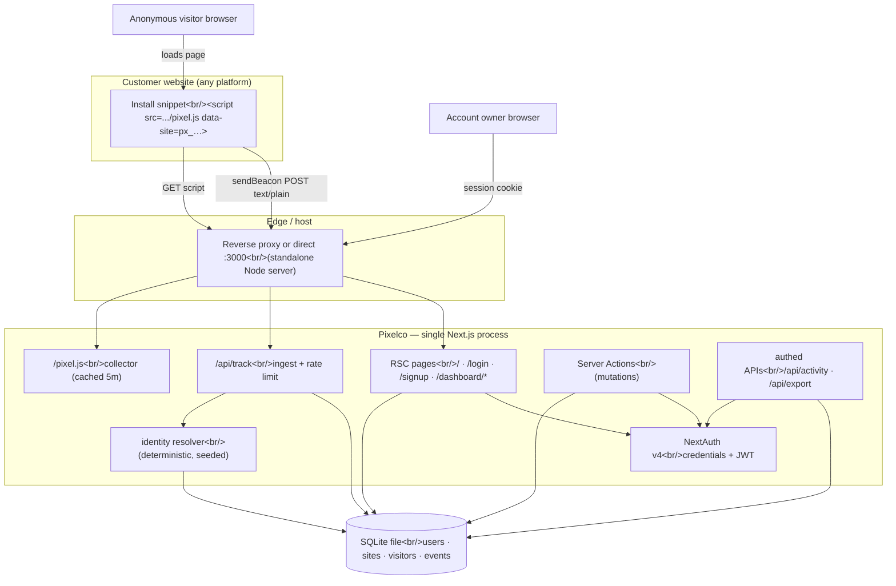
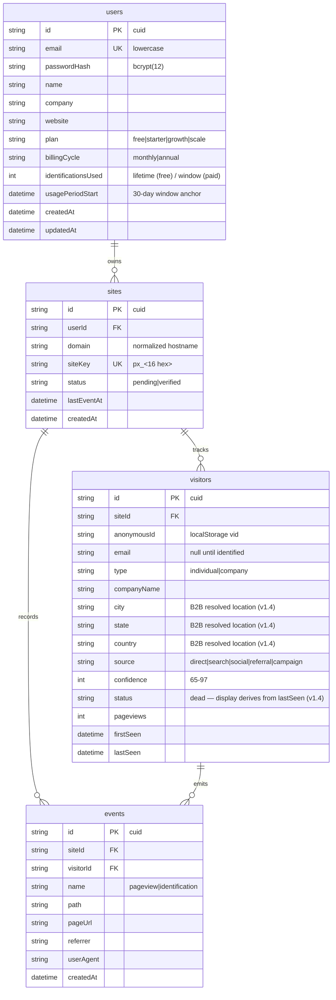

# Pixelco — Master Project Architecture Document (PAD) v1.6

**Classification:** Internal Engineering Reference
**Status:** DEFINITIVE, PRODUCTION-LOCKED BLUEPRINT
**Companion Document:** README.md (user-facing setup) · AGENTS.md (agent quick-start) · CLAUDE.md (working agreements)
**Last Updated:** 2026-09-16
**Audience:** Senior Engineers, Tech Leads, DevOps, and Onboarding Engineers
**Rule:** Every architectural decision in this document traces to a specific rationale.
           Nothing is here "because it's popular."

---

#### Revision Block (Tracked Changes)

- **v1.6** `[SYN]` Round-7 parity refinement (plan:
  `docs/plans/2026-09-16-round7-parity-refinement.md`; evidence in
  `research/round7-audit/`): a fresh live re-audit (logged-in DOM
  extraction, computed styles, pairwise VLM diffs, OpenCV logo tracing)
  closed the residual gaps. Functional: the activity feed's pageview rows
  show the **truncated anonymous id** (12 chars + "...") — the previous
  seam joined the visitor's current email onto every event, rewriting
  pageview history after identification (R7-F1, RED→GREEN in
  `tests/activity-query.test.ts`). Visual: the trend chart gained the
  live's hand-built centered legend (bg-primary / bg-neon-green dots —
  round 6's "no legend" finding had missed it because it is not a
  Recharts legend) and gradient fills on both series; `--primary`
  realigned to the measured app bundle value #FFC105 (marketing tree
  re-scopes to #FFBF00); every text input moved to the live's h-10; the
  auth forms use space-y-2 fields, my-6 divider, sibling footer links,
  #F6F7F9 OAuth tint and the live's diffuse glow-primary; the logo mark
  is now the OpenCV-traced silhouette of the live asset (54-anchor
  Catmull-Rom path, 135° #FFD119→#FFB800 gradient); marketing: the
  "By Ai Viral" Dancing Script wordmark subtext (captured but missed in
  rounds 5–6), photo-avatar trust row with stacked stars, pill trust
  points, plain-text testimonials, live process-step chrome, the live's
  six-item benefits list with a real product screenshot, gradient-text
  H2 highlights, live pricing CTA variants (marketing enterprise banner
  removed — dashboard-only on the live), card-style FAQ items, the
  max-w-4xl gradient CTA card, audience icon corrections, the live's
  ten-name logo marquee and globe/external-link/mail footer socials;
  HSTS added to the baseline headers (the live sends it).
- `[SR]` v1.6 evidence: `npm run verify` green (lint, typecheck, **187
  tests across 25 files**, build 35 routes); browser DOM pass on every
  changed surface with zero console errors; VLM re-diffs at CLOSE MATCH
  for overview/activity/login with residuals verified as data or
  animation-state differences.
- **v1.5** `[SYN]` Round-6 visual & functional parity (plan:
  `docs/plans/2026-09-16-round6-visual-parity.md`; evidence in
  `research/round6-audit/`): a fresh logged-in live audit (DOM ground
  truth for all 7 dashboard surfaces, auth pages and the marketing
  landing, plus pairwise VLM diffs) closed the remaining gaps. Critical:
  the visitors topbar subtitle is now **server-rendered** — the
  `PAGE_META` template leaked literal `{individuals}` braces on first
  paint until the client store published counts (R6-C1); the layout now
  fetches `getVisitorSegmentCounts` (new analytics seam) and passes the
  counts into the Topbar. Functional: Top Pages shows the **identified
  count** per page like live (second SQL groupBy over identification
  events, R6-H1); `/forgot-password` exists as a real anti-enumeration
  reset-request page — the live links to it but 404s, and this clone
  deliberately does not replicate a dead link (R6-H4, honest divergence
  documented in §11); the live's non-pluralizing subtitle format
  ("1 companies") is matched exactly. Visual: visitors pill tabs with
  count badges + sort-glyph headers + square checkboxes + "· N visits"
  company sub-lines; uppercase KPI labels + hover elevation + the live
  Recent-table chrome on Overview; one-card Activity with the gradient
  Identified badge and two-group row meta; Plus-icon domain CTA inside a
  card-wrapped domain list; the pricing banner card, six static FAQ
  question cards, and the live's hardcoded annual price table
  ($65/$199/$639 on the dashboard, floored $63/$199/$639 on marketing —
  both surfaces single-sourced in `plans.ts`, R6-H7); the dark
  gradient-hero auth canvas with breathing orbs and h-16 logos; the
  marketing announcement bar, hero feed widget (stat strip + rotating
  rows + Match Rate footer) and pricing-card rework; new brand utilities
  (`.gradient-hero`, `.gradient-hero-light`, `.gradient-cta`,
  `.shadow-elevated`, `--color-hot-pink`, `pulse-glow`).
- `[SR]` v1.5 evidence: `npm run verify` green (lint, typecheck, **186
  tests across 25 files**, build 35 routes); browser DOM pass on every
  changed surface with zero console errors; pairwise VLM re-diffs at
  CLOSE MATCH for 7/8 surfaces (the visitors pair's residual flags
  verified as data differences + one VLM icon misread — byte-identical
  `lucide-eye` path).
- **v1.4** `[SYN]` Round-5 parity hardening (plan:
  `docs/plans/2026-09-15-round5-parity-hardening.md`): a fresh live audit
  (logged-in DOM extraction of all 7 dashboard surfaces + auth + marketing,
  controlled beacon experiments, pairwise VLM diffs; evidence in
  `research/round5-audit/`) closed the remaining functional and visual gaps.
  Functional: the emitted install snippet now **executes** (R5-C1 — it
  previously passed `'document'` as a string and threw the moment a customer
  pasted it; pinned by a new `node:vm` execution test); visitor status is
  honest (derived from the live collector's 30-minute session window, not a
  dead schema default); the visitors table lists **identified visitors
  only** with B2B company rows showing company name, resolved location
  (`visitors.city/state/country` added) and an amber Company badge; the
  domains row counts identified vs total visitors. Visual: Inter body +
  Space Grotesk display (app) and DM Sans (marketing) replace Geist; brand
  utilities (`.gradient-primary`, `.glow-primary`, `.text-gradient-primary`,
  `.text-gradient-hero`, neon-green tokens) added to `globals.css`; sidebar,
  topbar (static gradient avatar, no menu), Install (How It Works + Site Key
  cards, neon banners), Settings (in-page H1, tinted inputs), Domains,
  Pricing (plain summary row, inline POPULAR pill, quota block), Visitors,
  Activity, Overview and auth pages realigned to the live DOM.
- `[SR]` v1.4 evidence: `npm run verify` green (lint, typecheck, 175 tests
  across 25 files + 2 opt-in smoke tests, build 34 routes); per-task
  targeted Vitest runs recorded in the round-5 plan execution log.
- **v1.3** `[SYN]` Round-4 dashboard parity & production readiness (plan:
  `docs/plans/2026-09-15-round4-dashboard-parity.md`): the dashboard chrome
  and all seven pages were re-audited against the live `app.pixelco.io`
  (logged-in DOM extraction + pairwise VLM screenshot diffs) and realigned —
  live lucide icon set, Title Case section headers, exact active-item tokens
  (#F8F6F2 / #CC9900), 4-lobe gradient logo, h-14 topbar without a page
  icon, honest hot-pink bell dot backed by a 7-day identification query,
  collapsible desktop icon rail (ADR-10), Visitors counts in the topbar
  subtitle + topbar Export All, plain-text tabs, teal confidence bars,
  purple/teal chart palette without a legend, light snippet block, live
  pricing-card structure (switch toggle, POPULAR-on-Growth, checklist below
  CTA), live-matching settings form (name no longer editable/clobbered).
  Production readiness: `npm run build:standalone` (fixes the missing
  `.next/static` copy that broke hydration on standalone deploys — passwords
  leaked into URLs via native form GET), opt-in standalone smoke test,
  multi-stage `Dockerfile` with `db push` entrypoint + HEALTHCHECK, GitHub
  Actions CI, and `getTopPages` aggregated in SQL `groupBy`.
- `[SR]` v1.3 evidence: `npm run verify` green (lint, typecheck, 157 tests
  across 24 files + 2 opt-in smoke tests, build 34 routes);
  `build:standalone` + chunk-200 smoke; browser E2E (login without
  credentials in the URL, sidebar rail toggle + localStorage persistence,
  bell dot, mobile 390px, zero console errors); VLM re-diff verdicts at
  close-match level with remaining flags settled by live DOM extraction.
- **v1.2** `[SYN]` Round-3 parity & polish (plan:
  `docs/plans/2026-09-15-round3-parity-polish.md`): the marketing
  surface now matches the original's full page set — `(marketing)` route
  group with shared chrome; `/about`, `/blog` + 10 SSG article pages,
  `/docs`, and the four legal pages (`/privacy`, `/terms`, `/gdpr`,
  `/ccpa`); footer/nav links are a single integrity-tested data module
  (ADR-009); `robots.txt` + `sitemap.xml` metadata routes and brand
  favicon shipped; `metadataBase` derives from `NEXTAUTH_URL`; baseline
  security headers in `next.config.ts`; `deepmerge-ts` advisory cleared
  via npm `overrides`; Zod 4 modernization completed (`z.email()`,
  `z.flattenError()` — no casts).
- `[SR]` v1.2 evidence: `npm run verify` green (lint, typecheck,
  125/125 tests across 20 files, build with 34 routes incl. SSG blog);
  `bun audit` clean; standalone smoke + security-header check.
- **v1.1** `[SYN]` Realigned with the post-remediation codebase (21 commits
  past `78f8342`): Vitest suite installed (§8), quota
  consumption centralized and made atomic in `src/lib/quota.ts` (ADR-008,
  §4.3), paid-plan overage accounting, hostname-gated ingest, per-IP signup
  throttle, session revocation on account deletion, visitors/activity
  pagination, per-domain install snippets, `_count` domain stats,
  `events.visitorId` index. §6 STRIDE and §11 known-issues refreshed.
- `[SR]` v1.1 evidence: `npm run verify` green (lint → typecheck → test →
  build), including the 110-concurrent-consumption quota Prove-It test.
- v1.0 `[SYN]` Initial blueprint generated from the as-built codebase (71 TS
  files, ~6,950 source lines). All sections verified against the repository
  state at commit `7d06bae` (main).
- v1.0 `[SR]` Verification evidence recorded: ESLint clean, `tsc --noEmit`
  clean, `next build` green (17 routes), standalone production server
  smoke-tested, browser E2E flows exercised (sign-up, login, domain add,
  beacon ingest, identification, plan switch, profile persistence, CSV
  export).
- v1.0 `[SAN]` Scope honesty pass: simulated subsystems (identity resolution,
  billing) and known gaps (per-instance rate limiting) are labelled as such
  in §1, §7, §8, §11.

---

## Table of Contents

1. [System Overview & Decisions](#1-system-overview--decisions)
2. [High-Level System Topology](#2-high-level-system-topology)
3. [Application Architecture](#3-application-architecture)
4. [Data Architecture](#4-data-architecture)
5. [Design System Reference](#5-design-system-reference)
6. [Security Architecture](#6-security-architecture)
7. [Worker / Background Service Architecture](#7-worker--background-service-architecture)
8. [Testing Strategy](#8-testing-strategy)
9. [Build & Deployment](#9-build--deployment)
10. [Developer Handbook](#10-developer-handbook)
11. [Known Issues & Outstanding Tasks](#11-known-issues--outstanding-tasks)
12. [Key Files Reference](#12-key-files-reference)
13. [Glossary](#13-glossary)

---

## 1. System Overview & Decisions

### 1.1 Document Metadata & Purpose

Pixelco is a cookieless **visitor email identification SaaS** built as a
single Next.js application. It is a full-stack clone of the commercial
pixelco.io product: marketing site, credential auth, analytics dashboard,
tracking pixel, and identity-resolution pipeline. This PAD is the definitive
engineering reference for onboarding, debugging, and extension. Read it
top-down; §3 (layer model) and §6 (security rules) are the sections most
likely to be violated by well-meaning changes.

**Honest scope statement.** Two subsystems are deliberate simulations of
capabilities that cannot be cloned from the commercial product:

- **Identity resolution** (§3.3, ADR-005): the proprietary identity graph is
  replaced by a deterministic seeded resolver with the same interface and the
  same advertised ~20% match rate.
- **Billing** (ADR-006): plan switching updates entitlements directly; no
  payment processor is integrated.

Everything else — ingest, session stitching, domain verification, quota
accounting, analytics, exports, auth — is a real working pipeline.

### 1.2 Technology Stack Summary

| Layer | Technology | Version | Key Rationale |
|-------|------------|---------|---------------|
| Web framework | Next.js (App Router, Turbopack) | 16.x | RSC-by-default colocates data fetching with rendering; route handlers for the collector; standalone output for self-hosting |
| UI runtime | React / React DOM | 19.x | Required by Next 16; `useActionState` drives form pending states |
| Language | TypeScript (strict) | 5.9.x | `any` is an ESLint error; strictness is a release gate |
| Styling | Tailwind CSS (CSS-first) | 4.x | No config file; tokens in `@theme inline`; matches the shadcn/ui v4 toolchain |
| UI primitives | shadcn/ui (New York) + Radix | radix 1.x | Accessible composable primitives; source-owned, no runtime lock-in |
| Charts | Recharts | 2.x | Declarative SVG charts; area chart for the 14-day trend |
| ORM | Prisma | 6.x | Type-safe queries; push-based schema sync fits the single-DB design |
| Database | SQLite (Postgres-ready) | file-based | Zero-config self-hosting; schema uses portable types (see ADR-003) |
| Auth | NextAuth v4 (credentials + JWT) | 4.24.x | Email/password without OAuth provider dependencies; stateless sessions (ADR-004) |
| Password hashing | bcryptjs | 3.x | Pure-JS bcrypt; 12 rounds |
| Validation | Zod | 4.x | Single validation dialect at every boundary (actions + ingest) |
| Test runner | Vitest | 3.x | Node env, SQLite-backed integration tests, `node:vm` collector tests (§8) |
| Icons | lucide-react | 0.x | Consistent outline icon set |
| Dev tooling | ESLint 9 flat, tsx | 9.x / 4.x | Flat config with React Compiler rules; tsx runs the Prisma seed |
| Runtime | Node.js | ≥ 20 | Next 16 requirement |

### 1.3 Architecture Decision Records

**ADR-001: Next.js 16 App Router as the single application framework**

- **Context:** The product needs a marketing site, an authenticated
  dashboard, and two public HTTP endpoints (collector script + beacon
  ingestion). Operating three deployments (static site + API + SPA) would
  triple infrastructure for a self-hostable product.
- **Decision:** One Next.js 16 App Router application. RSC pages render the
  marketing site and dashboard; route handlers serve `/pixel.js` and
  `/api/track`; Server Actions handle all mutations.
- **Rationale:** Colocation of rendering and data access removes a client
  data-fetching layer entirely; `output: "standalone"` yields a single
  deployable Node server; auth cookies work uniformly across pages and APIs.
- **Consequences:** (+) One process, one DB, one deploy target. (−) Server
  Components' constraints (no hooks in RSC) discipline component design;
  the team must respect the client-island boundary.
- **Alternatives Rejected:** Separate marketing site + SPA dashboard (extra
  infrastructure, duplicated auth); Remix/Vite (no equivalent
  server-action + route-handler unification at the time of writing).

**ADR-002: Server Actions as the only mutation path, behind an ActionResult envelope**

- **Context:** Dashboard mutations (add domain, delete account, change plan,
  update profile) need session checks, validation, and revalidation. REST
  endpoints would require a parallel client fetch layer and error contract.
- **Decision:** All UI mutations are `'use server'` actions in `src/actions/*`
  returning `ActionResult<T> = { ok: true; data } | { ok: false; error: {
  code, message, fieldErrors? } }`. Route handlers are a fixed whitelist:
  `api/track`, `api/activity`, `api/export`, `api/health`,
  `api/auth/[...nextauth]`, `pixel.js`.
- **Rationale:** One error contract for every form; validation via one Zod
  dialect; revalidation (`revalidatePath`) scoped to the narrowest route.
  Pattern adopted from the scandihaven architecture where it proved itself
  across a production monorepo.
- **Consequences:** (+) No client fetch layer for writes; typed errors
  everywhere. (−) NextAuth v4's client-only `signIn` forced the sign-up
  flow into a submit-handler sequence (action → client signIn → redirect),
  which is documented in the component.
- **Alternatives Rejected:** tRPC (extra dependency, duplicate of server
  actions for this scale); raw route handlers per mutation (breaks the
  single error contract).

**ADR-003: SQLite as the default database behind Prisma, Postgres-ready schema**

- **Context:** The product must be self-hostable by non-operators in under
  five minutes, yet credible at SaaS scale.
- **Decision:** `DATABASE_URL` defaults to a SQLite file; the Prisma schema
  uses portable scalar types (String ids with cuid, DateTime, Int) and no
  SQLite-specific column types, so switching `provider` to `postgresql`
  plus a URL is the entire migration path.
- **Rationale:** Zero-config local/self-host runs (single file, no daemon);
  Prisma's client API is identical across providers. Identified hotspots
  for Postgres (window-reset SQL, aggregate groupBy on date buckets) are
  consciously implemented as bounded in-JS aggregation over ≤14-day windows
  (see §4.3).
- **Consequences:** (+) `npm install && npm run db:push` is a working
  deployment. (−) Single-writer concurrency limits ingest throughput;
  in-memory rate limiting is per-instance (§11); analytics aggregation is
  application-side rather than SQL-side.
- **Alternatives Rejected:** Postgres-only (kills the five-minute self-host);
  PlanetScale/Neon serverless drivers (external dependency contradicts
  self-hosting).

**ADR-004: NextAuth v4 with credentials provider and JWT strategy**

- **Context:** The product's identity model is email/password with no
  external identity requirements in the clone; the reference product's
  OAuth buttons are marketing surface.
- **Decision:** NextAuth 4.24 with a Credentials provider (bcrypt compare in
  `authorize`), JWT sessions (30-day expiry), session augmentation in
  `src/types/next-auth.d.ts` so `session.user.id` is the database key. OAuth
  buttons render disabled with explanatory titles.
- **Rationale:** v4 is the stable line compatible with Next 16 App Router
  without the v5 beta churn; JWT strategy avoids session-table plumbing for
  a credentials-only flow; `getServerSession` works in RSC and actions.
- **Consequences:** (+) No OAuth configuration surface; stateless session
  verification. (−) Sessions cannot be revoked server-side before expiry
  (acceptable: single-product accounts, 30-day window); v4's client-only
  `signIn`/`signOut` shape the auth flows (§3.3).
- **Alternatives Rejected:** Better-Auth (cleaner model but adds a runtime
  dependency for a single credentials flow); v5 beta (interface churn);
  hand-rolled JWT auth (reimplements CSRF and cookie hardening — never
  hand-roll auth).

**ADR-005: Deterministic seeded identity-resolution engine**

- **Context:** The commercial product resolves visitors through a
  proprietary identity graph — the one component that cannot be cloned
  functionally. The clone still needs a working end-to-end pipeline:
  decision points, quota accounting, event ledger, dashboard surfacing.
- **Decision:** `src/lib/identification.ts` resolves identity with
  `sha256('pixelco-resolver' | siteKey | anonymousId)` seeded into a
  mulberry32 PRNG: ~20% of visitors resolve (matching the advertised match
  rate), ~25% of resolutions are B2B (work email + company name), the rest
  B2C (personal email), confidence 65–97. Decisions are stable per visitor
  across restarts.
- **Rationale:** Same interface and observable statistics as the real
  subsystem; deterministic so demos, seeds, and (future) tests are
  reproducible; quota gating exercises the real accounting path.
- **Consequences:** (+) The full product pipeline is demonstrable and
  honest about being simulated (labelled in UI copy and docs). (−) Changing
  name lists, PRNG, or thresholds reshapes historical decisions — such
  changes are data-affecting migrations and must be treated as such.
- **Alternatives Rejected:** Random (non-seeded) resolution (non-reproducible
  demos); a pluggable "real provider" interface with no implementation
  (speculative abstraction); calling a third-party enrichment API (external
  dependency + cost, contradicts the clone's self-contained scope).

**ADR-006: Simulated billing — plan entitlements without payment processing**

- **Context:** The dashboard's Pricing & Plan page must switch plans
  (Free/Starter/Growth/Scale, monthly/annual with 20% annual discount) for
  the quota system to be exercisable, but integrating Stripe in a
  self-hosted clone without keys would produce a permanently broken flow.
- **Decision:** `changePlanAction` updates `user.plan`, `billingCycle`,
  resets `usagePeriodStart` (and the used counter when the plan changes),
  and the UI marks this path as simulated. Prices are defined as integer
  cents in `src/lib/plans.ts` — the single source of truth for quotas,
  limits, overage prices, and display.
- **Rationale:** Integer-cent money and one catalogue keep a future Stripe
  integration additive; nothing on the page lies to the user about payment.
- **Consequences:** (+) Full entitlement lifecycle works today. (−) A real
  integration must add webhook idempotency and server-side price
  re-derivation before production (§11).
- **Alternatives Rejected:** Stripe with placeholder keys (broken flow);
  removing the pricing page (the quota system is core to the clone).

**ADR-007: Cookieless collector with text/plain beacons**

- **Context:** The pixel runs on customer sites cross-origin; cookie
  restrictions (ITP, third-party cookie deprecation) and CORS preflight
  latency both threaten reliability of the ingest path.
- **Decision:** `/pixel.js` generates a per-site visitor id stored in
  localStorage (`_px_vid_<siteKey>`), and ships beacons via
  `navigator.sendBeacon` with a `text/plain;charset=UTF-8` Blob body — a
  CORS-safelisted content type, so no preflight. The server parses the text
  body as JSON. Visitor stitching keys on `(siteId, anonymousId)` in the
  payload, never on cookies.
- **Rationale:** sendBeacon survives page unload; text/plain avoids an
  OPTIONS round-trip on every pageview; localStorage first-party storage
  needs no consent banner under the product's cookieless positioning.
- **Consequences:** (+) Zero-cookie ingest; one POST per pageview. (−)
  Responses are unreadable from sendBeacon (acceptable — the collector is
  fire-and-forget); localStorage is unavailable in some privacy modes, in
  which case the visitor falls back to a per-pageview id (documented
  degradation).
- **Alternatives Rejected:** `application/json` fetch beacons (preflight on
  every pageview); first-party cookies (contradicts the cookieless claim);
  1×1 GIF GET tracking (URL length limits, no SPA route events).

**ADR-008: Centralized atomic quota consumption with paid-plan overage**

- **Context:** v1.0 incremented `identificationsUsed` inside the ingest
  flow with a read-then-write pattern. Under concurrent beacons the counter
  could overshoot the plan limit, the monthly reset was display-only
  (computed in `getUsage`, never persisted), and plan switches zeroed the
  counter — three defects sharing one root cause: no single owner of quota
  state.
- **Decision:** All quota mutations live in `src/lib/quota.ts`.
  `consumeIdentification` is one conditional `updateMany`
  (`WHERE id = ? AND identificationsUsed < limit`, `increment: 1`) for
  free/lifetime plans — the database arbitrates the race, so exactly
  `limit` consumptions can ever succeed. Paid monthly plans increment
  unconditionally and keep counting **overage** (`used − limit`, priced at
  the plan's per-identification rate, displayed in the UI, never charged —
  billing is simulated). `resetMonthlyWindowIfNeeded` persists the 30-day
  reset with a staleness-guarded `updateMany` so concurrent readers reset
  exactly once.
- **Rationale:** A conditional UPDATE is atomic in every backend (SQLite,
  Postgres) without transactions or advisory locks; centralizing the write
  path makes the invariant auditable in one file and testable with a
  Prove-It (110 concurrent consumptions → exactly `limit` succeed).
- **Consequences:** (+) No overshoot, ever; usage survives plan switches;
  overage is honest accounting. (−) The free-plan rejection path needs a
  pre-check read for the response shape (accepted: worst case the visitor
  is not identified, which is the quota's purpose).
- **Alternatives Rejected:** Prisma interactive transactions (single-writer
  SQLite makes them redundant here); optimistic locking with version
  columns (more schema for the same guarantee); Redis counters (introduces
  shared-state infrastructure contradicted by ADR-003's self-hosting
  posture).

**ADR-009: Static marketing content as data-driven RSC pages**

- **Context:** The original pixelco.io serves a full marketing surface —
  landing, about, a ten-post blog, docs, and four legal pages — cloned
  here for functional parity. The content changes rarely, must be
  SEO-crawlable, and must stay consistent with the site's navigation.
- **Decision:** Marketing pages are static React Server Components in a
  `(marketing)` route group whose layout provides the shared chrome.
  Repeated content lives in pure, unit-tested data modules:
  `src/lib/marketing-links.ts` (nav + footer map — every link must target
  a real route, with exactly one documented parity exception: Careers is
  dead on the original too) and `src/data/blog-posts.ts` (the catalogue
  driving the blog index, `generateStaticParams` article pages, and
  `sitemap.ts`). `robots.ts` / `sitemap.ts` / `icon.svg` use the Next
  Metadata Routes API.
- **Rationale:** Data modules give the link graph and content a single
  source of truth that tests can hold honest (route existence, slug
  uniqueness, date ordering) without a CMS, database, or build-time
  pipeline; RSC keeps the pages zero-JS and statically prerendered.
- **Consequences:** (+) Adding a blog post or footer link is a one-file
  edit picked up everywhere; the sitemap can never drift from the actual
  page set. (−) Content edits are code edits — there is no editor
  interface (acceptable for a clone; a CMS integration would be a new
  ADR).
- **Alternatives Rejected:** MDX per post (file explosion for ten short
  posts, no stronger guarantees than the typed catalogue); a `posts` DB
  table (adds a query per page and seed complexity for content that is
  not user data); hard-coded JSX in every page (links drift, no testable
  seam).

**ADR-010: Dashboard chrome as a data seam + collapsible icon rail**

- **Context:** Round-4 auditing against the logged-in live app showed the
  chrome (sidebar sections, icons, per-page titles/subtitles, bell state,
  sidebar geometry) drifting from the original across many components, and
  the live app collapses its desktop sidebar into a ~64px icon rail via an
  always-visible "Toggle Sidebar" button.
- **Decision:** Chrome metadata lives in one pure, unit-tested module —
  `src/lib/dashboard-nav.ts` exports `NAV_SECTIONS` (routes, labels, lucide
  icon names matching the live set exactly), `PAGE_META` (verbatim
  title/subtitle per route, incl. the Visitors counts template and the
  Settings trailing period), `visitorsSubtitle`, `hasUnreadActivity` (the
  honest 7-day rule behind the bell dot), and the `nextSidebarState`
  reducer + storage key. `sidebar-nav.tsx` / `topbar.tsx` consume it; a
  tiny client store (`chrome-store.ts`, `useSyncExternalStore`) shares the
  rail state between the topbar toggle and `SidebarShell` (persisted to
  `localStorage`, rehydrated post-mount to avoid SSR mismatch) and carries
  the visitors segment counts from the page to the topbar subtitle.
- **Rationale:** Chrome drift is a data problem, not a styling problem —
  holding the exact strings/icon names/order in one testable module keeps
  parity auditable (16 tests) instead of scattered across JSX; the store is
  the minimal client-side bridge for state that must cross the
  layout/page boundary without prop drilling through the server tree.
- **Consequences:** (+) Parity regressions fail a unit test, not a visual
  review; the collapse feature works on desktop with zero server changes.
  (−) Two source files instead of one for the topbar; the visitors
  subtitle arrives one client tick after first paint on hard load (the
  live SPA behaves identically).
- **Alternatives Rejected:** Route groups with per-page topbars (duplicates
  chrome, breaks the single-layout model); URL-encoded sidebar state
  (pollutes every link); a context provider in the layout (server
  component cannot hold client state; would force a client layout).

---

## 2. High-Level System Topology



**Runtime characteristics.** One Node process (standalone build) serves
everything; the database is a single SQLite file accessed through Prisma's
connection pool (single writer). The ingest path (`/api/track`) is
optimised for accept-then-persist: no redirects, 204 responses, in-memory
fixed-window rate limiting at 120 events/minute/site-key. The dashboard
read path is session-scoped and `force-dynamic`. Scaling today is vertical
(one bigger box); horizontal scale requires Postgres + shared rate-limit
storage (§11).

---

## 3. Application Architecture

### 3.1 The Layer Model

```
Layer 0: Route handlers — public protocol surfaces (collector script,
         beacon ingest, auth, health) and authed JSON APIs. Rule: they
         validate input and never contain business rules beyond their
         single responsibility.
Layer 1: RSC pages — session-scoped rendering; fetch via analytics lib;
         never fetch in client components except the activity poll.
         Rule: `force-dynamic` on session pages; UI state stays client-side.
Layer 2: Client islands — 'use client' components under src/components/*
         for interactivity (filters, forms, polling, copy). Rule: no
         direct DB or secrets access; server communication only through
         actions and the whitelisted APIs.
Layer 3: Server Actions — the ONLY write path. Rule: session re-check,
         Zod parse, ActionResult envelope, narrowest revalidatePath.
Layer 4: Domain libs — src/lib/* (pure logic + server-only data access).
         Rule: no React imports; dependencies point downward only.

Golden Rule: requests flow L0/L1 → L3 → L4 → DB and render flows back up.
A client island never bypasses L3 to write, and a page never reaches past
L4. Cycles between layers are build-breaking by convention — enforce by
review.
```

### 3.2 Annotated Directory Structure

```
pixel-identifier/
├── src/
│   ├── app/
│   │   ├── (marketing)/              ← Route group: shared chrome (layout.tsx)
│   │   │   ├── page.tsx              ← Marketing landing (13 sections)
│   │   │   ├── about/ · docs/        ← Content pages (RSC)
│   │   │   ├── blog/ + blog/[slug]/  ← Blog index + 10 SSG article pages
│   │   │   └── privacy/ · terms/ · gdpr/ · ccpa/ ← Legal pages (LegalPage prose)
│   │   ├── layout.tsx                ← Root layout: fonts, metadata, metadataBase, Toaster
│   │   ├── globals.css               ← Tailwind 4 @theme tokens (brand palette)
│   │   ├── robots.ts · sitemap.ts · icon.svg ← SEO metadata routes + favicon
│   │   ├── login/ · signup/          ← Auth pages (dark shell + forms)
│   │   ├── dashboard/
│   │   │   ├── layout.tsx              ← Session gate (UX) + sidebar/topbar chrome
│   │   │   ├── page.tsx                ← Overview: KPIs, trend, top pages, recent
│   │   │   ├── visitors/page.tsx       ← Visitor table + detail sheet (client)
│   │   │   ├── activity/page.tsx       ← Live feed (5s poll)
│   │   │   ├── install/page.tsx        ← Snippet + status + platform guides
│   │   │   ├── domains/page.tsx        ← Domain registration + limits
│   │   │   ├── pricing/page.tsx        ← Plan switching (simulated billing)
│   │   │   └── settings/page.tsx       ← Profile + danger zone
│   │   ├── api/
│   │   │   ├── track/route.ts          ← Beacon ingest (204/429, CORS *)
│   │   │   ├── activity/route.ts       ← Authed: latest 60 events JSON
│   │   │   ├── export/route.ts         ← Authed: CSV download
│   │   │   ├── health/route.ts         ← SELECT 1 probe
│   │   │   └── auth/[...nextauth]/route.ts
│   │   └── pixel.js/route.ts           ← Collector script (folder named pixel.js)
│   ├── actions/
│   │   ├── auth.ts                     ← signUpAction (account creation only)
│   │   ├── domains.ts                  ← add/delete/list domain actions
│   │   └── settings.ts                 ← profile, plan change, account deletion
│   ├── components/
│   │   ├── marketing/                  ← Landing sections (server + 2 client)
│   │   ├── dashboard/                  ← Sidebar, topbar, tables, feeds, panels
│   │   ├── auth/                       ← Shell + login/signup forms (client)
│   │   ├── ui/                         ← shadcn primitives (15 components in use)
│   │   └── pixelco-logo.tsx            ← Inline SVG brand mark
│   ├── hooks/                          ← use-toast (shadcn toast state)
│   ├── data/
│   │   └── blog-posts.ts              ← Blog catalogue (ADR-009: index/SSG/sitemap source)
│   ├── lib/
│   │   ├── db.ts                       ← Prisma client singleton
│   │   ├── auth.ts                     ← NextAuth options (credentials + JWT)
│   │   ├── analytics.ts                ← server-only: stats, trend, top pages
│   │   ├── identification.ts           ← Deterministic resolver + source rules
│   │   ├── plans.ts                    ← Plan catalogue (int cents, quotas)
│   │   ├── validation.ts               ← Zod schemas + ActionResult + fieldErrorsOf
│   │   ├── marketing-links.ts          ← Nav + footer link map (integrity-tested)
│   │   ├── site-url.ts                 ← Canonical origin (NEXTAUTH_URL)
│   │   ├── snippet.ts                  ← Snippet builder + collector URL
│   │   └── format.ts                   ← relative time, initials, CSV cells
│   └── types/next-auth.d.ts            ← Session.user.id augmentation
├── prisma/
│   ├── schema.prisma                   ← users · sites · visitors · events
│   └── seed.ts                         ← Idempotent demo seed (guards non-local DBs)
├── docs/                               ← SSH push runbook + reference materials
└── AGENTS.md · CLAUDE.md · README.md · Project_Architecture_Document.md
```

### 3.3 Critical Code Patterns

**Pattern 1 — Ingest endpoint: accept, validate, persist, stay silent**

```typescript
// src/app/api/track/route.ts (excerpt)
export async function POST(request: NextRequest): Promise<NextResponse> {
  let raw: string
  try {
    raw = await request.text()           // text/plain body (see ADR-007)
  } catch {
    return new NextResponse(null, { status: 204, headers: CORS_HEADERS })
  }

  let json: unknown
  try {
    json = JSON.parse(raw)
  } catch {
    return new NextResponse(null, { status: 204, headers: CORS_HEADERS })
  }

  const parsed = trackPayloadSchema.safeParse(json)
  if (!parsed.success) {
    // Malformed beacons must never break or reveal anything — 204, not 400:
    // the collector is fire-and-forget and the endpoint is public.
    return new NextResponse(null, { status: 204, headers: CORS_HEADERS })
  }
  // ...
  const site = await db.site.findUnique({ where: { siteKey: payload.k }, include: { user: { … } } })
  if (!site) {
    // Unknown key: 204 rather than 404 so probes cannot enumerate site keys.
    return new NextResponse(null, { status: 204, headers: CORS_HEADERS })
  }
```

*Why this pattern:* every early exit returns the same shape so the customer's
page never observes errors; enumeration is impossible; validation happens
before any DB touch. The full handler then verifies the domain by hostname,
upserts the visitor, appends the pageview event, and runs quota-gated
resolution — each step a single bounded write.

**Pattern 2 — ActionResult envelope for every mutation**

```typescript
// src/lib/validation.ts
export type ActionResult<T> =
  | { ok: true; data: T }
  | { ok: false; error: { code: string; message: string; fieldErrors?: Record<string, string[]> } }

// src/actions/domains.ts (excerpt)
const domain = normalizeDomain(parsed.data.domain)
if (!domain) {
  return fail('VALIDATION', 'That does not look like a valid domain.', {
    domain: ['Enter a domain like yoursite.com'],
  })
}
// ownership-scoped delete — cross-tenant deletion impossible:
await db.site.deleteMany({ where: { id: siteId, userId } })
revalidatePath('/dashboard/domains')
```

*Why this pattern:* forms render one typed error surface; Zod field errors
map straight to `fieldErrors`; actions never throw across the boundary.
Ownership predicates (`userId`) ride along every write — the layout's
redirect is UX, this is the real authorization.

**Pattern 3 — Deterministic identity resolution**

```typescript
// src/lib/identification.ts (excerpt)
function seedFrom(...parts: string[]): number {
  const digest = createHash('sha256').update(parts.join('|')).digest()
  return digest.readUInt32BE(0)
}

function mulberry32(seed: number): () => number { /* stable PRNG */ }

export function resolveIdentity(anonymousId: string, siteKey: string): ResolvedIdentity | null {
  const seed = seedFrom('pixelco-resolver', siteKey, anonymousId)
  const rand = mulberry32(seed)
  if (Math.floor(rand() * 100) >= MATCH_RATE_PERCENT) return null   // ~80% stay anonymous
  // … derive names/provider/company/confidence from further rand() draws
}
```

*Why this pattern:* identical inputs always produce identical outputs —
across restarts, replicas, and seeds — so analytics, demos, and future tests
are reproducible. The draw order is part of the contract; reordering the
`rand()` calls reshapes history (see ADR-005 consequences).

**Pattern 4 — Client submit-handler auth sequence (NextAuth v4 constraint)**

```tsx
// src/components/auth/signup-form.tsx (excerpt)
async function handleSubmit(event: React.FormEvent<HTMLFormElement>) {
  event.preventDefault()
  const formData = new FormData(event.currentTarget)
  const result = await signUpAction(null, formData)      // 1. server action creates account
  if (!result.ok) { /* render field errors */ return }
  const signInResult = await signIn('credentials', {     // 2. client-only API signs in
    email, password, redirect: false,
  })
  if (signInResult?.error) { router.push('/login?registered=1'); return }
  router.push('/dashboard')                               // 3. enter the app
  router.refresh()                                        // 4. re-render with session
}
```

*Why this pattern:* v4 exposes `signIn` only on the client; doing both steps
in the submit handler (not an effect) keeps state transitions user-driven
and satisfies the React Compiler's `set-state-in-effect` rule. The effect
variant of this flow self-cancelled its redirect in testing — that failure
is why this shape is load-bearing.

**Pattern 5 — Cookieless collector**

```javascript
// src/app/pixel.js/route.ts (served script, excerpt)
var payload = {
  k: siteKey,                              // from data-site attribute
  u: location.href, p: location.pathname + location.search,
  r: document.referrer || '', t: document.title || '',
  v: getVid(),                             // localStorage _px_vid_<siteKey>
  w: window.screen.width, h: window.screen.height
}
navigator.sendBeacon(endpoint, new Blob([JSON.stringify(payload)],
  { type: 'text/plain;charset=UTF-8' }))   // safelisted type → no preflight
// SPA routes: pushState/replaceState/popstate patched → re-send on path change
```

*Why this pattern:* one POST per pageview, survives unload, no OPTIONS
round-trip, zero cookies. The visitor id travels in the payload, so CORS
can be `*` without credentials.

---

## 4. Data Architecture

### 4.1 Database Schema



Uniques and indexes: `sites @@unique([userId, domain])`, `siteKey` unique;
`visitors @@unique([siteId, anonymousId])` + index `(siteId, lastSeen)`;
`events` indexes `(siteId, createdAt)`, `(siteId, name, createdAt)` (trend
chart + identification feed), and `(visitorId)` (added v1.1 — serves the
visitor-activity joins and cascade deletes).

### 4.2 Data Models

Statuses are strings (SQLite has no enums) constrained by application code:
`plan` ∈ `src/lib/plans.ts` (the catalogue is the enum), `site.status` ∈
`{pending, verified}`, `event.name` ∈ `{pageview, identification}`,
`visitor.source` derived by `sourceFromReferrer`. Monetary values exist only
in `plans.ts` (integer cents); no money columns are stored.

### 4.3 Persistence Strategy

- **Client:** Prisma singleton via `globalThis` cache (`src/lib/db.ts`) —
  one pool per process, query logging in dev only.
- **Schema sync:** push-based (`db:push`) — no migration history; the schema
  is young and single-writer, making push pragmatically safe. Moving to
  Postgres in production implies adopting `prisma migrate`.
- **Aggregation:** analytics read minimal fields for ≤14-day windows and
  aggregate in JS (`getTrend`, `getTopPages`) — bounded by window size, so
  complexity is O(events in window) regardless of total table size. Top
  pages scans lifetime pageviews; at very large scales this becomes a
  SQL groupBy (Postgres) — tracked in §11.
- **Quota accounting (ADR-008):** `src/lib/quota.ts` is the only writer of
  `identificationsUsed`. Free/lifetime consumption is a single conditional
  `updateMany` (`used < limit`) — the DB arbitrates concurrency, so the
  limit can never be overshot. Paid monthly plans increment unconditionally
  and count overage at the plan's per-identification rate. The 30-day
  window resets lazily via a staleness-guarded `updateMany` (persisted, not
  display-only) on the first event after expiry — checked in both ingest
  and `getUsage`.

---

## 5. Design System Reference

### 5.1 Typographic System

- **Inter** (`next/font/google`, `--font-inter`) is the app body face;
  **Space Grotesk** (`--font-space-grotesk`, exposed as the `font-display`
  utility via `--font-display`) renders card titles, page H1s, KPI values,
  prices and the sidebar wordmark; **DM Sans** (`--font-dm-sans`) wraps the
  marketing tree. Geist Mono remains the `font-mono` stack for code/paths.
  H1 landing: 4xl→[3.4rem] extrabold tracking-tight with the hero's
  italic gradient span; KPI values: 3xl `font-display font-bold
  tracking-tight` with `tabular-nums`; body: `text-sm` /
  `text-muted-foreground` for secondary. (Fonts aligned to the live app in
  v1.4; Geist retired.)

### 5.2 Color Tokens

| Token | Hex | Usage | Notes |
|-------|-----|-------|-------|
| `--primary` | `#FFC105` | CTAs, active nav, badges, avatar fill | v1.6: measured off the live app bundle (hsl(45 100% 51%)); the marketing tree re-scopes it to `#FFBF00` in its layout wrapper. Black text on yellow stays ≥ 12:1 |
| `--primary-foreground` | `#1C1917` | Text/icons on primary | |
| `--chart-1` | `hsl(262 83% 58%)` | Pageviews series | Purple (v1.4 live palette) |
| `--chart-2` | `hsl(172 66% 50%)` | Identified series, confidence bars | Teal (v1.4 live palette) |
| `--color-neon-green` | `#2BD4BD` | Confidence fills, source badges, install banners, legend dot | v1.4 token; generates `bg-`/`text-`/`border-neon-green` utilities |
| `--color-hot-pink` | `#EC4699` | Bell dot, auth-page orb glow | v1.5 token (R6-M8) |
| `--color-highlight` | `#FFD91A` | Hero Zap icon | v1.6 token (R7-V6, live `--highlight`) |
| `--shadow-card` | amber two-layer elevation | Open FAQ items | v1.6 token (R7-V14, measured off the live's open item) |
| `.gradient-primary` | `135deg #FFC105→#FFB200` | CTAs, FREE badge, avatars, icon chips | v1.4 utility (live class of the same name) |
| `.gradient-hero` | `135deg #0F111A→#2B2312` | Auth canvas (login/signup/forgot) | v1.5 — the live APP bundle's dark variant |
| `.gradient-hero-light` | `135deg #FFAA00→#FFD91A→#F58F00` | Marketing announcement bar, process icon boxes, bottom CTA card | v1.5 — the live MARKETING bundle reuses the name `gradient-hero` in yellow; one bundle needs two names |
| `.gradient-cta` | `135deg #FFAA00→#FFCE0A` | Marketing POPULAR pill, Free/Growth CTAs | v1.5 |
| `.shadow-elevated` | amber elevation | Featured marketing cards | v1.5 |
| `.glow-primary` | `rgba(255,193,5,0.3) 0 0 40px` | Elevated CTAs | v1.6: realigned to the live's diffuse zero-offset glow |
| `.animate-pulse-glow` | 3s opacity breathing | Auth-page blurred orbs | v1.5; disabled under `prefers-reduced-motion` |
| `--background` | `#FFFCF5` | Marketing canvas | Warm off-white |
| `.bg-app` | `#F9FAFB` | Dashboard canvas | Cool gray |
| `--muted-foreground` | `#6B7280` | Secondary text | 4.8:1 on white |
| `--destructive` | red (oklch) | Danger zone, delete | |
| `--border` | `#E7E5DF` | Hairlines | Warm gray |
| `--font-script` | Dancing Script | "By Ai Viral" wordmark subtext | v1.6 (R7-V4); marketing chrome only |

Focus visibility: brand yellow fails contrast for focus rings, so
`.focus-brand` uses `#A16207` (amber-700) 2px outlines — an accessibility
decision, not a styling preference.

### 5.3 Component Primitives

shadcn/ui (New York style) source-owned in `src/components/ui/` — 15
primitives in use (accordion, alert-dialog, badge, button, card, checkbox,
dropdown-menu, input, label, progress, select, sheet, tabs, toast, toaster).
Composites live beside their feature (`components/dashboard/*`), never in
`ui/`. Icons: lucide-react outline style; the brand mark is inline SVG
(`pixelco-logo.tsx`) so it inherits color and needs no asset requests.

### 5.4 Motion / Animation

CSS-only. `feed-in` keyframes (0.45s, `cubic-bezier(0.22,1,0.36,1)`) for the
landing "Live Visitor Feed" rows; `animate-pulse` for the live indicator;
hover transitions ≤200ms. All motion collapses under
`prefers-reduced-motion: reduce` (the `feed-in` rule disables itself).
No JS animation library — Framer Motion was deliberately not added for two
animations.

---

## 6. Security Architecture

### 6.1 Security Rules

| Rule | Enforcement |
|------|-------------|
| All external input validated (Zod) before use | `validation.ts` schemas in every action + ingest; no action reads raw FormData fields beyond schema input |
| No secrets in code or logs | `.env*` gitignored; `.gitignore` rejects `*.key`/`ssh-key.txt`; ESLint `no-console` restricts to warn/error/info |
| Parameterized data access only | Prisma query API exclusively; no `$queryRaw` with interpolation (the single `$queryRaw` in health uses a literal `SELECT 1`) |
| Authorization on every mutation, not just the layout | Each action re-fetches the session and scopes writes by `userId`; `deleteDomainAction` deletes by `{ id, userId }` |
| Password storage | bcrypt, 12 rounds; hashes never leave `authorize` |
| Sessions | Signed JWT (HttpOnly cookie, 30-day); `NEXTAUTH_SECRET` required |
| Beacon endpoint hardening | Site-key lookup returns 204 for unknown keys (anti-enumeration); 120/min fixed-window per key; 204 for malformed payloads; beacons whose page hostname ≠ the registered domain are dropped **before any write** (spoofed-key quota burning is impossible) |
| Response hardening | Baseline headers on every route via `next.config.ts` `headers()`: `X-Content-Type-Options: nosniff`, `X-Frame-Options: SAMEORIGIN`, `Referrer-Policy: strict-origin-when-cross-origin`, `Permissions-Policy: camera=(), microphone=(), geolocation=()`, `Strict-Transport-Security: max-age=31536000; includeSubDomains` (v1.6 — the live sends HSTS on both surfaces). Strict CSP deferred (§11) |
| Signup abuse | Per-IP fixed-window throttle (5 signups / 10 min) in the server action; duplicate-email races resolve to a typed CONFLICT result (never a thrown P2002) |
| Output encoding | React escapes by default; CSV export escapes per RFC 4180 (`csvCell`) + formula-injection guard (`'` prefix on `=+-@`); the snippet generator validates the forwarded host against a hostname grammar and escapes every JS-string interpolation |
| Account deletion | Requires retyped email confirmation; cascades all owned data; the client signs the session out on success (JWT revocation on delete is inherently best-effort with stateless tokens) |

### 6.2 Security Utilities

`normalizeDomain` (hostname-grammar allowlist — defeats path/query/injection
smuggling through the domain field), `sourceFromReferrer` (URL-parsed, never
string-matched raw), rate limiter with stale-bucket sweep (bounds memory),
CSV cell escaper, `initialsForEmail` (display-only derivation).

### 6.3 Authentication & Authorization

Single role (account owner) — no RBAC surface. The dashboard layout
redirect is UX; actions and authed APIs independently verify the session
and derive `userId` server-side. Tenant isolation is enforced by query
predicates (`where: { site: { userId } }`), not by client-supplied IDs.

### 6.4 Threat Model (STRIDE, ingest surface)

| Threat | Vector | Mitigation |
|--------|--------|------------|
| Spoofing | Forged beacons with a stolen site key (public in page source) | Hostname gate: the beacon's page URL (`u`) must resolve to the registered domain before any write; rate limiting bounds abuse; verification is hostname-based |
| Tampering | Malformed/oversized payloads | Zod schema with length caps and minimal keys (`k,u,p,r,v` — legacy keys stripped); silent 204 rejection |
| Repudiation | No ingest audit trail | Events ledger is append-only with timestamps — acceptable |
| Information disclosure | Site-key enumeration; user enumeration at signup | 204s for unknown keys/domains; duplicate-email returns a generic conflict without confirming ownership; signup throttled per IP |
| DoS | Beacon floods | Per-key fixed window (120/min) + response shape that costs nothing; 429 carries `Retry-After: 60`; ingest write failures are contained to a 204 (never a 500); in-memory (per-instance) — see §11 |
| Elevation | Direct mutation of another tenant's resources | Ownership predicates on every write; actions re-check session; `/api/export` scopes `ids` to the session user's visitors |

---

## 7. Worker / Background Service Architecture

**Intentionally absent.** There are no queues, workers, or cron jobs. Rationale:

- Identity resolution runs inline in the ingest request (sub-millisecond,
  deterministic — no external calls), so no async decoupling is needed.
- The Activity Log's "real-time" feed is 5-second client polling of an
  indexed query (`ORDER BY createdAt DESC LIMIT 60`) — at this scale,
  polling is cheaper and operationally simpler than a websocket service.
- Rollups do not exist: analytics aggregate on read over bounded windows
  (§4.3), eliminating the classic aggregator-worker entirely.

If traffic scales past SQLite's single-writer comfort, the first worker to
introduce is an outbox-driven event rollup job (the scandihaven `job` table
pattern) — that migration point is tracked in §11, not implemented
speculatively.

---

## 8. Testing Strategy

### 8.1 Test Distribution

| Category | Files | Tests | Location | Framework |
|----------|-------|-------|----------|-----------|
| Lint (static) | 80+ | — | repo-wide | ESLint 9 + typescript-eslint + React Compiler rules |
| Types (static) | 80+ | — | repo-wide | `tsc --noEmit`, strict |
| Build (integration) | 35 routes | — | `next build` | Next 16 (16 marketing URLs incl. 10 SSG blog posts + 15 dynamic/authed routes — `/forgot-password` added v1.5) |
| Unit (pure libs + data modules) | 9 files | ~66 | `tests/{plans,format,snippet,sites,smoke,marketing-links,blog-posts,blog-slug,dashboard-chrome}.test.ts` | Vitest |
| Behavioural (collector + snippet in `node:vm`) | 2 | 9 | `tests/collector-script.test.ts`, `tests/snippet.test.ts` | Vitest |
| Integration (DB-backed + routes + SEO) | 14 files | ~100 | `tests/*.test.ts` + `db/test.db` | Vitest |
| E2E (browser) | manual + opt-in smoke | — | dev server flows; `PIXELCO_STANDALONE_SMOKE=1` boots the standalone server | browser pass |

The suite totals **187 tests across 25 files** (plus 2 opt-in standalone
smoke tests), runs in the `node`
environment against a throwaway SQLite database (`db/test.db`, recreated
from the schema by `tests/global-setup.ts` on every run), with `TZ=UTC`
pinned and `fileParallelism` disabled (SQLite single-writer). Mock seams for
Next server context (`next/cache`, `next/navigation`, `next/headers`,
`server-only`) live in `tests/setup.ts`.

### 8.2 Test Patterns

- **Red → green discipline:** behavioral changes start with a failing test
  that reproduces the bug or specifies the new behavior; the commit lands
  only when green.
- **Snippet execution (round-5, R5-C1):** the emitted **install snippet** —
  not just the collector — is built, stripped of `<script>` tags, and run
  in `node:vm` against mocked `window`/`document`: it must not throw, must
  create exactly one script element whose `src` is the collector URL and
  whose `data-site` is the site key. This test exists because the previous
  string-pinning assertion was green while the snippet threw on real
  pages — never pin a serialization that has a behavioral contract.
- **Pure-lib units:** plan/money math (integer cents, IEEE-754 robustness,
  `annualTotalCents` rounding), `normalizeDomain`, `csvCell` (RFC 4180 +
  formula-injection guard), relative time boundaries.
- **Collector in `node:vm`:** the emitted `/pixel.js` source runs against
  mocked `document`/`history`/`localStorage`/`navigator` — asserts
  route-change beacons, `pushState`/`replaceState`/`popstate` wiring, and
  the monkey-patch recursion regression (ADR-007's risky edge).
- **Visitor semantics (round-5):** `listVisitors` is identified-only
  (anonymous seeded rows never appear; counts match), the 30-minute
  `isVisitorActive` window has boundary cases (+29 min active, +31 min
  inactive), B2B resolutions persist a deterministic `"City, State, CC"`
  location, and the domains DTO splits identified vs total counts.
- **Quota Prove-It:** 110 concurrent `consumeIdentification` calls against a
  free plan at the limit → exactly `limit` succeed (ADR-008's concurrency
  guarantee, tested at the DB level).
- **Route-handler integration:** `/api/track` and `/api/export` invoked
  directly with `Request` objects — hostname gating (forged hostnames
  produce no rows), anti-enumeration 204s, 429 + `Retry-After` timing,
  write-failure containment (mocked DB rejection still returns 204), and
  ownership-scoped export of selected ids.
- **Action integration (mocked session/headers):** plan switching never
  resets the counter and blocks impossible downgrades; sign-up handles the
  P2002 race, per-IP throttle, and plan intent; domains enforce IDOR guards
  and `_count` stats; account deletion cascades and returns typed errors.
- **Content & SEO modules:** the link map (route existence, mailto Contact,
  the single flagged dead link), the blog catalogue (unique URL-safe
  slugs, date ordering, required fields, outbound sister-product links),
  `robots.ts`/`sitemap.ts` (16-URL set, `/api/` disallowed, app routes
  excluded, absolute URLs with priorities).
- **Manual browser pass:** sign-up → domain add → beacon burst → dashboard
  (search/filters/pagination, activity load-more, export-selected) → plan
  switch → account deletion. Complements, never replaces, the suite.

### 8.3 Coverage Thresholds

None enforced numerically yet. The high-value targets named in v1.0
(resolver determinism, `normalizeDomain`, `sourceFromReferrer`, `csvCell`,
plan math, `/api/track` integration) are all covered. Remaining gaps worth
adding: resolver distribution property tests over larger samples, and a
Playwright E2E smoke of the critical funnel.

### 8.4 Pre-PR / Pre-Deploy Checklist

- [ ] `npm run verify` green (lint → typecheck → **test** → build)
- [ ] New/changed behavior has a test that failed before the change
- [ ] `npm run db:push` still clean against the current schema
- [ ] Ingest probe returns 204 (README "Testing the tracking pipeline")
- [ ] `/api/health` reports `db: up`
- [ ] Sign-up → dashboard flow manually exercised
- [ ] No secrets in `git diff` (`git ls-files | grep -E '\.env|\.key$'` is empty)
- [ ] Docs updated if setup, env, or architecture changed

---

## 9. Build & Deployment

### 9.1 Production Build

```bash
npm run verify                       # gate: lint → typecheck → test → build
npm run build:standalone            # build + copy .next/static (+ public/) into .next/standalone
cd .next/standalone
DATABASE_URL="file:/abs/path/pixelco.db" \
NEXTAUTH_SECRET="…" NEXTAUTH_URL="https://host" \
PORT=3000 HOSTNAME=0.0.0.0 node server.js
```

⚠️ **Never deploy raw `next build` output:** `output: "standalone"` does
not copy `.next/static` or `public/` into `.next/standalone` — a server
started from that directory serves pages whose JS/CSS 404, React never
hydrates, and forms fall back to native GET submission (login credentials
land in the URL). `build:standalone` performs the documented copy; the
opt-in `PIXELCO_STANDALONE_SMOKE=1` vitest run guards it end-to-end.

35 routes: marketing surface (static + SSG blog), dashboard pages,
authed APIs, collector. Standalone is the supported self-host target;
Vercel deploys work by removing `output: "standalone"`.

### 9.2 Environment Variables

| Name | Required | Description | Default |
|------|----------|-------------|---------|
| `DATABASE_URL` | yes | SQLite file path (absolute in standalone) or Postgres URL | `file:./db/pixelco.db` (relative resolves against `prisma/`) |
| `NEXTAUTH_SECRET` | yes | ≥32-char session signing secret | — (fail-fast without it) |
| `NEXTAUTH_URL` | prod | Canonical origin used for auth callbacks | `http://localhost:3000` |

### 9.3 Docker Configuration

A multi-stage `Dockerfile` ships in the repo root (v1.3): `node:22-alpine`
deps → build (`prisma generate` + `build:standalone`) → non-root runner
carrying the standalone output, the Prisma schema + CLI for `db push` on
boot (`RUN_DB_PUSH=false` to skip), a `/app/data` volume for SQLite, and a
`/api/health` HEALTHCHECK. Build/run snippets live in README §Deployment.

### 9.4 CI/CD Pipeline

`.github/workflows/ci.yml` (v1.3) runs the full gate on every push/PR to
`main`: `npm ci` → `prisma generate` → lint → typecheck → `vitest run`
(`TZ=UTC`) → `next build`, with concurrency-cancelling per ref. The push
runbook itself is manual: verification gate → conventional commit →
`docs/ssh_git_wrapper_v3.py` with an externally-supplied deploy key
(`docs/how-to-git-push-using-ssh-wrapper_SKILL.md`). The wrapper pre-flights
auth with `git ls-remote`, pushes `HEAD:refs/heads/main` only, and shreds
the materialized key.

---

## 10. Developer Handbook

### 10.1 Local Setup

Minimal: Node ≥ 20 → `npm install` → `cp .env.example .env` (set
`NEXTAUTH_SECRET`) → `npm run db:push` → `npm run dev`. With demo data:
`npm run db:seed` (demo@pixelco.local / Demo123456!; refuses non-local
`DATABASE_URL`).

### 10.2 Common Commands

| Command | Location | Purpose |
|---------|----------|---------|
| `npm run dev` | repo root | Dev server :3000 |
| `npm run lint` / `typecheck` / `build` | repo root | Gate stages |
| `npm run verify` | repo root | Full gate in order |
| `npm run db:push` / `db:seed` | repo root | Schema sync / demo seed |
| `curl -X POST /api/track …` | anywhere | Ingest probe (see README) |

### 10.3 Code Style Rules

Enforced by ESLint 9 flat config: `no-explicit-any` error, unused vars
error (`_` prefix exempt), `no-console` warn (warn/error/info allowed),
React Compiler rules (notably `set-state-in-effect` — error). Formatting
follows existing file style; there is no Prettier config — match the
surrounding code.

### 10.4 Git Workflow

Trunk-based: `main` only. Conventional Commits with scopes
(`feat(visitors):`, `fix(track):`). Atomic commits — one logical change
each. Never commit `.env*`, `*.key`, or the SQLite file (all gitignored).
Pushes via the SSH wrapper (§9.4), never with ambient credentials.

---

## 11. Known Issues & Outstanding Tasks

| Priority | Issue | Impact | Status |
|----------|-------|--------|--------|
| HIGH | Identity resolution and billing are simulations | Clone parity, not production capability — labelled everywhere | By design (ADR-005/006) |
| MEDIUM | No email transport: `/forgot-password` acknowledges but cannot send reset links | Reset requests show an honest configuration note; operator must wire SMTP for delivery | Open — deliberate divergence: the live links to `/forgot-password` but 404s (R6-H4); a dead link would be a defect here |
| HIGH | NextAuth v4 on Next 16 (one-major-behind pairing) | Peer-dependency warnings; upgrade path to Auth.js v5 is non-trivial | Accepted — pinned deliberately (ADR-004); revisit before any Next 17 move |
| MEDIUM | Strict CSP not implemented | Clickjacking/mixed-content hardening limited to baseline headers | Open — needs nonce plumbing for Next's inline bootstrap and the collector route |
| MEDIUM | In-memory rate limiting and signup throttle (per-instance) | Multi-instance deploys would multiply the effective limit | Open — swap to shared store when horizontally scaling |
| MEDIUM | `getTopPages` aggregates lifetime pageviews in JS | Degrades at very large event counts | **Fixed in v1.3** — SQL `groupBy` with deterministic tie-breaks |
| LOW | OAuth buttons are disabled placeholders | Users must use email sign-in | By design — no providers configured |
| LOW | Sessions are 30-day JWTs; no server-side revocation | Stolen cookies valid until expiry; deletion sign-out is client-side only | Accepted for this product shape |
| LOW | Footer Careers link is dead | None functionally — the original pixelco.io links it to `#` too | Parity — flagged `dead: true` in the link map |
| LOW | No Dockerfile / CI workflow | Self-hosting requires manual steps | **Fixed in v1.3** — multi-stage Dockerfile + GitHub Actions CI |
| LOW | Relative SQLite paths resolve against `prisma/` | Confusing first-run behavior | Documented (README, §9.2) |
| LOW | E2E is a manual browser pass (no Playwright) | Critical funnel regressions caught late | Open — §8.3 |
| LOW | `deepmerge-ts` advisory (GHSA-ggr8-5vv4-36mx) pinned away via `overrides` | Override must be revisited when Prisma ships a fixed `@prisma/config` | Managed — `bun audit` clean; verified against db:push/db:seed/tests |

**Fixed in v1.6 (round-7):** the activity feed rewrote pageview history —
once a visitor was identified, their earlier pageview rows displayed the
email (the seam joined the visitor's *current* email onto every event);
the row identity now keys off the event type like the live (pageview rows
show the truncated anonymous id, identification rows show the email).
The trend chart was missing the live's hand-built legend (round 6's
"no legend" finding only checked for a Recharts legend) and the
pageviews area carried no fill. `--primary` was #FACC15 against the live
app bundle's measured #FFC105 (marketing #FFBF00). Text inputs were h-9
against the live's uniform h-10. The auth pages carried a layered CTA
shadow where the live uses a diffuse glow, and the OAuth buttons lacked
the live's #F6F7F9 tint. The logo mark's bar+circles construction read
as an "X" next to the live's organic four-lobe silhouette. The marketing
header/footer wordmark lacked the "By Ai Viral" Dancing Script subtext
(present in the round-5/6 evidence, missed both rounds); the hero trust
points were a plain list (live: pill badges) with initials avatars and
no stars (live: photo avatars + stacked ★★★★★); testimonials carried
avatar circles the live does not render; process steps used
number-in-circle badges (live: faint background numbers + gradient icon
boxes); the benefits list had five items with different copy/icons (live:
six incl. Instant Integrations and Privacy Compliant) and a hand-built
mockup where the live ships a real product screenshot; H2 highlights
used bg-primary boxes (live: text-gradient-hero spans); marketing
pricing CTAs were uniform (live: gradient on Free/Growth, muted on
Starter/Scale, CTA above features) and carried an enterprise banner the
live only renders on the dashboard; the marketing FAQ used divider
accordion items (live: card items with an amber open-shadow); the bottom
CTA was full-width (live: max-w-4xl card, white heading); audience icons
had SaaS/Startups swapped; the logo marquee and footer social icons
differed. HSTS was missing from the baseline headers.

**Fixed in v1.5 (round-6):** the visitors topbar subtitle rendered literal
`{individuals}` braces on server paint (→ server-rendered via
`getVisitorSegmentCounts` in the layout); Top Pages showed views as the big
number (→ identified counts per page like live); the login's "Forgot
password?" was a dead span and no route existed (→ real link + honest
reset-request page); visitors table chrome drift (→ pill tabs with count
badges, sort-glyph headers, square checkboxes, `· N visits` company
sub-lines, plain neon confidence bars); overview KPI/Recent-table drift;
two-card activity feed (→ one card, gradient Identified badge); domains
list outside a card with an icon-less CTA; pricing drift (→ banner card,
FAQ question cards, live annual price table); auth-page drift (→ dark
gradient-hero canvas, pulse orbs, h-16 logos, shadcn OAuth/divider);
marketing drift (→ announcement bar, hero feed widget, pricing cards);
missing brand utilities (gradient-hero/cta, shadow-elevated, hot-pink,
pulse-glow).

**Fixed in v1.4 (round-5):** the install snippet passed `'document'` as a
string and threw on the customer's page (→ passes the real `document`,
pinned by a `node:vm` execution test — found-and-fixed same round);
visitor `status` was a dead always-`'active'` column (→ honest active /
inactive badge derived from the 30-minute session window); the visitors
table listed anonymous visitors (→ identified-only scope with B2B company
+ location rows); the domains row showed only total visitors (→ identified
vs total split); Geist typography (→ Inter + Space Grotesk app, DM Sans
marketing); missing brand utilities and per-component color
approximations (→ `.gradient-primary` family + neon-green tokens); chrome
and page-level drift across sidebar, topbar, Install, Settings, Domains,
Pricing, Visitors, Activity, Overview and auth (→ live DOM realignment).

**Fixed in v1.3 (round-4):** standalone deployments serving 404 static
assets (→ `npm run build:standalone` + opt-in smoke test — unhydrated pages
previously native-GET-submitted login credentials into the URL); dashboard
chrome drift (icons, headers, active tokens, logo, topbar); no desktop
sidebar collapse; decorative-free bell (→ honest 7-day-activity dot);
`getTopPages` in-JS aggregation (→ SQL groupBy); no Dockerfile/CI; the
settings form editing/clobbering `name`.

**Fixed in v1.2 (round-3):** missing marketing/legal routes and dead footer
links (→ 16-URL marketing surface with robots + sitemap); no favicon; no
`metadataBase`; no security headers; `deepmerge-ts` high advisory;
Zod-4 migration leftovers (`z.string().email()`, `error.flatten()` casts);
the last raw internal `<a>`.

**Fixed in v1.1 (were open in v1.0):** no automated test suite (→ 125
Vitest tests); quota check-then-increment overshoot (→ atomic conditional
`updateMany`, ADR-008); display-only monthly reset (→ persisted, guarded);
plan switch resetting the counter; ungated ingest from foreign hostnames;
P2002 crashes on duplicate-email signup races; account deletion leaving
the JWT session alive; first-domain-only install page; decorative visitor
row selection (→ real "Export Selected"); collector `replaceState`
recursion (P0).

---

## 12. Key Files Reference

| File | Lines | Purpose |
|------|-------|---------|
| `src/app/api/track/route.ts` | ~228 | Beacon ingest: validation, rate limit, hostname gate, visitor upsert, quota-gated resolution, contained errors |
| `src/app/pixel.js/route.ts` | ~116 | Collector script served as a route (cookieless vid, sendBeacon, SPA hooks) |
| `src/lib/identification.ts` | ~136 | Deterministic identity-resolution engine + referrer→source rules + site-key generator |
| `src/lib/plans.ts` | ~132 | Plan catalogue + money math: integer-cent prices, `annualTotalCents`, quotas, domain limits (single source of truth) |
| `src/lib/quota.ts` | ~81 | **Only writer of `identificationsUsed`**: atomic conditional consumption, paid overage, persisted 30-day reset (ADR-008) |
| `src/lib/marketing-links.ts` | ~70 | Nav + footer link map — single source of truth, integrity-tested (ADR-009) |
| `src/lib/dashboard-nav.ts` | ~140 | Chrome metadata seam: nav sections/icons, page subtitles, unread rule, rail reducer (ADR-010, 16 tests) |
| `src/data/blog-posts.ts` | ~415 | Blog catalogue: 10 posts driving index, SSG article pages and sitemap (ADR-009) |
| `src/lib/analytics.ts` | ~440 | Server-only aggregations + query seams (`listVisitors`, `listActivity`, `getVisitorSegmentCounts`) + `requireUser` guard |
| `src/lib/validation.ts` | ~98 | Zod schemas for every boundary (minimal ingest keys) + `ActionResult<T>` envelope |
| `src/lib/auth.ts` | ~52 | NextAuth options (credentials, JWT, session callbacks) |
| `src/actions/domains.ts` | ~121 | Add/delete/list domain actions (ownership-scoped) |
| `src/actions/settings.ts` | ~140 | Profile (company/website — name deliberately not editable), plan change (usage-preserving, downgrade guard), account deletion |
| `src/app/dashboard/layout.tsx` | ~45 | Session gate (UX) + SidebarShell/Topbar chrome + usage + unread props |
| `src/app/dashboard/page.tsx` | ~201 | Overview: KPI cards, trend chart, top pages, recent identifications |
| `src/components/dashboard/visitors-table.tsx` | ~490 | Visitors page: plain-text tabs, URL-driven search/filters, circular select checkboxes, export, detail sheet |
| `src/components/dashboard/activity-feed.tsx` | ~201 | Live feed: 5s polling (visibility-aware), cursor "Load more" |
| `src/components/auth/signup-form.tsx` | ~160 | Action → client signIn → redirect sequence (ADR-004 pattern) |
| `src/app/globals.css` | ~171 | Tailwind 4 `@theme` brand tokens, focus ring, motion, scrollbar |
| `prisma/schema.prisma` | ~95 | users · sites · visitors · events (uniques + ingest indexes) |
| `prisma/seed.ts` | ~191 | Idempotent, resumable demo seed (local-DB guard) |

---

## 13. Glossary

| Term | Meaning |
|------|---------|
| **Beacon** | One POST from the collector to `/api/track` describing a pageview |
| **Collector** | The `/pixel.js` script executing on a customer site |
| **Site key** | `px_<16 hex>` public identifier binding beacons to a registered domain |
| **Visitor** | A browser on a site, keyed by `(siteId, anonymousId)`; identified once an email is resolved |
| **Identification** | A resolution event: visitor → real email (+ type, company, confidence) |
| **Match rate** | Share of visitors resolved; engine targets ~20% |
| **Domain verification** | Flipping a site from `pending` to `verified` when a beacon's page hostname matches the registered domain |
| **Quota** | Per-plan identification allowance: lifetime (Free) or 30-day window (paid) |
| **Resolver** | The deterministic identity engine (`identification.ts`) |
| **Standalone** | Next.js `output: "standalone"` build: a self-contained `server.js` Node deployment |
