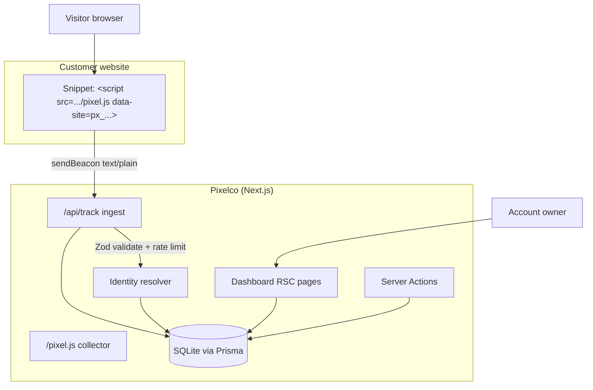

# Pixelco

**Identify anonymous website visitors — by their real email address.**

Pixelco is a full-stack, self-hostable visitor-identification SaaS: a cookieless
tracking pixel, a real-time analytics dashboard, and an identity-resolution
pipeline that turns anonymous traffic into actionable leads (B2C individuals
and B2B companies) — no forms, no popups, no cookies.

| | |
|---|---|
| **Stack** | Next.js 16 (App Router) · React 19 · TypeScript 5 · Tailwind CSS 4 · shadcn/ui |
| **Data** | Prisma ORM · SQLite (Postgres-ready schema) |
| **Auth** | NextAuth v4 (credentials, JWT sessions, bcrypt) |
| **Runtime** | Node.js ≥ 20 |

## Overview

Traditional visitor-identification tools only resolve the *company* behind an
IP address. Pixelco is built for **individual-level identification**: it
resolves the actual person — a personal or work email — plus company
firmographics when the visitor is B2B. The product has three parts:

1. **Marketing site** (`/`) — hero, social proof, pricing (Free → Scale), FAQ.
2. **Dashboard** (`/dashboard`) — visitor analytics, identification feed,
   pixel installation, domain management, plan settings.
3. **Tracking pipeline** — a one-line `<script>` snippet loads `/pixel.js`
   from this app; beacons flow into `/api/track`, where visitors are stitched
   by a cookieless localStorage ID, domains are auto-verified by hostname,
   and the identity-resolution engine resolves ~20% of visitors to an email.

> **Honest scope note:** the identity-resolution engine in this codebase is a
> deterministic simulation of the proprietary identity graph behind the
> commercial product this project clones (stable per-visitor decisions at the
> advertised ~20% match rate). Everything else — ingest, session stitching,
> quota accounting, analytics, exports — is a real, working pipeline. Billing
> is also simulated: plan switching updates entitlements without processing
> payments.

## Key Features

| | Feature | What it does |
|---|---|---|
| 🔍 | B2C + B2B identification | Resolves individual consumers by personal email and business visitors by work email + company |
| 🍪 | Cookieless tracking | First-party localStorage visitor ID — no consent-banner dependencies |
| ⚡ | One-line install | Single `<script>` snippet; per-platform guides (HTML, WordPress, Shopify, GTM) |
| 📊 | Real-time dashboard | KPIs, 14-day trend chart, top pages, recent identifications |
| 👥 | Visitor CRM | Segments, search, confidence/source filters, detail view, CSV export |
| 🔴 | Live activity feed | Auto-refreshing event stream across all domains |
| 🌍 | Domain management | Registration, hostname-based auto-verification, plan-based limits |
| 💳 | Plans & quotas | Free / Starter / Growth / Scale with per-plan identification allowances |

## Architecture



**Data flow:** beacon → validate → find site by key → verify domain by
hostname → upsert visitor (pageviews++) → append pageview event → resolve
identity (quota-gated) → append identification event → dashboard reads.

## File Hierarchy

```
📂 src/
├── 📂 app/
│   ├── 📄 page.tsx                  ← Marketing landing page
│   ├── 📂 login/ · 📂 signup/       ← Auth pages (dark shell, OAuth placeholders)
│   ├── 📂 dashboard/                ← 7 authed pages + layout guard
│   ├── 📂 api/
│   │   ├── 📂 track/                ← Pixel ingestion (beacon endpoint)
│   │   ├── 📂 activity/ · 📂 export/ · 📂 health/
│   │   └── 📂 auth/[...nextauth]/   ← NextAuth handler
│   └── 📂 pixel.js/                 ← Collector script route
├── 📂 actions/                      ← Server Actions (auth, domains, settings)
├── 📂 components/
│   ├── 📂 marketing/ · 📂 dashboard/ · 📂 auth/ · 📂 ui/
├── 📂 lib/
│   ├── 📄 identification.ts         ← Seeded identity-resolution engine
│   ├── 📄 plans.ts                  ← Plan catalogue (single source of truth)
│   ├── 📄 analytics.ts              ← Aggregation queries (server-only)
│   ├── 📄 auth.ts · validation.ts · snippet.ts · format.ts
│   └── 📄 db.ts                     ← Prisma client singleton
├── 📂 types/                        ← NextAuth session augmentation
📂 prisma/
├── 📄 schema.prisma                 ← users · sites · visitors · events
└── 📄 seed.ts                       ← Idempotent demo seed
📂 docs/                             ← SSH push runbook + reference materials
```

## Quick Start

Requires **Node.js ≥ 20** (or Bun ≥ 1.1) and npm (or bun).

```bash
# 1. Install dependencies
npm install            # or: bun install

# 2. Configure environment
cp .env.example .env
# Generate a real secret:
#   openssl rand -base64 32   → NEXTAUTH_SECRET

# 3. Create the database and generate the Prisma client
npm run db:push

# 4. (Optional) Seed demo data — demo@pixelco.local / Demo123456!
npm run db:seed

# 5. Start the dev server
npm run dev
```

### Verify Setup

```bash
curl http://localhost:3000/api/health
# {"status":"ok","db":"up"}

curl -o /dev/null -w "%{http_code}\n" http://localhost:3000/pixel.js
# 200  (collector script)

curl -o /dev/null -w "%{http_code}\n" http://localhost:3000/dashboard
# 307  (redirects to /login when signed out)
```

Then open `http://localhost:3000`, create an account, add a domain on the
**Domains** page, and install the snippet from **Install Pixel**.

### Testing the tracking pipeline

With the dev server running and a domain registered (site key visible in the
snippet, e.g. `px_abc123…`):

```bash
curl -X POST http://localhost:3000/api/track \
  -H "Content-Type: text/plain;charset=UTF-8" \
  -d '{"k":"px_YOUR_SITE_KEY","u":"https://yourdomain.com/","p":"/","r":"","v":"testvisitor0001","w":1920,"h":1080}'
# 204 No Content — check the dashboard: visitor appears, domain verifies
```

Send beacons from ~25 distinct `v` values to see the ~20% identification
match rate in practice.

## API Reference

| Endpoint | Method | Auth | Description |
|----------|--------|------|-------------|
| `/pixel.js` | GET | public | Collector script (CORS `*`, 5-min cache) |
| `/api/track` | POST | public (site key) | Beacon ingestion — 204 on accept, 429 when rate-limited (120/min per site key) |
| `/api/health` | GET | public | Liveness + DB readiness |
| `/api/auth/[...nextauth]` | GET/POST | public | NextAuth credentials flow |
| `/api/activity` | GET | session | Latest 60 events (polled by Activity Log) |
| `/api/export` | GET | session | CSV export of identified visitors |
| Server Actions | — | session | Mutations: sign-up, add/delete domain, update profile, change plan, ⚠️ delete account |

## Environment Variables

| Variable | Required | Description |
|----------|----------|-------------|
| `DATABASE_URL` | yes | SQLite file path (`file:./db/pixelco.db`) or Postgres URL |
| `NEXTAUTH_SECRET` | yes | ≥32-char secret (`openssl rand -base64 32`) |
| `NEXTAUTH_URL` | yes in prod | Canonical origin, e.g. `https://pixelco.example.com` |

## Design System

| Token | Hex | Usage |
|-------|-----|-------|
| `--primary` | `#FACC15` | Brand yellow — CTAs, active nav, badges, avatar fills |
| `--chart-1` | `#F59E0B` | Pageviews series, amber accents |
| `--chart-2` | `#2DD4BF` | Identified series, confidence bars |
| `--background` | `#FFFCF5` | Marketing canvas (warm off-white) |
| `.bg-app` | `#F9FAFB` | Dashboard canvas (cool gray) |
| `--destructive` | red | Danger zone, delete confirm |

Typography: **Geist Sans** (UI) via `next/font`, tabular numerals for all
metrics. Radii: `--radius: 0.75rem`. Motion: CSS-only `feed-in` keyframes
(0.45s brand easing), disabled under `prefers-reduced-motion`.

## Verification

```bash
npm run lint        # ESLint 9 flat config (strict: no-explicit-any is an error)
npm run typecheck   # tsc --noEmit
npm run build       # next build (17 routes; standalone output)
npm run verify      # all three in order
```

There is no automated unit/E2E suite yet — verification today is the gate
above plus manual browser flows (sign-up → domain → beacon → dashboard).

## Deployment

`next build` emits a **standalone** server (`output: "standalone"`):

```bash
npm run build
cp -r .next/static .next/standalone/.next/
cd .next/standalone
DATABASE_URL="file:/absolute/path/pixelco.db" \
NEXTAUTH_SECRET="..." NEXTAUTH_URL="https://your-host" \
PORT=3000 HOSTNAME=0.0.0.0 node server.js
```

SQLite paths must be **absolute** in the standalone context (Prisma resolves
relative paths against the build-time schema location). For Postgres, swap
`DATABASE_URL` and change the provider in `prisma/schema.prisma` — the schema
uses portable types throughout.

## Security Notes

- Passwords: bcrypt (12 rounds); sessions: signed JWTs (30 days), HttpOnly cookies.
- Ingest input is Zod-validated; unknown site keys return 204 (no enumeration).
- Domain strings pass a hostname-grammar normaliser before storage/snippet use.
- Rate limiting: in-memory fixed window per site key (120/min) — per-instance.
- The marketing/ingest surface never logs secrets; see PAD §6 for the threat model.

## Project Status

| Phase | Status | Key Deliverables |
|-------|--------|------------------|
| Marketing site | ✅ Complete | Landing page, pricing, FAQ, auth pages |
| Tracking pipeline | ✅ Complete | Collector, ingestion, verification, rate limiting |
| Identity resolution | ✅ Complete | Deterministic engine, quota accounting |
| Dashboard | ✅ Complete | All 7 pages, live feed, CSV export |
| Billing | 🟡 Simulated | Plan switching without payment processing |
| Tests | 🔴 Not started | No automated unit/E2E suite |

## License

Proprietary — all rights reserved by the repository owner.
