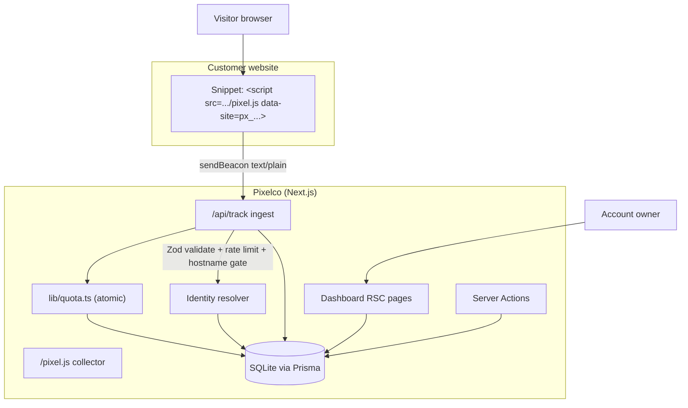

# Pixelco

**Identify anonymous website visitors — by their real email address.**

Pixelco is a full-stack, self-hostable visitor-identification SaaS: a cookieless
tracking pixel, a real-time analytics dashboard, and an identity-resolution
pipeline that turns anonymous traffic into actionable leads (B2C individuals
and B2B companies) — no forms, no popups, no cookies.

| | |
|---|---|
| **Stack** | Next.js 16 (App Router) · React 19 · TypeScript 5 · Tailwind CSS 4 · shadcn/ui |
| **Data** | Prisma ORM · SQLite (Postgres-ready schema) |
| **Auth** | NextAuth v4 (credentials, JWT sessions, bcrypt) |
| **Tests** | Vitest (unit + SQLite-backed integration, 568 assertions) |
| **Runtime** | Node.js ≥ 20 |

## Overview

Traditional visitor-identification tools only resolve the *company* behind an
IP address. Pixelco is built for **individual-level identification**: it
resolves the actual person — a personal or work email — plus company
firmographics when the visitor is B2B. The product has four parts:

1. **Marketing site** (`/`) — hero, social proof, pricing (Free → Scale), FAQ.
   Pricing cards carry `?plan=…&cycle=…` intent into sign-up.
2. **Marketing sub-pages** — `/about`, `/blog` (ten posts, the same set
   the original advertises), `/docs` quickstart, and the four legal pages
   (`/privacy`, `/terms`, `/gdpr`, `/ccpa`). All share the site chrome via
   the `(marketing)` route group and appear in `sitemap.xml` (R13: all
   sub-page copy — blog posts and legal texts — is the live content,
   converted verbatim).
3. **Dashboard** (`/dashboard`) — visitor analytics with server-side search,
   filters and pagination; a cursor-paged activity log; per-domain pixel
   installation; domain management; plan settings with overage accounting.
4. **Tracking pipeline** — a one-line `<script>` snippet loads `/pixel.js`
   from this app; beacons flow into `/api/track`, where visitors are stitched
   by a cookieless localStorage ID, hostnames are gated against the
   registered domain, and the identity-resolution engine resolves ~20% of
   visitors to an email.

> **Honest scope note:** the identity-resolution engine in this codebase is a
> deterministic simulation of the proprietary identity graph behind the
> commercial product this project clones (stable per-visitor decisions at the
> advertised ~20% match rate). Everything else — ingest, session stitching,
> quota accounting, analytics, exports — is a real, working pipeline. Billing
> is also simulated: plan switching updates entitlements without processing
> payments (overage is counted and priced, never charged). Password-reset
> emails are not sent either — `/forgot-password` acknowledges requests
> anti-enumeratively and tells the reader that self-hosted operators must
> configure email delivery.

## Key Features

| | Feature | What it does |
|---|---|---|
| 📄 | Content pages | About, blog (10 posts), docs quickstart, privacy / terms / GDPR / CCPA — same route set as the original |
| 🔍 | B2C + B2B identification | Resolves individual consumers by personal email and business visitors by work email + company |
| 🍪 | Cookieless tracking | First-party localStorage visitor ID — no consent-banner dependencies |
| ⚡ | One-line install | Single `<script>` snippet per domain with a domain switcher; the install page carries the live's Quick Start, How It Works and Site Key cards plus per-platform guides (HTML, WordPress, Shopify, GTM) |
| 📊 | Real-time dashboard | KPIs, 14-day UTC-bucketed trend chart, top pages, recent identifications, loading/error boundaries |
| 👥 | Visitor CRM | **Identified visitors only** (like the live product — anonymous traffic never hits the table), B2B rows show company + resolved location + a “· N visits” sub-line, honest active/inactive status from the live's 1-hour window, server-side search + segment/confidence-band/source filters (the live's identification-source model), 20/page pagination, true DB counts, row selection, CSV export (current page or selected — the live's byte format) |
| 🔴 | Live activity feed | Auto-refreshing event stream (pauses in background tabs) with cursor-based "Load older events" |
| 🌍 | Domain management | Registration, hostname-based auto-verification, ingest gated to registered hostnames, plan-based limits, delete confirmations |
| 💳 | Plans & quotas | Free / Starter / Growth / Scale with per-plan allowances; paid plans keep identifying past the limit and count overage at the per-identification rate |

## Architecture



**Data flow:** beacon → validate → find site by key → **hostname gate**
(reject non-matching hosts) → upsert visitor (pageviews++) → append pageview
event → resolve identity → claim visitor (conditional update) → **consume
quota atomically** (`lib/quota.ts`) → append identification event → dashboard
reads. Errors anywhere in the DB section are contained to a silent 204.

## File Hierarchy

```
📂 src/
├── 📂 app/
│   ├── 📂 (landing)/               ← Route group: landing page (chrome + announcement bar)
│   ├── 📂 (marketing)/             ← Route group: sub-pages (chrome only)
│   │   ├── 📄 page.tsx            ← Marketing landing page
│   │   ├── 📂 about/ · 📂 docs/   ← Content pages
│   │   ├── 📂 blog/ + blog/[slug]/ ← Blog index + 10 SSG article pages
│   │   └── 📂 privacy/ · terms/ · gdpr/ · ccpa/ ← Legal pages (shared LegalPage prose)
│   ├── 📂 login/ · 📂 signup/     ← Auth pages (plan-intent aware)
│   ├── 📂 dashboard/              ← 7 authed pages + layout guard + loading/error boundaries
│   ├── 📂 api/
│   │   ├── 📂 track/              ← Pixel ingestion (hostname-gated beacon endpoint)
│   │   ├── 📂 activity/ · 📂 export/ · 📂 health/
│   │   └── 📂 auth/[...nextauth]/ ← NextAuth handler
│   ├── 📄 robots.txt/ · sitemap.xml/  ← SEO route handlers (live-exact bytes)
│   │   └── 📄 route.ts             ← R14: comments, namespaces, 1.0 priorities
│   └── 📂 pixel.js/               ← Collector script route
├── 📂 actions/                      ← Server Actions (auth, domains, settings)
├── 📂 components/
│   ├── 📂 marketing/ · 📂 dashboard/ · 📂 auth/ · 📂 ui/
├── 📂 data/
│   └── 📄 blog-posts.ts           ← Blog catalogue (slug-tested; sitemap source)
├── 📂 lib/
│   ├── 📄 identification.ts         ← Seeded identity-resolution engine
│   ├── 📄 plans.ts                  ← Plan catalogue + money math (single source of truth)
│   ├── 📄 quota.ts                  ← Atomic quota consumption + monthly reset (only mutation path)
│   ├── 📄 analytics.ts              ← Aggregation + list queries, requireUser guard (server-only)
│   ├── 📄 collector-script.ts       ← The emitted collector JS (VM-tested)
│   ├── 📄 marketing-links.ts        ← Nav + footer link map (integrity-tested)
│   ├── 📄 site-url.ts               ← Canonical origin for metadata URLs
│   ├── 📄 auth.ts · validation.ts · snippet.ts · sites.ts · format.ts
│   └── 📄 db.ts                     ← Prisma client singleton
├── 📂 types/                        ← NextAuth session augmentation
📂 prisma/
├── 📄 schema.prisma                 ← users · sites · visitors · events (FK indexes)
└── 📄 seed.ts                       ← Resumable idempotent demo seed
📂 tests/                            ← Vitest suite (see Testing)
📂 docs/                             ← Plans, SSH push runbook, reference materials
```

## Quick Start

Requires **Node.js ≥ 20** (or Bun ≥ 1.1) and npm (or bun).

```bash
# 1. Install dependencies
npm install            # or: bun install

# 2. Configure environment
cp .env.example .env
# Generate a real secret:
#   openssl rand -base64 32   → NEXTAUTH_SECRET

# 3. Create the database and generate the Prisma client
npm run db:push

# 4. (Optional) Seed demo data — demo@pixelco.local / Demo123456!
npm run db:seed

# 5. Start the dev server
npm run dev
```

### Verify Setup

```bash
curl http://localhost:3000/api/health
# {"status":"ok","db":"up"}

curl -o /dev/null -w "%{http_code}\n" http://localhost:3000/pixel.js
# 200  (collector script)

curl -o /dev/null -w "%{http_code}\n" http://localhost:3000/dashboard
# 307  (redirects to /login when signed out)
```

Then open `http://localhost:3000`, create an account, add a domain on the
**Domains** page, and install the snippet from **Install Pixel** (the page
serves a snippet for every registered domain).

### Testing the tracking pipeline

With the dev server running and a domain registered (site key visible in the
snippet, e.g. `px_abc123…`):

```bash
# u must match the registered domain — beacons from other hostnames are dropped
curl -X POST http://localhost:3000/api/track \
  -H "Content-Type: text/plain;charset=UTF-8" \
  -d '{"k":"px_YOUR_SITE_KEY","u":"https://yourdomain.com/","p":"/","r":"","v":"testvisitor0001"}'
# 204 No Content — check the dashboard: visitor appears, domain verifies
```

Send beacons from ~25 distinct `v` values to see the ~20% identification
match rate in practice.

## API Reference

| Endpoint | Method | Auth | Description |
|----------|--------|------|-------------|
| `/pixel.js` | GET | public | Collector script (CORS `*`, 5-min cache) |
| `/api/track` | POST | public (site key) | Beacon ingestion — hostname-gated; 204 on accept, 204 on reject (indistinguishable), 429 when rate-limited (120/min per site key, `Retry-After: 60`) |
| `/api/health` | GET | public | Liveness + DB readiness |
| `/api/auth/[...nextauth]` | GET/POST | public | NextAuth credentials flow |
| `/forgot-password` | GET | public | Anti-enumeration reset-request page (no email transport — shows an honest configuration note; the live links here but 404s) |
| `/api/activity` | GET | session | Latest 60 events, or the page after `?cursor=` (event id) |
| `/api/export` | GET | session | CSV of identified visitors in the LIVE's byte format (9 columns, LF, no BOM, relative last-seen — R21); `?ids=` scopes to a selection/current page (ownership-scoped, max 500; present-but-empty = header-only file) |
| Server Actions | — | session | Mutations: sign-up (throttled, P2002-safe, plan-intent), add/delete domain, update profile, change plan, ⚠️ delete account (signs out) |

## Environment Variables

| Variable | Required | Description |
|----------|----------|-------------|
| `DATABASE_URL` | yes | SQLite file path (`file:./db/pixelco.db`) or Postgres URL |
| `NEXTAUTH_SECRET` | yes | ≥32-char secret (`openssl rand -base64 32`) |
| `NEXTAUTH_URL` | yes in prod | Canonical origin, e.g. `https://pixelco.example.com` |

## Testing

```bash
npm run test         # Vitest — full suite (unit + SQLite-backed integration)
npm run test:watch   # Watch mode
```

The suite runs against a throwaway SQLite database (`db/test.db`, recreated
from the schema on every run) with `TZ=UTC` pinned. Coverage highlights:

- **Collector script + install snippet** — both executed in `node:vm` with
  mocked browser globals: the collector's SPA route-change beacons,
  `pushState`/`replaceState`/`popstate` wiring, stable visitor ids and the
  monkey-patch recursion regression; the **install snippet** must actually
  run (create the collector script element with the right `src` + `data-site`
  and not throw) — a regression test for a bug the old string-pinning
  assertion hid.
- **Quota** (`src/lib/quota.ts`) — atomic consumption under 110 concurrent
  calls (exactly `limit` succeed), persisted monthly reset, paid-plan overage.
- **Activity feed semantics (round-7)** — `listActivity` returns the email
  only for identification events; pageview rows always carry the truncated
  anonymous id (12 chars + `...`) so identification never rewrites a
  visitor's pageview history.
- **Track route** — invoked directly with `Request` objects: hostname gating,
  auto-verification, anti-enumeration, quota/overage at the route level, 429
  timing, and write-failure containment (never a 500).
- **Server actions** — plan switching (counter never resets, downgrade
  guard), sign-up (duplicate race, per-IP throttle, plan intent), domains
  (IDOR guard, `_count`), account deletion (cascades, typed errors).
- **SSR render parity tests (round-10)** — every rebuilt marketing section
  (hero, benefits, pricing, audience/process, compare/CTA/footer, social
  proof) renders through `renderToStaticMarkup` and pins the live DOM's
  exact class strings, plus `tests/marketing-theme.test.ts` pinning the
  scoped marketing palette (`.marketing-scope` — the live ships separate
  app/marketing palettes; the marketing tree renders a white canvas,
  warm-white cards, cool borders, a yellow accent and 10px corners).
- **Dashboard shell parity (round-15)** — the shadcn Sidebar primitive DOM
  (provider/gap/fixed-container, the `data-sidebar` tree, the full
  `peer/menu-button` class string with appended active tails, the PNG logo
  asset), the topbar chrome (trigger button, font-display h1, hot-pink
  bell dot), the auth cards (h3 headings, new-gen Label, OAuth buttons on
  the Button primitive), the pricing plan cards (Card-base-first roots,
  chip-row features) and the Badge/Label primitives — all pinned against
  the live's current build (`tests/sidebar-chrome.test.tsx` +
  `tests/shell-parity.test.tsx`).
- **Content & SEO data modules** — the footer/nav link map (every link
  targets a real route; the only dead link is Careers, which is dead on
  the original too), the blog catalogue (10 posts, unique URL-safe slugs,
  date ordering, required fields incl. the live's `metaDescription`), and
  the robots/sitemap route handlers (18-URL set in the live's order,
  `/api/` disallowed, app routes excluded, byte-exact formatting).
- **Pure helpers** — plan/money math (IEEE-754 robustness), domain
  normalisation, snippet hardening (host validation, JS-string escaping),
  the live's Ry relative-time boundaries.
- **Dashboard content parity (round-16)** — the app bundle's content layer
  is pinned to the live's current build: the div-generation activity/
  domains/visitors rows, the legacy-gen content badges (visitors tab
  counts, type/status, domains Pending) vs the new-gen sidebar/Verified
  badges, the Radix billing switch, the Tabs primitive's current trigger
  order, the KPI card DOM, the `h-[280px]` trend chart, the visitors
  B2B icon-chip avatar and Card-wrapped table, and the install/settings
  class orders (`tests/content-parity.test.tsx`).
- **Content-parity gap closure (round-17)** — the activity Identified
  badge pinned to the new-gen default-variant string (byte-identical to
  domains Verified), the pricing contact-sales card (variant-free
  button CTA + twMerge-displaced card root), the install chip wrappers
  as bare geometry-first divs, and the trend-chart a11y ruling
  (role=img kept, documented) — +8 pins in `tests/content-parity.test.tsx`.
- **Geometry + marketing class realignment (round-18)** — the first
  geometry probes (getBoundingClientRect) caught two visual bugs every
  DOM-string pass missed: the settings Profile form eating the card
  body's `space-y-4` (0px group gaps vs the live's 16px) and TW4's
  `space-y` compiling margin onto inline labels (8px-short auth-form
  gaps). The marketing bundle was realigned to the live's class
  emission — icon/paragraph/container orders, full `gradient-hero`
  chips, anchor-wrapped CTAs, PNG wordmark, header `container` chrome,
  div feed avatars with inline backgrounds, the data-URI stat zap —
  +35 pins (`tests/marketing-r18-parity.test.tsx` + the content-parity
  R18 blocks); post-fix the settings card matches the live
  pixel-exactly.
- **Computed-style + runtime-model parity (round-19)** — the geometry
  probes extended to the marketing bundle's COMPUTED styles caught what
  class-string pins cannot: `.gradient-hero` resolving dark instead of
  the live's amber 3-stop on every marketing surface (fixed with a
  `.marketing-scope .gradient-hero` rule — one bundle, two resolutions,
  like the live's marketing/app bundle split; the auth canvas stays
  dark) and the hero feed widget running a static 8-entry rotation
  instead of the live's 5-entry phase machine (enter→scan→reveal→done,
  10s cycle, `index*56+12` row tops, avatar muted→primary flip,
  Matching…/✓ phase badges — rebuilt from the live's bundle source).
  The hero trust-row avatars were re-synced to the live's current
  photos (guarded by an offline perceptual-hash pin) — +12 pins in
  `tests/marketing-r19-parity.test.tsx`; post-fix the feed rows measure
  identical tops to the live (12/68/124/180/236) and the login canvas
  keeps the dark sweep. Screenshots in `docs/screenshots/`.
- **Runtime-state + functional parity (round-20)** — the probe
  toolchain's 5th generation sampled the live's rotating feed at 2 s
  intervals and drove its interactive states (pricing toggle, domains
  form, delete flow), catching what every static audit missed: the
  pricing MONTHLY mode diverged 4 ways (missing "billed monthly"
  sub-line, off-track `bg-muted-foreground/30` vs the live's
  `bg-muted`, off-thumb missing `translate-x-0`, plus the
  D5-re-confirmed toggle attrs) and the Add-Domain button wasn't
  disabled on empty input like the live's. The feed reveal now STAGES
  its text swap like the live's AnimatePresence `mode:"wait"` (exit
  0.3 s → enter 0.4 s, ✓ badge spring) instead of swapping atomically.
  The live's own defects (zero domain validation, no delete confirm)
  are documented intentional divergences — the clone keeps zod +
  AlertDialog. +12 pins in `tests/marketing-r20-parity.test.tsx`;
  post-fix the monthly cards, the disabled form state and the reveal
  transition all match the live's runtime emission. Screenshots in
  `docs/screenshots/`.
- **Export byte-format & data-semantics parity (round-21)** — the 6th
  probe generation decoded the live's CSV export from its app bundle
  (function W) and found the clone's file completely different. The
  export now ships the live's exact bytes: `Type,Name,Detail,
  Confidence,Source,Location,First Seen,Last Seen,Status` columns,
  Company/Individual rows, en-US short First Seen + RELATIVE Last
  Seen, LF line endings, no BOM, no quoting, and the live's
  current-page scope ("Export All" = all rows on this page vs the
  selected subset). The visitors page was re-aligned to the live's
  data model: page size 20, confidence BAND filters (High (85%+)/
  Medium (70-84%)/Low (<70%)), the identification-source model
  (Direct Signups/Network Matches; Direct/Network badges), 3-tier
  confidence bar fills, null-confidence company rows with the MapPin
  location cell, the live's "Nd ago" relative formatter, the 1-hour
  active window, and the live's mobile dropdown (plain links, one
  full-width CTA, no Log In). +30 pins in
  `tests/visitors-r21-parity.test.tsx` +
  `tests/export-r21-parity.test.ts`; responsive probes (375/768px)
  confirmed parity. Screenshots in `docs/screenshots/`.
- **UI primitives + app theme (round-11)** — the live app ships the
  LEGACY shadcn generation and a cool-neutral palette: the primitive
  class strings (button/badge/card/tabs/select/input/checkbox), the
  app `:root` token set (teal accent, cool hairlines, navy foreground,
  sidebar tokens), the sidebar chrome (footer, rail, menu buttons),
  the badge consumers, the visitors selection UX (topbar Export (N)
  swap), the 404 boundary, and the round-11 marketing seams (inline
  span kickers, `#benefits` placement, header margins, footer anchors,
  Compare/header CTA chrome, the system mono stack) are all pinned by
  SSR/source tests against the live DOM.
- **Precision parity + scroll reveal (round-12)** — the live's entrance
  motion (46 `data-reveal` coordinates, translateY 12/16/20/24 px, ~100 ms
  stagger, once-only, reduced-motion-safe, no-JS visible) reproduced with
  ONE shared IntersectionObserver + CSS transitions; the hero H1's v3
  cascade quirk (`sm:leading-none` — the live renders ratio 1.0 at ≥sm),
  ASCII testimonial quotes, the live's custom 5-path B2B building icon,
  the marketing `--foreground` family as pre-rounded `#171a26` (Lightning
  CSS floor-rounds half-channel HSL), and the live's variant-free
  gradient CTA class strings are all pinned by SSR/source tests.
- **Dashboard chrome data seam** (`src/lib/dashboard-nav.ts`) — sidebar
  sections/icons and per-page subtitles match the live app verbatim,
  visitors-subtitle formatting, the 7-day unread-activity rule behind the
  bell dot, and the collapsible-sidebar state reducer.
- **Metadata & SEO parity (round-14)** — the live-verbatim head on every
  surface: the root description/title template (`|` suffix), the
  per-page marketing metadata builder (`marketing-seo.ts` — title,
  description, og/twitter, canonical, self-hosted 1200×630 social
  image), the app-bundle og block (`app-seo.ts` — "Pixelco" /
  "Visitor identification platform dashboard", deliberately NO
  `@Lovable` twitter:site artifact), the 404 title island
  (`NotFoundTitle` — MutationObserver re-assertion past Next's
  post-hydration metadata patch), the byte-exact robots.txt/sitemap.xml
  route handlers (live order incl. the pinned post-slug array), and the
  favicon convention (`public/favicon.ico`, no link tag).
- **Queries** — top pages via SQL `groupBy` (ordering, tie-breaks,
  cross-user isolation), profile action (name never clobbered), the
  bell's recent-identification flag, the identified-only visitors scope,
  the 30-minute active/inactive window, B2B location persistence, and the
  domains identified-vs-total count split.

## Verification

```bash
npm run lint        # ESLint 9 flat config (strict: no-explicit-any is an error)
npm run typecheck   # tsc --noEmit
npm run test        # Vitest suite
npm run build       # next build (36 routes; standalone output)
npm run verify      # all four in order
```

SEO surface: `/robots.txt` and `/sitemap.xml` are served by Route
Handlers (`src/app/{robots.txt,sitemap.xml}/route.ts`) that reproduce the
original's documents byte-for-byte — comments, `xmlns:news`/`xmlns:image`
namespaces, "1.0"-style priorities, lowercase `User-agent:`, the live's
hand-authored URL order (18 marketing URLs — app routes excluded) — with
the origin substituted from `NEXTAUTH_URL`. Every marketing page ships
the live's verbatim head (title, description, og/twitter tags, canonical)
via `src/lib/marketing-seo.ts`; app surfaces ship the live app-bundle's og
block via `src/lib/app-seo.ts`; the favicon is the original's
`public/favicon.ico` (auto-discovered, no link tag — like the live); and
`metadataBase` derives from `NEXTAUTH_URL` so canonical/OG URLs are
absolute in production. The blog posts also carry the live's meta
descriptions (`metaDescription` — distinct from the card excerpts).

Manual browser flows (sign-up → domain → beacon → dashboard → export)
complement the automated suite.

## Deployment

### Standalone (recommended for self-hosting)

`next build` with `output: "standalone"` emits a self-contained server — but
**it does not copy the static assets**, and serving that directory as-is
ships a page whose JS/CSS 404 (React never hydrates; forms fall back to
native GET submission). Always build with the helper that performs the copy
the Next docs require:

```bash
npm run build:standalone   # next build + cp .next/static (+ public/) into .next/standalone
cd .next/standalone
DATABASE_URL="file:/absolute/path/pixelco.db" \
NEXTAUTH_SECRET="..." NEXTAUTH_URL="https://your-host" \
PORT=3000 HOSTNAME=0.0.0.0 node server.js
```

An opt-in regression guard exists: `PIXELCO_STANDALONE_SMOKE=1 npx vitest run
tests/standalone-smoke.test.ts` boots `server.js` and asserts a
`_next/static` chunk answers 200.

SQLite paths must be **absolute** in the standalone context (Prisma resolves
relative paths against the build-time schema location). For Postgres, swap
`DATABASE_URL` and change the provider in `prisma/schema.prisma` — the schema
uses portable types throughout.

### Docker

```bash
docker build -t pixelco .
docker run -p 3000:3000 \
  -e NEXTAUTH_SECRET="$(openssl rand -base64 32)" \
  -e NEXTAUTH_URL="https://your-host" \
  -v pixelco-data:/app/data \
  pixelco
```

The image is a multi-stage `node:22-alpine` build: standalone output +
static assets, non-root user, `/app/data` volume for the SQLite file, a
`/api/health` HEALTHCHECK, and an entrypoint that runs `prisma db push` on
boot (set `RUN_DB_PUSH=false` when the schema is managed externally). For
Postgres, pass `DATABASE_URL=postgresql://…` instead of mounting the volume.

CI (`.github/workflows/ci.yml`) runs lint → typecheck → test → build on
every push and pull request.

## Security Notes

- Passwords: bcrypt (12 rounds); sessions: signed JWTs (30 days), HttpOnly
  cookies; account deletion revokes the session client-side.
- Ingest input is Zod-validated and minimised (`k,u,p,r,v` only); unknown
  site keys and foreign hostnames both return 204 (no enumeration, no
  quota-burning forged beacons).
- Quota consumption is a single conditional UPDATE — exactly `limit`
  concurrent consumptions can ever succeed; paid plans count overage.
- Sign-up is per-IP throttled (5 / 10 min); duplicate-email races return
  typed CONFLICT results, never thrown P2002s.
- Domain strings pass a hostname-grammar normaliser; the snippet generator
  validates the forwarded host and escapes every interpolation.
- Rate limiting: in-memory fixed window per site key (120/min) — per-instance.
- Baseline security headers on every response (`X-Content-Type-Options`,
  `X-Frame-Options`, `Referrer-Policy`, `Permissions-Policy`) via
  `next.config.ts`; a strict CSP is deferred (see PAD §11).
- Transitive dependency advisories are pinned away via `overrides`
  (`deepmerge-ts ^8` — GHSA-ggr8-5vv4-36mx); `bun audit` is clean.
- The marketing/ingest surface never logs secrets; see PAD §6 for the threat model.

## Project Status

| Phase | Status | Key Deliverables |
|-------|--------|------------------|
| Marketing site | ✅ Complete | Landing page, pricing with plan intent, FAQ, auth pages |
| Content pages | ✅ Complete | About, blog (10 posts), docs, privacy/terms/GDPR/CCPA, robots + sitemap |
| Tracking pipeline | ✅ Complete | Collector, hostname-gated ingestion, verification, rate limiting, error containment |
| Identity resolution | ✅ Complete | Deterministic engine, atomic quota accounting, paid overage |
| Dashboard | ✅ Complete | All 7 pages, pagination/search, live feed with history, CSV export |
| Billing | 🟡 Simulated | Plan switching + overage counting without payment processing |
| Tests | ✅ Complete | Vitest: unit + integration (see Testing) |

## License

Proprietary — all rights reserved by the repository owner.
